English | [简体中文](./README_cn.md)

# AdvBox

AdvBox (Adversarialbox) is a Paddlepaddle Open Source project that provides users with a series of AI model security tools, including adversarial examples (AEs) generation techniques and model-based adversarial data augmentation.

Since the existence of adversarial examples may be an inherent weakness of deep learning models, it is important to benchmark deep learning models and improve their robustness against AEs. The purpose of the AdvBox is to help users generate and use adversarial examples conveniently in Paddlepaddle.

The project also contains plenty of useful tutorials for different AI applications and scenarios.

(A command-line tool is given to generate adversarial examples with Zero-Coding which is inspired and based on FoolBox v1.)

# Attack Methods

**FGSM untargeted attack**      
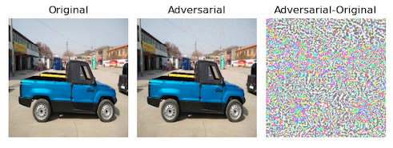

**PGD targeted attack**
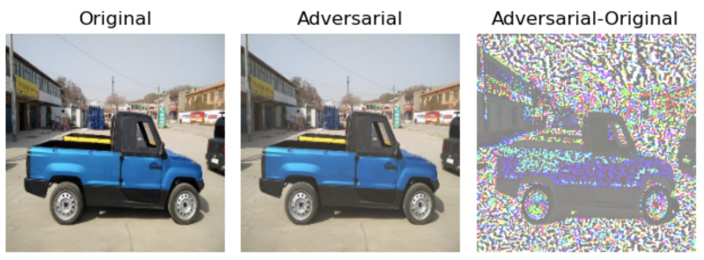

**CW targeted attack**
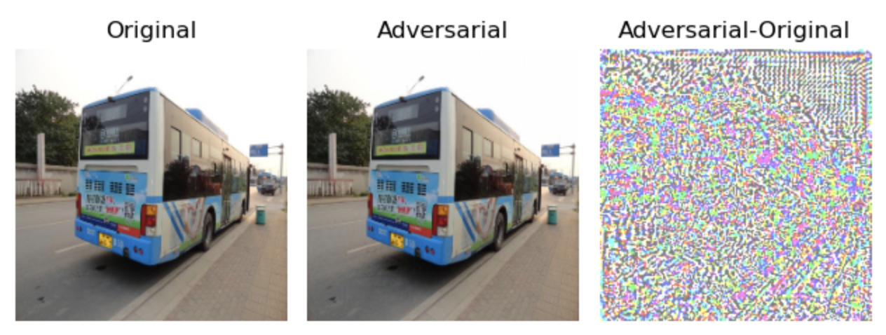


## Table of Adversarial Attack Methods

| Adversarial Attack Methods                                    | White-Box | Black-Box | Ensemble  |  AdvTrain   |
|-------------------------------------------------------------------------------------------------------------------------------------------------------------------------------------------------------------|:--:|:--:|:--:|:--:|
| [FGSM (FastGradientSignMethodAttack)](attacks/gradient_method.py)                | ✓  |   | ✓ | ✓ |
| [FGSMT (FastGradientSignMethodTargetedAttack)](attacks/gradient_method.py)       | ✓  |   | ✓ | ✓ |
| [BIM (BasicIterativeMethodAttack)](attacks/gradient_method.py)                   | ✓  |   | ✓ | ✓ |
| [ILCM (IterativeLeastLikelyClassMethodAttack)](attacks/gradient_method.py)       | ✓  |   | ✓ | ✓ |
| [MI-FGSM (MomentumIteratorAttack)](attacks/gradient_method.py)                   | ✓  |   | ✓ | ✓ |
| [PGD (ProjectedGradientDescentAttack)](attacks/gradient_method.py)               | ✓  |   | ✓ | ✓ |
| [CW_L2 (CWL2Attack)](attacks/cw.py)                                              | ✓  |   |   | ✓ |
| [SinglePixelAttack](attacks/single_pixel_attack.py)                              |    | ✓ |   |   |
| [HopSkipJumpAttack](attacks/hop_skip_jump_attack.py)                             |    | ✓ |   |   |

## To generate an AE in AdvBox

```python
import sys
sys.path.append("..")
import paddle
import numpy as np
from adversary import Adversary
from attacks.cw import CW_L2
from models.whitebox import PaddleWhiteBoxModel

from classifier.towernet import transform_eval, TowerNet, MEAN, STD
model_0 = TowerNet(3, 10, wide_scale=1)
model_1 = TowerNet(3, 10, wide_scale=2)

advbox_model = PaddleWhiteBoxModel(
    [model_0, model_1],
    [1, 1.8],
    (0, 1),
    mean=MEAN,
    std=STD,
    input_channel_axis=0,
    input_shape=(3, 256, 256),
    loss=paddle.nn.CrossEntropyLoss(),
    nb_classes=10)

# init attack with the ensembled model
attack = CW_L2(advbox_model)

cifar10_test = paddle.vision.datasets.Cifar10(mode='test', transform=transform_eval)
test_loader = paddle.io.DataLoader(cifar10_test, batch_size=1)

data = test_loader().next()
img = data[0][0]
label = data[1]

# init adversary status
adversary = Adversary(img.numpy(), int(label))
target = np.random.randint(advbox_model.num_classes())
while label == target:
    target = np.random.randint(advbox_model.num_classes())
print(label, target)
adversary.set_status(is_targeted_attack=True, target_label=target)

# launch attack
adversary = attack(adversary, attack_iterations=50, verbose=True)

if adversary.is_successful():
    original_img = adversary.original
    adversarial_img = adversary.adversarial_example
    print("Attack succeeded.")
else:
    print("Attack failed.")
```


# Adversarial Training

## AdvBox Adversarial Training(advtraining) provides:
- Mainstream attack methods **[FGSM/PGD/BIM/ILCM/MI-FGSM](#AdvBox/attacks)** for model adversarial training.
- A unified yet generic adversarial training API: 
    + AEs generation/transformation in data-flow style, which can be easily incorporated into existing training process.
    + Supports weighted model ensembling for AEs generation/transformation.
    + Supports multi-methods adversarial training.
    + Allows users to specify settings for each adversarial attack method, including their probabilities to take effect.
- Advtraining **[tutorial scripts](#AdvBox/examples/image_adversarial_training)** for classification task on Cifar10 & Mini-ImageNet dataset.

```shell script
cd AdvBox/examples/image_adversarial_training
python run_advtrain_main.py
```

| Evaluation-Method | Mini-ImageNet-FGSM | Mini-ImageNet-PGD-20 |
| :----: | :----: | :----: |
|   val_acc: _ / natural_acc: _ / fooling_rate: _   |   preactresnet   |   preactresnet   |
|   Natural Adversarial Training(p=0.1, fgsm(default))   |   0.980 / 0.986 / 0.282   |   0.980 / 0.986 / 0.984   |
|   Natural Adversarial Training(p=0.1, PGD(default))   |   0.983 / 0.978 / 0.098   |   0.983 / 0.982 /0.850   |
|  TRADES(beta=1.0, fgsm(default))  |  0.989 / 0.994 / 0.146  |  0.989 / 0.994 / 0.956  |
|  TRADES(beta=1.0, PGD(default))  |  0.990 / 0.992 / 0.028  |  0.990 / 0.996 / 0.540  |
|  TRADES(beta=1.0, LD(default))  |  0.990 / 0.996 / 0.020  |  0.990 / 0.992 / 0.734  |

## Easy to use adversarial training
```python
import sys
sys.path.append("..")
import paddle
from attacks.gradient_method import FGSM, PGD
from attacks.cw import CW_L2
from models.whitebox import PaddleWhiteBoxModel
from defences.adversarial_transform import ClassificationAdversarialTransform

from classifier.towernet import transform_train, TowerNet, MEAN, STD
model_0 = TowerNet(3, 10, wide_scale=1)
model_1 = TowerNet(3, 10, wide_scale=2)

advbox_model = PaddleWhiteBoxModel(
    [model_0, model_1],
    [1, 1.8],
    (0, 1),
    mean=MEAN,
    std=STD,
    input_channel_axis=0,
    input_shape=(3, 256, 256),
    loss=paddle.nn.CrossEntropyLoss(),
    nb_classes=10)

# "p" controls the probability of this enhance.
# for base model training, we set "p" == 0, so we skipped adv trans data augmentation.
# for adv trained model, we set "p" == 0.05, which means each batch
# will probably contain 5% adv trans augmented data.
enhance_config1 = {"p": 0.1}
enhance_config2 = {"p": 0.1}
init_config3 = {"norm": 'L2', "epsilon_ball": 8/255, "epsilon_stepsize": 2/255}
enhance_config3 = {"p": 0.05,
                   "attack_iterations": 15,
                   "c_search_steps": 6,
                   "verbose": False}

adversarial_trans = ClassificationAdversarialTransform(advbox_model,
                                                       [FGSM, PGD, CW_L2],
                                                       [None, None, init_config3],
                                                       [enhance_config1, enhance_config2, enhance_config3])

cifar10_train = paddle.vision.datasets.Cifar10(mode='train', transform=transform_train)
train_loader = paddle.io.DataLoader(cifar10_train, batch_size=16)

for batch_id, data in enumerate(train_loader()):
    x_data = data[0]
    y_data = paddle.unsqueeze(data[1], 1)
    x_data_augmented, y_data_augmented = adversarial_trans(x_data.numpy(), y_data.numpy())
```

# Adversarial Perturbation for Object Detection
Adversarial perturbation for object detection is used for adversarial training and 
evaluating the robustness of object detectors.

<div align="center">
    Images used for Feed & Sniff
</div>

<table align="center">
<tr>
    <div align="center">
        <td></td>
        <td>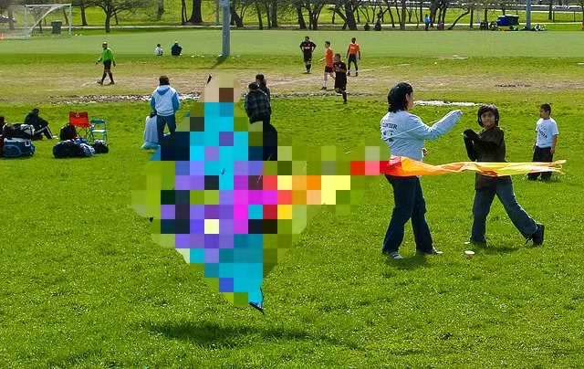</td>
    </div>
</tr>

<tr>
    <div align="center">
        <td>Original Image</td>>
        <td>Masked Image</td>
    </div>
</tr>
<table>

In `PaddleSleeve/AdvBox/examples/objectdetector`, we demonstrate the Target Ghosting 
attack, a method using PGD to produce perturbation to minimize Kullback-Leibler Divergence 
between victim and target feature map in PP-YOLO, successfully making it 
undetect the kite in `000000014439.jpg`. We obtain the feature map by feeding & sniffing 
the intermediate output `pcls`, the tensor stands for classification confidence in PP-YOLO.

- A kindly Reminder: since paddlepaddle <= 2.1 does not support gradient backward for
 `paddle.nn.SyncBatchNorm` in eval() mode, to run the demonstration, we need to modify 
 all `sync-bn` components in detector model into `bn` (because `paddle.nn.BatchNorm` 
 supports gradient backward in eval() mode).
 
 If you want to customize your own demo script, you should try the following methods:
 
- For object detector like `configs/yolov3/_base_/yolov3_darknet53.yml`,
 add `norm_type: sync_bn` on the third line.
- For object detector like `configs/ppyolo/ppyolo_mbv3_large_coco.yml`, add `norm_type: sync_bn` 
 on the 9 th line.

## Run Target Ghosting Demonstration
After changing all `sync-bn` components into `bn`, run the following commandline.
1. `cd PaddleSleeve/AdvBox/examples/objectdetector`
2. `python target_ghosting_demo.py -c configs/ppyolo/ppyolo_mbv3_large_coco.yml -o weights=https://paddledet.bj.bcebos.com/models/ppyolo_mbv3_large_coco.pdparams --infer_img=dataloader/demo_pics/000000014439.jpg --target_img=dataloader/demo_pics/masked_0014439.png`

The successful execution of the target_ghosting_demo.py, will produce the following outputs.

**Image Compares**

<div align="center">
    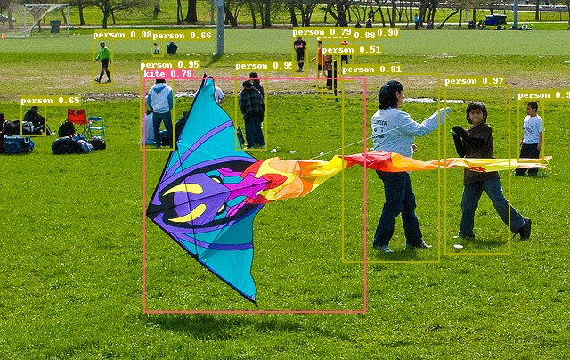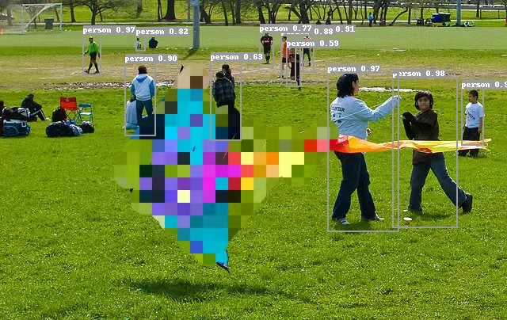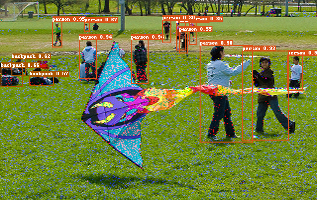
    <br>
    <div>
    Original Image Detection Result
    </div>
    <br>
    <div>
    Original Image Detection Result    Masked Image Detection Result    Adv Image Detection Result
    </div>
</div>

# Adversarial example denoising

## AdvBox denoising provides:

- [Basic denoising methods](#AdvBox/denoisers)
    + Gaussian Filter
    + Median Filter
    + Mean Filter
    + Box Filter
    + Bilateral Filter
    + Pixel Deflection
    + JPEG Compression
    + DCT Compression
    + PCA Compression
    + Gaussian Noise
    + Salt and Pepper Noise
    + Random Resize and Padding
- A **[tutorial python script](#AdvBox/examples/imagenet_tutorial_fgsm_denoise.py)** uses the FGSM attack for denoising demonstration.
  - **Command-line parameters**
    - `--image_path`  
    : the path of the input image, one can upload images to the folder: AdvBox/examples/image_cls/input. We provide some images sampled from the mini-imagenet dataset:
      + input/schoolbus.png
      + input/vase.png
      + input/lion.png
      + input/hourglass.png
      + input/crate.png
      + input/malamute.png
    - `--method`  
    : the name of the denoising method:
      + GaussianBlur
      + MedianBlur
      + MeanFilter
      + BoxFilter
      + BilateralFilter
      + PixelDeflection
      + JPEGCompression
      + DCTCompress
      + PCACompress
      + GaussianNoise
      + SaltPepperNoise
      + ResizePadding

- A **[evaluation python script](#AdvBox/examples/imagenet_tutorial_fgsm_denoise.py)** uses the FGSM attack and the denoising method on the Mini-ImageNet dataset.
  - **Command-line parameters**
    - `--dataset_path`  
    : the path of the mini-imagenet dataset (.pkl), one can download the .pkl mini-imagenet dataset to the folder: AdvBox/examples/image_cls/input.
    - `--label_path`  
    : the path of the mini-imagenet label (.txt), one can download the put the label file to the folder: AdvBox/examples/image_cls/input. We provide the labels of the testing set:
      + input/mini_imagenet_test_labels.txt
    - `--mode`
    : dataset type, the 'train', 'test', or 'val' mode. Default 'test'.
    - `--method`  
    : the name of the denoising method:
      + GaussianBlur
      + MedianBlur
      + MeanFilter
      + BoxFilter
      + BilateralFilter
      + PixelDeflection
      + JPEGCompression
      + DCTCompress
      + PCACompress
      + GaussianNoise
      + SaltPepperNoise
      + ResizePadding
    - `--method`  

## Usage of Denoising methods
Examples of using the denoising methods on an image sample or on the mini-imagenet dataset.

### On an image sample
Given an input image, the FGSM is first used for generating the adversarial example (AE), and then the denoising method is applied to the input image and the AE.

#### Run:
```shell
cd PaddleShield/Advbox/examples/image_cls
python imagenet_tutorial_fgsm_denoise.py --method='GaussianBlur' --image_path='input/schoolbus.png'
```

#### Output:
```
input image label: school bus
input image shape:  [3, 84, 84]
FGSM attack succeeded, adversarial_label: rubber eraser, rubber, pencil eraser
FGSM attack done
GaussianBlur denoise succeeded
GaussianBlur denoise doesn't change the label of the input image
GaussianBlur denoise done
```

#### Illustration:
```
1. The original model recognizes the input image as: school bus;  
2. Using FGSM to obtain an adversarial example (AE), the label of the AE is: rubber eraser, rubber, pencil eraser;  
3. Using GaussianBlur to denoise, the label of the denoising result is school bus.
```

#### Qualitative result:
<div align=center>
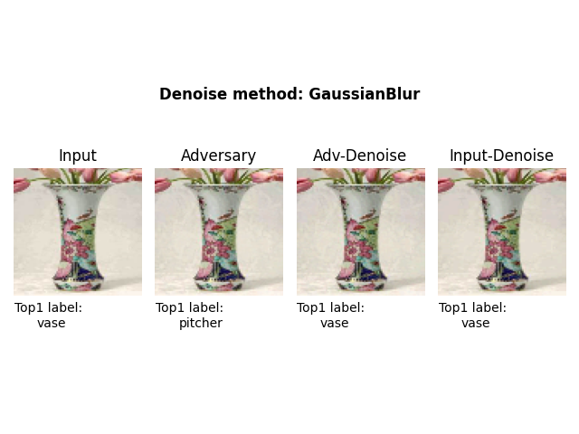
</div>

#### Usage of other denoising methods

**Median Blur**
```shell
python imagenet_tutorial_fgsm_denoise.py --method='MedianBlur' --image_path='input/vase.png'
```
<div align=center>
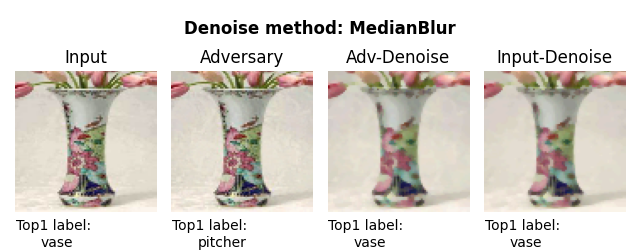
</div><br/>

**Mean Filter**
```shell
python imagenet_tutorial_fgsm_denoise.py --method='MeanFilter' --image_path='input/lion.png'
```

<div align=center>
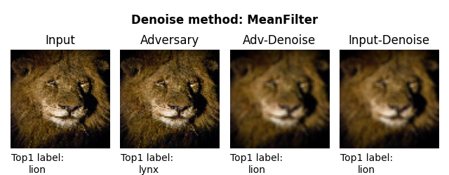
</div><br/>


**Box Filter**
```shell
python imagenet_tutorial_fgsm_denoise.py --method='BoxFilter' --image_path='input/hourglass.png'
```
<div align=center>
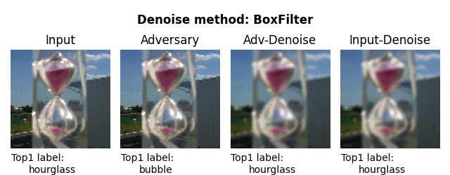
</div><br/>


**Bilateral Filter**
```shell
python imagenet_tutorial_fgsm_denoise.py --method='BilateralFilter' --image_path='input/crate.png'
```
<div align=center>
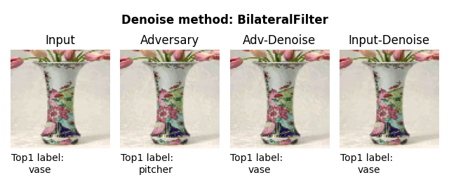
</div><br/>


**Pixel Deflection**
```shell
python imagenet_tutorial_fgsm_denoise.py --method='PixelDeflection' --image_path='input/malamute.png'
```
<div align=center>
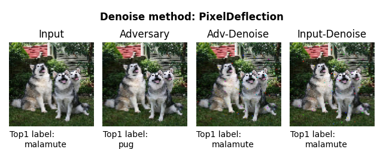
</div><br/>


**JPEG Compression**
```shell
python imagenet_tutorial_fgsm_denoise.py --method='JPEGCompression' --image_path='input/schoolbus.png'
```
<div align=center>
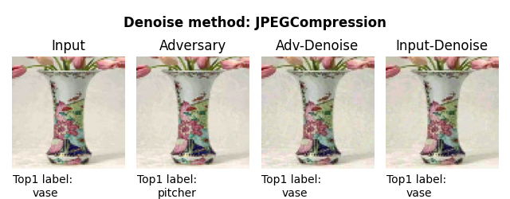
</div><br/>


### On the mini-imagenet dataset
Given the mini-imagenet dataset, the FGSM is first used for generating the adversarial example (AE), and then the denoising method is applied to the input image and the AE.

#### Run:
```shell
cd PaddleShield/Advbox/examples/image_cls
python mini_imagenet_evaluation_tool.py --method='GaussianBlur' --dataset_path='input/mini-imagenet-cache-test.pkl' --label_path='mini_imagenet_test_labels.txt'
```

#### Output:
```
100%|█████| 12000/12000 [2:45:59<00:00,  1.20it/s, ORI_ACC=0.439, AE_ACC=0.000, DE_AE_ACC=0.063, DE_ORI_ACC=0.010]
```

#### Quantitative results (Acc.):
| Denoising method | Clean Image | AE | Denoised AE | Denoised Clear Image |
|:-|:-:|:-:|:-:|:-:|
| GaussianBlur    | 43.9%  | 0.0%  | 6.3% | 10.0% |
| MedianBlur      | 43.9%  | 0.0%  | 7.2% | 10.4% |
| MeanFilter      | 43.9%  | 0.0%  | 5.8% | 9.0% |
| BoxFilter       | 43.9%  | 0.0%  | 7.4% | 14.4% |
| BilateralFilter | 43.9%  | 0.0%  | 5.8% | 9.0% |
| PixelDeflection | 43.9%  | 0.0%  | 11.7% | 18.3% |
| JPEGCompression | 43.9%  | 0.0%  | 12.6% | 19.5% |
| DCTCompress     | 43.9%  | 0.0%  | 10.9% | 16.5% |
| PCACompress     | 43.9%  | 0.0%  | 11.7% | 20.6% |
| GaussianNoise   | 43.9%  | 0.0%  | 8.0% | 10.0% |
| SaltPepperNoise | 43.9%  | 0.0%  | 7.3% | 11.0% |
| ResizePadding   | 43.9%  | 0.0%  | 18.9% | 22.5% |


# Contributing
We appreciate your contributions!

# Citing
If you find this toolbox useful for your research, please consider citing.
