English | [简体中文](./README_cn.md)

# AdvBox

AdvBox (Adversarialbox) is a Paddlepaddle Open Source project that provides users with a series of AI model security tools, including adversarial examples (AEs) generation techniques and model-based adversarial data augmentation.

Since the existence of adversarial examples may be an inherent weakness of deep learning models, it is important to benchmark deep learning models and improve their robustness against AEs. The purpose of the AdvBox is to help users generate and use adversarial examples conveniently in Paddlepaddle.

The project also contains plenty of useful tutorials for different AI applications and scenarios.

(A command-line tool is given to generate adversarial examples with Zero-Coding which is inspired and based on FoolBox v1.)

---

## Noun Explanation

* White-box attack: The attacker can know the internal structure of the model, training parameters, training and defense methods, etc.
* Black-box attack: The attacker knows nothing about the internal structure of the attacked model, training parameters, etc., and can only communicate with the model through the output.
* Untargeted attack: All the attacker has to do is cause the target model to misclassify an example, but not to which class.
* Targeted attack: The attacker specifies a class in such a way that the target model not only misclassifies samples but also needs to misclassify the specified class No.

---
## Attack Methods

| Adversarial Attack Methods                                    | White-Box | Black-Box | Ensemble  |  AdvTrain   |
|-------------------------------------------------------------------------------------------------------------------------------------------------------------------------------------------------------------|:--:|:--:|:--:|:--:|
| [FGSM (FastGradientSignMethodAttack)](attacks/gradient_method.py)                | ✓  |   | ✓ | ✓ |
| [FGSMT (FastGradientSignMethodTargetedAttack)](attacks/gradient_method.py)       | ✓  |   | ✓ | ✓ |
| [BIM (BasicIterativeMethodAttack)](attacks/gradient_method.py)                   | ✓  |   | ✓ | ✓ |
| [ILCM (IterativeLeastLikelyClassMethodAttack)](attacks/gradient_method.py)       | ✓  |   | ✓ | ✓ |
| [MI-FGSM (MomentumIteratorAttack)](attacks/gradient_method.py)                   | ✓  |   | ✓ | ✓ |
| [PGD (ProjectedGradientDescentAttack)](attacks/gradient_method.py)               | ✓  |   | ✓ | ✓ |
| [CW_L2 (CWL2Attack)](attacks/cw.py)                                              | ✓  |   |   | ✓ |
| [SinglePixelAttack](attacks/single_pixel_attack.py)                              |    | ✓ |   |   |
| [HopSkipJumpAttack](attacks/hop_skip_jump_attack.py)                             |    | ✓ |   |   |
| [GeneticPixelAttack](attacks/genetic_pixel_attack.py)                            |    | ✓ |   |   |
| [SquareAttack](attacks/square_attack.py)                                         |    | ✓ |   |   |

---
# Installation
## Requirements
- Python >= 3.7
- PaddlePaddle(GPU) >= 2.2.2
- protobuf==3.19.0
- opencv-python
- opencv-contrib-python
- pyyaml
- tqdm
- pycocotools
- scipy
- lap
- scikit-learn
- motmetrics
- openpyxl
- future
- imgaug
- pyclipper
- lmdb
- pandas
- filelock
- Polygon3
- lanms-neo

# Attack
Go to the attack example directory:

    cd PaddleSleeve/Advbox/examples/image_cls

## Usage of a black-box attack
### Single Pixel Attack
- **[tutorial python script](/AdvBox/examples/image_cls/mnist_tutorial_singlepixelattack.py)** Single Pixel Attack was used to attack the CNN model trained through the mnist dataset to generate adversarial samples. Only non-targeted attacks are supported.

#### Usage of Single Pixel Attack
First, generate the model to attack:

    python mnist_cnn_bapi.py


Using Single Pixel Attack to generate adversarial examples:

    python mnist_tutorial_singlepixelattack.py

```shell
2021-04-25 13:51:26,187 - INFO - Attack location x=19 y=25
attack success, original_label=9, adversarial_label=2, count=17
2021-04-25 13:51:26,386 - INFO - Attack location x=1 y=6
attack success, original_label=7, adversarial_label=3, count=18
2021-04-25 13:51:26,587 - INFO - Attack location x=5 y=19
attack success, original_label=3, adversarial_label=8, count=19
2021-04-25 13:51:26,788 - INFO - Attack location x=20 y=20
attack success, original_label=4, adversarial_label=1, count=20
[TEST_DATASET]: fooling_count=20, total_count=20, fooling_rate=1.000000
SinglePixelAttack attack done
```

<p align="center">
<br>
</p>

### Genetic Pixels attack
Genetic Pixels Attack is an attacking method in L0 norm. It inherits Single Pixel Attack and utilizes genetic algorithm to enhance the performance. 

- **[tutorial python script](/AdvBox/examples/image_cls/imagenet_tutorial_gp.py)** The Genetic Pixels Attack was used to attack the ResNet50 model trained on the ImageNet dataset.
  - **Command-line parameters**
    - `--max_gen`
    : maximum iterative steps this attack will perform.
    - `--image_path`
    : path of the input image, default: input/cat_example.png. Users can upload their own images to the AdvBox/examples/image_cls/input folder, and we have also provided some images from the mini-imagenet dataset:
      + input/schoolbus.png
      + input/vase.png
      + input/lion.png
      + input/hourglass.png
      + input/crate.png
      + input/malamute.png
    - `--target`
    : target class label, -1 if untargeted attack.
    - `--max_pixels`
    : the maximum number of pixels allowed to be changed. This is equivalent to the radius of Lp ball in L0.
    - `--temp`
    : initial temp. Controls how likely an unfavored candidate will be selected as parent.

#### Usage of Genetic Pixels Attack

    python imagenet_tutorial_gp.py

<p align="center">
<br>
</p>

### Square Attack
Square attack is a black-box attack algorithm based on score. The model does not rely on the local gradient information of the model, so it can bypass the gradient hiding defense attack. Square Attack is a randomized search method that selects local square updates at random locations such that the perturbation lies approximately on the boundary of the feasible set at each iteration.

- **[tutorial python script](/AdvBox/examples/image_cls/imagenet_tutorial_sq.py)** The Square Attack is applied to the ResNet50 model trained on the ImageNet dataset.
  - **Command-line parameters**
    - `--image_path`
    : the path of the input image, default: input/cat_example.png.
    - `--norm`
    : Choose to launch the attack in the L2 or LInf norm.
    - `--target`
    : the target class label, -1 if untargeted attack
    - `eps`
    : radius of the Lp ball
    - `--max_steps`
    : the maximum iterative steps this attack will perform
    - `--window_size`
    : the initial size of the noise window


#### Usage of Square Attack (L2)
**Untargeted Attack**

    python imagenet_tutorial_sq.py --norm L2

<p align="center">
<br>
</p>

**Targeted Attack**

    python imagenet_tutorial_sq.py --norm L2 --target 390

<p align="center">
<br>
</p>


#### Usage of Square Attack (LInf)
**Untargeted Attack**

    python imagenet_tutorial_sq.py --norm LInf

<p align="center">
<br>
</p>

**Targeted Attack**

    python imagenet_tutorial_sq.py --norm LInf --target 390

<p align="center">
<br>
</p>
The tiger cat, of class 282, was misidentified as class 390 eel after the black-box attack.

### HopSkipJumpAttack(HSJA)
HSJA is an algorithm based on binary boundary search. In the black box case, the gradient can be approximated to generate adversarial samples.

- **[tutorial python script](/AdvBox/examples/image_cls/imagenet_tutorial_hsja.py)** The Square Attack is applied to the ResNet101 model trained on the ImageNet dataset.
  - **Command-line parameters**
    - `--image_path`
    : the path of the input image, default: input/cat_example.png.
    - `--norm`
    : Choose to launch the attack in the l2 or linf norm.
    - `--target_image`
    : the target class path, None if untargeted attack
    - `--num_iterations`
    : iteration num for hsja, The larger the number is, the better attacks effection. default value is 1

#### Usage of HopSkipJumpAttack (L2)
**Untargeted Attack**

    python imagenet_tutorial_hsja.py --norm l2

<p align="center">
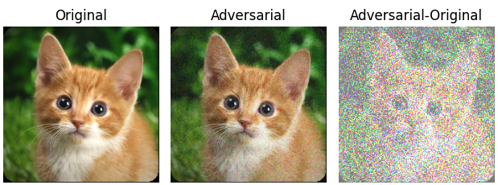<br>
</p>

**Targeted Attack**

    python imagenet_tutorial_hsja.py --norm l2 --target_image input/lion.png --num_iterations 32

<p align="center">
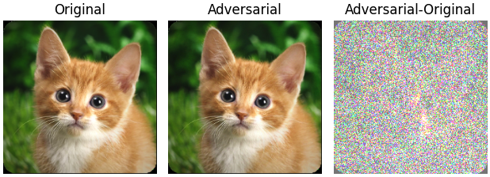<br>
</p>
The tiger cat, of class 282, was misidentified as class 291 lion after the black-box attack.

#### Usage of HopSkipJumpAttack (LInf)
**Untargeted Attack**

    python imagenet_tutorial_hsja.py --norm linf

<p align="center">
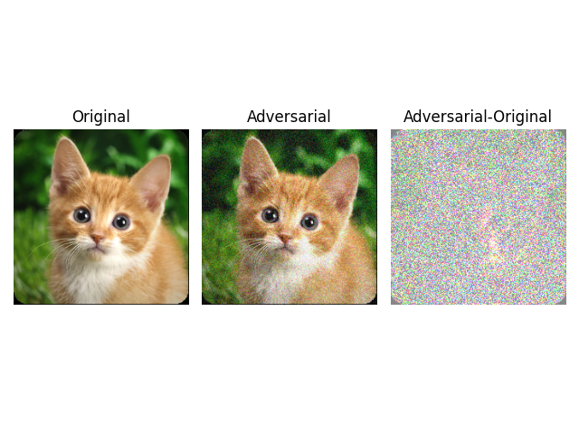<br>
</p>

**Targeted Attack**

    python imagenet_tutorial_hsja.py --norm linf --target_image input/lion.png --num_iterations 96
<p align="center">
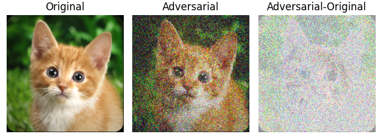<br>
</p>
The tiger cat, of class 282, was misidentified as class 291 lion after the black-box attack.

## Usage of white-box attack
In the case of FGSM, other attack methods are used in a similar way. The resnet50 pre-trained model trained on imagenet dataset is used as the attack object.

### FGSM
- **[tutorial python script](/AdvBox/examples/image_cls/imagenet_tutorial_fgsm.py)** FGSM is used to attack the ResNet50 model trained on the ImageNet dataset.
  - **Command-line parameters**
    - `--target`
    : target class. Default: -1.

#### Usage of untargeted FGSM

    python imagenet_tutorial_fgsm.py

``` shell
label=717
input img shape:  [3, 224, 224]
attack success, adversarial_label=654
diff shape:  (224, 224, 3)
fgsm attack done
```
The attack was successful, and the model recognized label 717 as label 654 for this image.

<p align="center">
<br>
</p>

#### Usage of targeted FGSM
The targeted attack category is 266:

    python imagenet_tutorial_fgsm.py --target=266

``` shell
label=717
input img shape:  [3, 224, 224]
attack success, adversarial_label=734
diff shape:  (224, 224, 3)
fgsm attack done
```
The attack was successful. Although the target label 266 was not identified by the model, the original label 717 was identified as label 734.

<p align="center">
<br>
</p>

### PGD
- **[tutorial python script](/AdvBox/examples/image_cls/imagenet_tutorial_pgd.py)** PGD is used to attack the ResNet50 model trained on the ImageNet dataset.
  - **Command-line parameters**
    - `--target`
    : target class. Default: -1.

#### Usage of untargeted PGD

    python imagenet_tutorial_pgd.py

<p align="center">
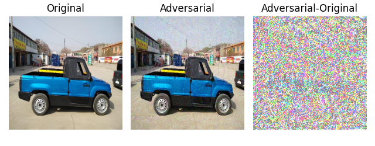<br>
</p>

#### Usage of targeted PGD

    python imagenet_tutorial_pgd.py --target=266

<p align="center">
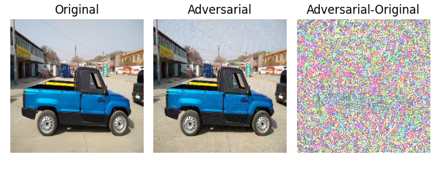<br>
</p>

### CW
- **[tutorial python script](/AdvBox/examples/image_cls/imagenet_tutorial_cw.py)** 
  - **Command-line parameters**
    - `--target`
    : target class. Default: 126.
    - `--class_dim`
    : Class number. Default: 1000.
    - `--image_shape`
    : Input image size Default: 3,224,224.

#### Usage of targeted CW

    python imagenet_tutorial_cw.py --target=126

<p align="center">
<br>
</p>

### BIM
- **[tutorial python script](/AdvBox/examples/image_cls/imagenet_tutorial_bim.py)** BIM is used to attack the ResNet50 model trained through the ImageNet dataset, and only untargeted attacks are supported

#### Usage of untargeted BIM

    python imagenet_tutorial_bim.py

<p align="center">
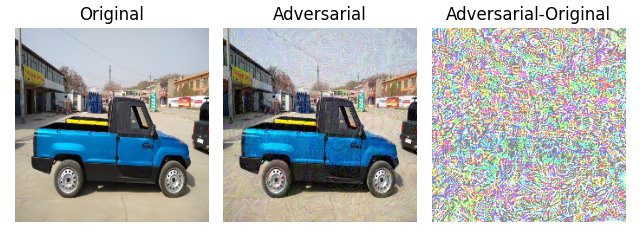<br>
</p>

### ILCM
- **[tutorial python script](/AdvBox/examples/image_cls/imagenet_tutorial_ilcm.py)** ILCM is used to attack the ResNet50 model trained on the ImageNet dataset.
  - **Command-line parameters**
    - `--target`
    : target class. Default: -1.

#### Usage of untargeted ILCM

    python imagenet_tutorial_ilcm.py

<p align="center">
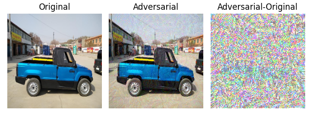<br>
</p>

#### Usage of targeted ILCM

    python imagenet_tutorial_ilcm.py --target=266

<p align="center">
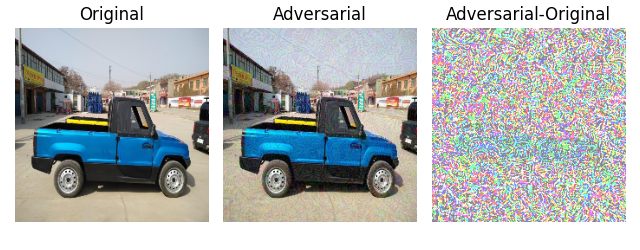<br>
</p>

### LBFGS
- **[tutorial python script](/AdvBox/examples/image_cls/imagenet_tutorial_lbfgs.py)** LBFGS is used to attack the ResNet50 model trained by the ImageNet dataset, and only supports targeted attacks.
  - **Command-line parameters**
    - `--target`
    : target class. Default: 290.

#### Usage of targeted LBFGS

    python imagenet_tutorial_lbfgs.py --target=290

<p align="center">
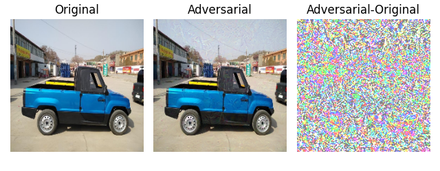<br>
</p>

### MI-FGSM
- **[tutorial python script](/AdvBox/examples/image_cls/imagenet_tutorial_mifgsm.py)** MI-FGSM is used to attack the ResNet50 model trained by ImageNet dataset.
  - **Command-line parameters**
    - `--target`
    : target class. Default: -1.

#### Usage of untargeted MI-FGSM

    python imagenet_tutorial_mifgsm.py

<p align="center">
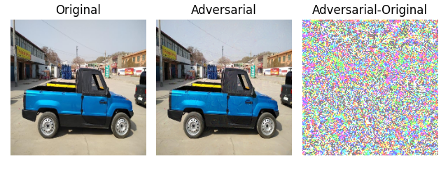<br>
</p>

#### Usage of targeted MI-FGSM

    python imagenet_tutorial_mifgsm.py --target=290

<p align="center">
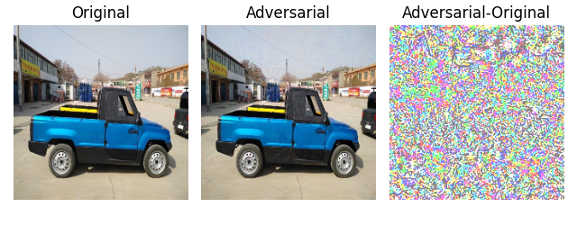<br>
</p>

## To generate an AE in AdvBox

```python
import sys
sys.path.append("..")
import paddle
import numpy as np
from adversary import Adversary
from attacks.cw import CW_L2
from models.whitebox import PaddleWhiteBoxModel

from classifier.towernet import transform_eval, TowerNet, MEAN, STD
model_0 = TowerNet(3, 10, wide_scale=1)
model_1 = TowerNet(3, 10, wide_scale=2)

advbox_model = PaddleWhiteBoxModel(
    [model_0, model_1],
    [1, 1.8],
    (0, 1),
    mean=MEAN,
    std=STD,
    input_channel_axis=0,
    input_shape=(3, 256, 256),
    loss=paddle.nn.CrossEntropyLoss(),
    nb_classes=10)

# init attack with the ensembled model
attack = CW_L2(advbox_model)

cifar10_test = paddle.vision.datasets.Cifar10(mode='test', transform=transform_eval)
test_loader = paddle.io.DataLoader(cifar10_test, batch_size=1)

data = test_loader().next()
img = data[0][0]
label = data[1]

# init adversary status
adversary = Adversary(img.numpy(), int(label))
target = np.random.randint(advbox_model.num_classes())
while label == target:
    target = np.random.randint(advbox_model.num_classes())
print(label, target)
adversary.set_status(is_targeted_attack=True, target_label=target)

# launch attack
adversary = attack(adversary, attack_iterations=50, verbose=True)

if adversary.is_successful():
    original_img = adversary.original
    adversarial_img = adversary.adversarial_example
    print("Attack succeeded.")
else:
    print("Attack failed.")
```


# Adversarial Training

## AdvBox Adversarial Training(advtraining) provides:
- Mainstream attack methods **[FGSM/PGD/BIM/ILCM/MI-FGSM](#AdvBox/attacks)** for model adversarial training.
- A unified yet generic adversarial training API: 
    + It supports the training data to be antagonized and perturbed in proportion, which is easy to use the existing training process of paddle classification model.
    + It supports the generation of adversarial samples for model fusion according to the set weights in advance.
    + Adversarial example generation supporting multiple adversarial attack methods.
- **[tutorial python script](/AdvBox/examples/image_adversarial_training/run_advtrain_main.py)** Adversarial training demonstration script, based on Preactresnet and Towernet models, Cifar10 and Mini-ImageNet datasets, PGD, FGSM, LD attack algorithms.
  - **Command-Line Parameters**
    - `--model`
    : Choose a model for adversarial training, default: preactresnet.
      + preactresnet
      + towernet
    - `--training_method`
    : Choose the adversarial training method, default: base(not adversarial training).
      + base
      + advtraining_natural
      + advtraining_TRADES
    - `--attack_method`
    : Choose the attack method, default: FGSM. Only use when training_method is not base.
      + FGSM
      + LD
      + PGD
    - `--dataset`
    : Choose dataset, default: cifar10.
      + cifar10
      + mini-imagenet
    - `--use_base_pretrain`
    : Whether to use the base pre-trained model, the default is no. The base training method only supports no. If yes, the best model trained by base will be used, so base mode training must be used first, default: no.
      + yes
      + no

- **[tutorial python script](/AdvBox/examples/image_adversarial_training/model_evaluation_tutorial.py)** Adversarial training model evaluation demonstration script, based on Preactresnet and Towernet models, Cifar10 and Mini-ImageNet data sets, PGD, FGSM, LD attack algorithms.
  - **Command-Line Parameters**
    - `--model`
    : Model to be evaluated, default: preactresnet.
      + preactresnet
      + towernet
    - `--training_method`
    : Adversarial training method used by the model to be evaluated, default: base.
      + base
      + advtraining_natural
      + advtraining_TRADES
    - `--attack_method`
    : The adversarial training attack method used by the model to be evaluated, default: FGSM. Only valid if the training method is not base.
      + FGSM
      + LD
      + PGD
    - `--dataset`
    : The dataset used by the model to be evaluated, default: cifar10.
      + cifar10
      + mini-imagenet
    - `--use_base_pretrain`
    : Whether the model is trained using a pre-trained model in base mode is to be evaluated, default: no
      + yes
      + no

## Run Adversarial Training Demonstration
The adversarial training demonstration contains the following experiments:
- PreactResnet adversarial training benchmark on Cifar10 & Mini-ImageNet.
- Towernet finetuning with PGD advtraining mode on Mini-ImageNet.

### Data Preparation
The experiments use the Cifar10 dataset and the Mini-ImageNet dataset.
- Cifar10 dataset, Using `paddle.Vision.Datasets.Cifar10` automatically download.
- Mini-ImageNet dataset, The `MINIIMAGENET` class provided in Advbox inherits the `paddle.io.DataSet` abstract class, It can be directly applied to training, the input for this class is the `.pkl` file. It should be noted that there is no crossover between the training set, test set and validation set of the mini-imagenet data set proposed in the original paper, so the dataset needs to be re-split before starting the training. Advbox provides the tools in `PaddleSleeve/AdvBox/examples/dataset/re_split.py`. First to download the complete set of mini-imagenet dataset to `PaddleSleeve/AdvBox/examples/dataset/mini-imagenet`, the complete dataset should contain a folder with input samples, and three label files in `.csv` format. The complete dataset can be downloaded from **[deep-learning-for-image-processing](https://github.com/WZMIAOMIAO/deep-learning-for-image-processing/blob/master/pytorch_classification/mini_imagenet/README.md)**. Run the following command when the download is complete:

```shell
cd PaddleSleeve/Advbox/examples/dataset/
python re_split.py
```

The script generates `re_split_mini-imagenet-cache-train.pkl`, `re_split_mini-imagenet-cache-test.pkl`, `re_split_mini-imagenet_labels.txt` in `PaddleSleeve/AdvBox/examples/dataset/mini-imagenet`.

### Run Demonstration
```shell
cd PaddleSleeve/AdvBox/examples/image_adversarial_training
python run_advtrain_main.py --model preactresnet --training_method advtraining_natural --attack_method FGSM --dataset cifar10 --use_base_pretrain no
python model_evaluation_tutorial.py --model preactresnet --training_method advtraining_natural --attack_method FGSM --dataset cifar10 --use_base_pretrain no
```

**PreactResnet Robustness Under Various Adversarial Training Settings**

| Evaluation-Method | Mini-ImageNet-FGSM | Mini-ImageNet-PGD-20 |
| :----: | :----: | :----: |
|   val_acc: _ / natural_acc: _ / fooling_rate: _   |   preactresnet   |   preactresnet   |
|   Natural Adversarial Training(p=0.1, fgsm(default))   |   0.980 / 0.986 / 0.282   |   0.980 / 0.986 / 0.984   |
|   Natural Adversarial Training(p=0.1, PGD(default))   |   0.983 / 0.978 / 0.098   |   0.983 / 0.982 /0.850   |
|  TRADES(beta=1.0, fgsm(default))  |  0.989 / 0.994 / 0.146  |  0.989 / 0.994 / 0.956  |
|  TRADES(beta=1.0, PGD(default))  |  0.990 / 0.992 / 0.028  |  0.990 / 0.996 / 0.540  |
|  TRADES(beta=1.0, LD(default))  |  0.990 / 0.996 / 0.020  |  0.990 / 0.992 / 0.734  |

As shown above, the adversarial trainings boost preactresnet's robustness at the cost of marginal model accuracy loss.

## Easy to use adversarial training
```python
import sys
sys.path.append("..")
import paddle
from attacks.gradient_method import FGSM, PGD
from attacks.cw import CW_L2
from models.whitebox import PaddleWhiteBoxModel
from defences.adversarial_transform import ClassificationAdversarialTransform

from classifier.towernet import transform_train, TowerNet, MEAN, STD
model_0 = TowerNet(3, 10, wide_scale=1)
model_1 = TowerNet(3, 10, wide_scale=2)

advbox_model = PaddleWhiteBoxModel(
    [model_0, model_1],
    [1, 1.8],
    (0, 1),
    mean=MEAN,
    std=STD,
    input_channel_axis=0,
    input_shape=(3, 256, 256),
    loss=paddle.nn.CrossEntropyLoss(),
    nb_classes=10)

# "p" controls the probability of this enhance.
# for base model training, we set "p" == 0, so we skipped adv trans data augmentation.
# for adv trained model, we set "p" == 0.05, which means each batch
# will probably contain 5% adv trans augmented data.
enhance_config1 = {"p": 0.1}
enhance_config2 = {"p": 0.1}
init_config3 = {"norm": 'L2', "epsilon_ball": 8/255, "epsilon_stepsize": 2/255}
enhance_config3 = {"p": 0.05,
                   "attack_iterations": 15,
                   "c_search_steps": 6,
                   "verbose": False}

adversarial_trans = ClassificationAdversarialTransform(advbox_model,
                                                       [FGSM, PGD, CW_L2],
                                                       [None, None, init_config3],
                                                       [enhance_config1, enhance_config2, enhance_config3])

cifar10_train = paddle.vision.datasets.Cifar10(mode='train', transform=transform_train)
train_loader = paddle.io.DataLoader(cifar10_train, batch_size=16)

for batch_id, data in enumerate(train_loader()):
    x_data = data[0]
    y_data = paddle.unsqueeze(data[1], 1)
    x_data_augmented, y_data_augmented = adversarial_trans(x_data.numpy(), y_data.numpy())
```

## Parallel Training
Advbox also supports adversarial training on multi-card devices. The following table summarizes all adversarial training methods in Advbox.

| Adversarial Training Methods                | Multi-method Training | Multi-card Training |
|---------------------------------------------|:--:|:--:|
| Natural Adversarial Training                | ✓  | ✓ |
| TRADES                                      | ✓  |   |
| Adversarial Weights Perturbation            |    | ✓ |
| FreeAT                                      |    | ✓ |

### **Multi-card Training Usage**

- ### Quick Start from Command-Line

   Parallel adversarial training tasks can be easily launched from command-line. The following command launches natural adversarial train on Resnet50 model using cifar10 dataset.
   
   ```
   cd PaddleSleeve/AdvBox/defences
   python -m paddle.distributed.launch advtrain_natural.py
   ```
   
   **Command-Line Parameters**
   - `--model` 
   : the CNN model to be trained. Currently support mobilenet_v1 and resnet seriers
   - `--dataset`
   : the dataset to use in training. Choose from `cifar10` or `mini-imagenet`
   - `--epoch`
   : number of epochs 
   - `--weights`
   : specify the model weights to load. Used when finetuning pretrained models or resuming from previous trainings
   - `opt_weights`
   : specify optimizer parameters when resuming trainings
   - `--save_path`
   : directory to save model after training
   - Other training schedules, including choices of batch_size, optimizer, learning rate, scheduler, regularizer, etc., can also be specified by corresponding flags

    **Examples**
    
    The Following commands launches adversarial weights perturbation training on 4 cards. This task trains resnet50 model on mini-imagenet dataset, with Adam optimizer used.
    ```
    export CUDA_VISIBLE_DEVICES=0,1,2,3
    cd PaddleSleeve/AdvBox/defences
    python -m paddle.distributed.launch advtrain_awp.py --model resnet50 --dataset mini-imagenet --epoch 80 --batch_size 256 --opt adam
    ```
    
- ### Incorporate into Existing Training Process

    It is also possible to launch the adversarial training process by directly calling the correspoding training method. This way provides more flexibility in configuring the training process. Models, datasets, and other method-specific parameters are all passed as function arguments. 

- **Parameters**

    - **Natural Advtrain**
    ```python 
        from defences.advtrain_natural import adversarial_train_natural
        from defences.pgd_perturb import PGDTransform
        training_config = {'epoch_num': 60,  # Number of epochs 
                           'advtrain_start_num': 20,  # Adversarial training may start later
                           'batch_size': 256,
                           'adversarial_trans': PGDTransform(model, p=0.1),  # Instance of PGDTransform class that generate AE
                           'optimizer': paddle.optimizer.Adam(learning_rate=0.0005,  # Instance of paddle optimizer
                                                              parameters=model.parameters()),
                           'metrics': paddle.metric.Accuracy(),  # Instance of paddle metric to evaluate model during training
                           'weights': None,  # Weights from previous training. None if new training
                           'opt_weights': None}

        save_path = os.path.join(os.path.dirname(__file__), "output/mini_imagenet_demo_advtrain_natural")
        adversarial_train_natural(model=m,
                                  train_set=train_dataset,
                                  test_set=test_dataset,
                                  save_path=save_path,
                                  **training_config)
    ```
    A ready-to-use demo script is available in `PaddleSleeve/AdvBox/examples/image_adversarial_training/mini_imagenet_demo_parallel_advtrain_natural.py`. No additional arguments or parameters need to be specified. Simply launch it by the following command to get first experience with adversarial training. 
    ```
    export CUDA_VISIBLE_DEVICES=0,1,2,3
    cd PaddleSleeve/AdvBox/examples/image_adversarial_training/
    python -m paddle.distributed.launch mini_imagenet_demo_parallel_advtrain_natural.py
    ```
    
    - **FreeAT**
    ```python
        from defences.advtrain_free import free_advtrain
        training_config = {'epoch_num': 20,  # Number of epochs 
                           'advtrain_start_num': 0,  # Adversarial training may start later
                           'batch_size': 256,
                           'steps': 8,  # Number of iterations for a mini-batch of data 
                           'optimizer': paddle.optimizer.Adam(learning_rate=0.0005,  # Instance of paddle optimizer
                                                              parameters=model.parameters()),
                           'metrics': paddle.metric.Accuracy(),  # Instance of paddle metric to evaluate model during training
                           'weights': None,  # Weights from previous training. None if new training
                           'opt_weights': None}

        save_path = os.path.join(os.path.dirname(__file__), "output/mini_imagenet_demo_freeat")
        free_advtrain(model=m,
                      train_set=train_dataset,
                      test_set=test_dataset,
                      save_path=save_path,
                      **training_config)
    ```
    A demo script is available here. `PaddleSleeve/AdvBox/examples/image_adversarial_training/mini_imagenet_demo_parallel_freeat.py`
    
    - **AWP**
    ```python
        from defences.advtrain_awp_mod_para import adversarial_train_awp
        from defences.pgd_perturb import PGDTransform
        training_config = {'epoch_num': 60,  # Number of epochs 
                           'advtrain_start_num': 20,  # Adversarial training may start later
                           'batch_size': 256,
                           'gamma': 0.01,  # Amplitude of adversarial weights perturbation
                           'adversarial_trans': PGDTransform(model, p=0.1),  # Instance of PGDTransform class that generate AE
                           'optimizer': paddle.optimizer.Adam(learning_rate=0.0005,  # Instance of paddle optimizer
                                                              parameters=model.parameters()),
                           'metrics': paddle.metric.Accuracy(),  # Instance of paddle metric to evaluate model during training
                           'weights': None,  # Weights from previous training. None if new training
                           'opt_weights': None}

        save_path = os.path.join(os.path.dirname(__file__), "output/mini_imagenet_demo_awp")
        adversarial_train_awp(model=m,
                              train_set=train_dataset,
                              test_set=test_dataset,
                              save_path=save_path,
                              **training_config)
    ```
    A demo script is available here. `PaddleSleeve/AdvBox/examples/image_adversarial_training/mini_imagenet_demo_parallel_awp.py`
    
- ### Resnet Robustness Under Various Adversarial Training Settings
    | Evaluation-Method | Mini-ImageNet-PGD-10 (L2 Norm) | Mini-ImageNet-PGD-10 (Linf Norm) |
    | :----: | :----: | :----: |
    |   natural_acc: _ / AE_acc: _ / fooling_rate: _  |   resnet50   |   resnet50   |
    |  No AdvTrain                             |  0.881 / 0.026 / 0.970 |  0.881 / 0.006 / 0.993 |
    |  Natural AdvTrain(p=0.1, PGD(default))   |  0.847 / 0.240 / 0.717 |  0.847 / 0.519 / 0.387 |
    |  FreeAT(steps=8)                         |  0.860 / 0.168 / 0.805 |  0.860 / 0.533 / 0.380 |
    |  AWP(gamma=0.02)                         |  0.843 / 0.501 / 0.406 |  0.843 / 0.281 / 0.667 |


# Adversarial Perturbation for Object Detection
Adversarial perturbation for object detection, usually grouped into digital and 
physical classes, is used for adversarial training and evaluating the robustness 
of object detectors. Here we provide a demonstration to generate adversarial 
perturbation for PP-YOLO in the digital world. The demonstration is based on 
**[PaddleDetection](https://github.com/PaddlePaddle/PaddleDetection)** . 

In `PaddleSleeve/AdvBox/examples/objectdetector`, we demonstrate the Target Ghosting 
attack, a method using PGD to produce perturbation to minimize Kullback-Leibler Divergence 
between victim and target feature map in PP-YOLO, successfully making it 
undetect the kite in `000000014439.jpg`. We obtain the feature map by feeding & sniffing 
the intermediate output `pcls`, the tensor stands for classification confidence in PP-YOLO.

- A kindly Reminder: since paddlepaddle <= 2.1 does not support gradient backward for
 `paddle.nn.SyncBatchNorm` in eval() mode, to run the demonstration, we need to modify 
 all `sync-bn` components in detector model into `bn` (because `paddle.nn.BatchNorm` 
 supports gradient backward in eval() mode).
 
 If you want to customize your own demo script, you should try the following methods:
 
- For object detector like `configs/yolov3/_base_/yolov3_darknet53.yml`,
 add `norm_type: bn` on the third line.
- For object detector like `configs/ppyolo/ppyolo_mbv3_large_coco.yml`, add `norm_type: bn` 
 on the 9 th line.

## Run Target Ghosting Demonstration
After changing all `sync-bn` components into `bn`, run the following commandlines.
```shell
cd PaddleSleeve/AdvBox/examples/objectdetector
python target_ghosting_demo.py -c configs/ppyolo/ppyolo_mbv3_large_coco.yml -o weights=https://paddledet.bj.bcebos.com/models/ppyolo_mbv3_large_coco.pdparams --infer_img=dataloader/demo_pics/000000014439.jpg --target_img=dataloader/demo_pics/masked_0014439.png
```

**Images used for Feed & Sniff**

<table align="center">
<tr>
    <td align="center"></td>
    <td align="center"></td>
</tr>

<tr>
    <td align="center">Original Image</td>
    <td align="center">Masked Image</td>
</tr>
</table>

The successful execution of the `target_ghosting_demo.py`, will produce the following outputs.

**Image Compares**

<table align="center">
<tr>
    <td align="center"></td>
    <td align="center"></td>
    <td align="center"></td>
</tr>

<tr>
    <td align="center">Original Image Detection Result</td>
    <td align="center">Masked Image Detection Result</td>
    <td align="center">Adv Image Detection Result</td>
</tr>
</table>

# Adversarial example denoising

## AdvBox denoising provides:

- [Basic denoising methods](AdvBox/denoisers)
    + Gaussian Filter
    + Median Filter
    + Mean Filter
    + Box Filter
    + Bilateral Filter
    + Pixel Deflection
    + JPEG Compression
    + DCT Compression
    + PCA Compression
    + Gaussian Noise
    + Salt and Pepper Noise
    + Random Resize and Padding
    + Feature Squeezing
- **[tutorial python script](AdvBox/examples/image_cls/imagenet_tutorial_fgsm_denoise.py)** Using FGSM to attack a single image and then denoised using a denoising method.
  - **Command-line parameters**
    - `--image_path`  
    : the path of the input image, one can upload images to the folder: AdvBox/examples/image_cls/input. We provide some images sampled from the mini-imagenet dataset:
      + input/schoolbus.png
      + input/vase.png
      + input/lion.png
      + input/hourglass.png
      + input/crate.png
      + input/malamute.png
    - `--method`  
    : the name of the denoising method:
      + GaussianBlur
      + MedianBlur
      + MeanFilter
      + BoxFilter
      + BilateralFilter
      + PixelDeflection
      + JPEGCompression
      + DCTCompression
      + PCACompression
      + GaussianNoise
      + SaltPepperNoise
      + ResizePadding
      + FeatureSqueezing
    - `--target`
    : target class. Default: -1.

-  **[tutorial python script](/AdvBox/examples/image_cls/mini_imagenet_evaluation_tool.py)** The FGSM attack is used on the Mini-ImageNet dataset and then denoised using the denoising method.
  - **Command-line parameters**
    - `--dataset_path`  
    : the path of the mini-imagenet dataset (.pkl), one can download the .pkl mini-imagenet dataset to the folder: PaddleSleeve/AdvBox/examples/image_cls/input.
    - `--label_path`  
    : the path of the mini-imagenet label (.txt), one can download the put the label file to the folder: PaddleSleeve/AdvBox/examples/image_cls/input.
    - `--mode`
    : dataset type, the 'train', 'test', or 'val' mode. Default 'test'.
    - `--method`  
    : the name of the denoising method:
      + GaussianBlur
      + MedianBlur
      + MeanFilter
      + BoxFilter
      + BilateralFilter
      + PixelDeflection
      + JPEGCompression
      + DCTCompression
      + PCACompression
      + GaussianNoise
      + SaltPepperNoise
      + ResizePadding
      + FeatureSqueezing
    - `--target`
    : target class. Default: -1.

## Usage of Denoising methods
Examples of using the denoising methods on an image sample or on the mini-imagenet dataset.

### On an image sample
Given an input image, the FGSM is first used for generating the adversarial example (AE), and then the denoising method is applied to the input image and the AE.

#### Run:
```shell
cd PaddleSleeve/Advbox/examples/image_cls
python imagenet_tutorial_fgsm_denoise.py --method='GaussianBlur' --image_path='input/vase.png'
```

#### Output:
```
input image shape:  [3, 84, 84]
input image label: vase
FGSM attack succeeded, adversarial_label: pitcher, ewer
GaussianBlur denoise succeeded
GaussianBlur denoise doesn't change the label of the input image
```

#### Illustration:
```
1. The original model recognizes the input image as: vase;  
2. Using FGSM to obtain an adversarial example (AE), the label of the AE is: pitcher, ewer;  
3. Using GaussianBlur to denoise, the label of the denoising result is vase.
```

#### Visualizing the results
<p align="center">
<br>
</p>

#### Usage of the other denoising methods
**Median Filter**
```shell
python imagenet_tutorial_fgsm_denoise.py --method='MedianBlur' --image_path='input/vase.png'
```
<p align="center">
<br>
</p>

**Mean Filter**
```shell
python imagenet_tutorial_fgsm_denoise.py --method='MeanFilter' --image_path='input/lion.png'
```
<p align="center">
<br>
</p>

**Box Filter**
```shell
python imagenet_tutorial_fgsm_denoise.py --method='BoxFilter' --image_path='input/hourglass.png'
```
<p align="center">
<br>
</p>

**Bilateral Filter**
```shell
python imagenet_tutorial_fgsm_denoise.py --method='BilateralFilter' --image_path='input/vase.png'
```
<p align="center">
<br>
</p>

**Pixel Deflection**
```shell
python imagenet_tutorial_fgsm_denoise.py --method='PixelDeflection' --image_path='input/malamute.png'
```
<p align="center">
<br>
</p>

**JPEG Compression**
```shell
python imagenet_tutorial_fgsm_denoise.py --method='JPEGCompression' --image_path='input/vase.png'
```
<p align="center">
<br>
</p>

### On the mini-imagenet dataset
Given the mini-imagenet dataset, the FGSM is first used for generating the adversarial example (AE), and then the denoising method is applied to the input image and the AE.

#### Data Preparation
The MINIIMAGENET class in Advbox inherits `paddle.io.Dataset` and can be directly incorporated into adversarial training. Instance of MINIIMAGENET reads `.pkl` file. A cached mini-imagenet pickle file can be downloaded from **[Kaggle](https://www.kaggle.com/datasets/whitemoon/miniimagenet)**. Download `mini-imagenet-cache-test.pkl` to `PaddleSleeve/AdvBox/examples/image_cls/input`. We also need a file with labels for the mini-imagenet categories, we provide `mini_imagenet_test_labels.txt` in `PaddleSleeve/AdvBox/examples/image_cls/input`.


#### Run:
```shell
cd PaddleSleeve/Advbox/examples/image_cls
python mini_imagenet_evaluation_tool.py --method='GaussianBlur' --dataset_path='input/mini-imagenet-cache-test.pkl' --label_path='input/mini_imagenet_test_labels.txt'
```

#### Output:
```
100%|█████| 12000/12000 [2:45:59<00:00,  1.20it/s, ORI_ACC=0.413, AE_ACC=0.081, DE_AE_ACC=0.186, DE_ORI_ACC=0.410]
```

#### Quantitative results (Acc.):
| Denoising method | Clean Image | AE | Denoised AE | Denoised Clear Image |
|:-|:-:|:-:|:-:|:-:|
| GaussianBlur    | 41.3%  | 8.1%  | 18.6% | 41.0% |
| MedianBlur      | 41.3%  | 8.1%  | 20.5% | 27.8% |
| MeanFilter      | 41.3%  | 8.1%  | 20.7% | 26.3% |
| BoxFilter       | 41.3%  | 8.1%  | 20.7% | 26.3% |
| BilateralFilter | 41.3%  | 8.1%  | 19.7% | 41.1% |
| PixelDeflection | 41.3%  | 8.1%  | 16.1% | 38.0% |
| JPEGCompression | 41.3%  | 8.1%  | 25.9% | 39.9% |
| DCTCompression  | 41.3%  | 8.1%  | 28.5% | 39.3% |
| PCACompression  | 41.3%  | 8.1%  | 19.2% | 41.2% |
| GaussianNoise   | 41.3%  | 8.1%  | 18.8% | 41.1% |
| SaltPepperNoise | 41.3%  | 8.1%  | 18.5% | 41.0% | 
| ResizePadding   | 41.3%  | 8.1%  | 31.0% | 40.2% |
| FeatureSqueezing (3 bits)| 41.3%  | 8.1%  | 11.6% | 32.5% |

# Other Modules
## Object Detection Attack
Module of object detection attack in **[obj_detection](/AdvBox/obj_detection)** .

## Image Segmentation Attack
Module of image segmentation attack in **[img_segmentation](/AdvBox/img_segmentation)** .

## OCR Attack
Module of OCR attack in **[text_recognition](/AdvBox/text_recognition)** .

## Tabular Data Attack
Module of Tabular Data Attack in **[tabular_adversarial_toolbox](/AdvBox/tabular_adversarial_toolbox)** .

# Contributing
We appreciate your contributions!
