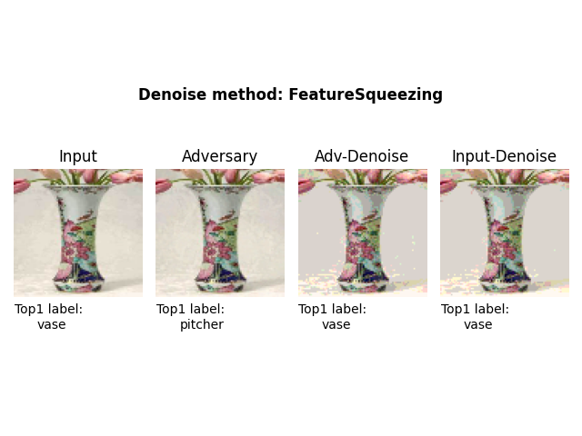
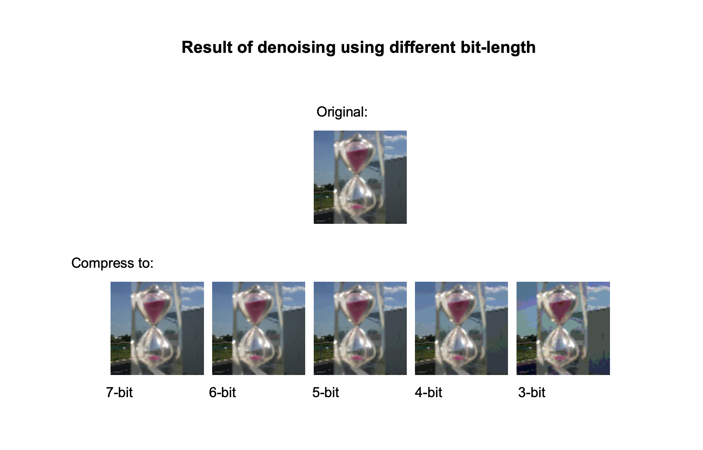

English | [简体中文](./README_cn.md)

# AdvBox

AdvBox (Adversarialbox) is a Paddlepaddle Open Source project that provides users with a series of AI model security tools, including adversarial examples (AEs) generation techniques and model-based adversarial data augmentation.

Since the existence of adversarial examples may be an inherent weakness of deep learning models, it is important to benchmark deep learning models and improve their robustness against AEs. The purpose of the AdvBox is to help users generate and use adversarial examples conveniently in Paddlepaddle.

The project also contains plenty of useful tutorials for different AI applications and scenarios.

(A command-line tool is given to generate adversarial examples with Zero-Coding which is inspired and based on FoolBox v1.)

## Attack Methods


| Adversarial Attack Methods                                    | White-Box | Black-Box | Ensemble  |  AdvTrain   |
|-------------------------------------------------------------------------------------------------------------------------------------------------------------------------------------------------------------|:--:|:--:|:--:|:--:|
| [FGSM (FastGradientSignMethodAttack)](attacks/gradient_method.py)                | ✓  |   | ✓ | ✓ |
| [FGSMT (FastGradientSignMethodTargetedAttack)](attacks/gradient_method.py)       | ✓  |   | ✓ | ✓ |
| [BIM (BasicIterativeMethodAttack)](attacks/gradient_method.py)                   | ✓  |   | ✓ | ✓ |
| [ILCM (IterativeLeastLikelyClassMethodAttack)](attacks/gradient_method.py)       | ✓  |   | ✓ | ✓ |
| [MI-FGSM (MomentumIteratorAttack)](attacks/gradient_method.py)                   | ✓  |   | ✓ | ✓ |
| [PGD (ProjectedGradientDescentAttack)](attacks/gradient_method.py)               | ✓  |   | ✓ | ✓ |
| [CW_L2 (CWL2Attack)](attacks/cw.py)                                              | ✓  |   |   | ✓ |
| [SinglePixelAttack](attacks/single_pixel_attack.py)                              |    | ✓ |   |   |
| [HopSkipJumpAttack](attacks/hop_skip_jump_attack.py)                             |    | ✓ |   |   |
| [GeneticPixelAttack](attacks/genetic_pixel_attack.py)                            |    | ✓ |   |   |
| [SquareAttack](attacks/square_attack.py)                                         |    | ✓ |   |   |

<p align="center">
<br>
PGD targeted attack
</p>

<p align="center">
<br>
C/W targeted attack
</p>


### Genetic Pixels attack
Genetic Pixels Attack is an attacking method in L0 norm. It inherits Single Pixel Attack and utilizes genetic algorithm to enhance the performance. 
<p align="center">
<br>
</p>

**Usage:** 
- **Command-line parameters**
    - `--max_gen`  
    : maximum iterative steps this attack will perform 
    - `--image_path`
    : path of the input image, e.g. example/image_cls/input/cat_example.png
    - `--target`
    : target class label, -1 if untargeted attack
    - `--max_pixels`  
    : the maximum number of pixels allowed to be changed. This is equivalent to the radius of Lp ball in L0

        
### Square Attack (L2)
<p align="center">
<br>
Untargeted Attack
</p>

<p align="center">
<br>
Targeted Attack
</p>


**Usage:** 
- **Command-line parameters**
    - `--window_size`  
    : the initial size of the noise window
    - `--max_steps`  
    : the maximum iterative steps this attack will perform 
    - `--image_path`
    : the path of the input image, e.g. example/image_cls/input/cat_example.png
    - `--target`
    : the target class label, -1 if untargeted attack
    - `eps`
    : radius of the Lp ball
    
 
 
 ### Square Attack (LInf)
<p align="center">
<br>
Untargeted Attack
</p>

<p align="center">
<br>
Targeted Attack
</p>

**Usage:** 
- **Command-line parameters**
    - `--window_size`  
    : the initial size of the noise window
    - `--max_steps`  
    : the maximum iterative steps this attack will perform 
    - `--image_path`
    : the path of the input image, e.g. example/image_cls/input/cat_example.png
    - `--target`
    : the target class label, -1 if untargeted attack
    - `eps`
    : radius of the Lp ball
    
#### Square Attack Demo
- A **[tutorial python script](#AdvBox/examples/imagenet_tutorial_sq.py)** conducts Square Attack on pretrained ResNet50 model.
  - **Command-line parameters**
    - `--image_path`  
    : the path of the input image, one can upload images to the folder: AdvBox/examples/image_cls/input. We provide some images sampled from the mini-imagenet dataset:
      + input/schoolbus.png
      + input/vase.png
      + input/lion.png
      + input/hourglass.png
      + input/crate.png
      + input/malamute.png
    - `--norm`
    : specify which norm to use, valid choices are 'L2' or 'Linf'
    - `--target`
    : target class label, -1 if untargeted attack
    - `--eps`
    : the radius of the Lp ball
    - `--max_steps`
    : maximum steps the attack will perform
    
    


## To generate an AE in AdvBox

```python
import sys
sys.path.append("..")
import paddle
import numpy as np
from adversary import Adversary
from attacks.cw import CW_L2
from models.whitebox import PaddleWhiteBoxModel

from classifier.towernet import transform_eval, TowerNet, MEAN, STD
model_0 = TowerNet(3, 10, wide_scale=1)
model_1 = TowerNet(3, 10, wide_scale=2)

advbox_model = PaddleWhiteBoxModel(
    [model_0, model_1],
    [1, 1.8],
    (0, 1),
    mean=MEAN,
    std=STD,
    input_channel_axis=0,
    input_shape=(3, 256, 256),
    loss=paddle.nn.CrossEntropyLoss(),
    nb_classes=10)

# init attack with the ensembled model
attack = CW_L2(advbox_model)

cifar10_test = paddle.vision.datasets.Cifar10(mode='test', transform=transform_eval)
test_loader = paddle.io.DataLoader(cifar10_test, batch_size=1)

data = test_loader().next()
img = data[0][0]
label = data[1]

# init adversary status
adversary = Adversary(img.numpy(), int(label))
target = np.random.randint(advbox_model.num_classes())
while label == target:
    target = np.random.randint(advbox_model.num_classes())
print(label, target)
adversary.set_status(is_targeted_attack=True, target_label=target)

# launch attack
adversary = attack(adversary, attack_iterations=50, verbose=True)

if adversary.is_successful():
    original_img = adversary.original
    adversarial_img = adversary.adversarial_example
    print("Attack succeeded.")
else:
    print("Attack failed.")
```


# Adversarial Training

## AdvBox Adversarial Training(advtraining) provides:
- Mainstream attack methods **[FGSM/PGD/BIM/ILCM/MI-FGSM](#AdvBox/attacks)** for model adversarial training.
- A unified yet generic adversarial training API: 
    + AEs generation/transformation in data-flow style, which can be easily incorporated into existing training process.
    + Supports weighted model ensembling for AEs generation/transformation.
    + Supports multi-methods adversarial training.
    + Allows users to specify settings for each adversarial attack method, including their probabilities to take effect.
- Advtraining **[tutorial scripts](#AdvBox/examples/image_adversarial_training)** for classification task on Cifar10 & Mini-ImageNet dataset.

## Run Adversarial Training Demonstration
The adversarial training demonstration contains the following experiments:
- PreactResnet adversarial training benchmark on Cifar10 & Mini-ImageNet.
- Towernet finetuning with PGD advtraining mode on Mini-ImageNet.
- Peripheral experiemnts to be finished.

Run the following commandlines to launch the demonstration.
1. `cd AdvBox/examples/image_adversarial_training`
2. `python run_advtrain_main.py`
3. `python model_evaluation_tutorial.py`

**PreactResnet Robustness Under Various Adversarial Training Settings**

| Evaluation-Method | Mini-ImageNet-FGSM | Mini-ImageNet-PGD-20 |
| :----: | :----: | :----: |
|   val_acc: _ / natural_acc: _ / fooling_rate: _   |   preactresnet   |   preactresnet   |
|   Natural Adversarial Training(p=0.1, fgsm(default))   |   0.980 / 0.986 / 0.282   |   0.980 / 0.986 / 0.984   |
|   Natural Adversarial Training(p=0.1, PGD(default))   |   0.983 / 0.978 / 0.098   |   0.983 / 0.982 /0.850   |
|  TRADES(beta=1.0, fgsm(default))  |  0.989 / 0.994 / 0.146  |  0.989 / 0.994 / 0.956  |
|  TRADES(beta=1.0, PGD(default))  |  0.990 / 0.992 / 0.028  |  0.990 / 0.996 / 0.540  |
|  TRADES(beta=1.0, LD(default))  |  0.990 / 0.996 / 0.020  |  0.990 / 0.992 / 0.734  |

As shown above, the adversarial trainings boost preactresnet's robustness at the cost of 
marginal model accuracy loss.

## Easy to use adversarial training
```python
import sys
sys.path.append("..")
import paddle
from attacks.gradient_method import FGSM, PGD
from attacks.cw import CW_L2
from models.whitebox import PaddleWhiteBoxModel
from defences.adversarial_transform import ClassificationAdversarialTransform

from classifier.towernet import transform_train, TowerNet, MEAN, STD
model_0 = TowerNet(3, 10, wide_scale=1)
model_1 = TowerNet(3, 10, wide_scale=2)

advbox_model = PaddleWhiteBoxModel(
    [model_0, model_1],
    [1, 1.8],
    (0, 1),
    mean=MEAN,
    std=STD,
    input_channel_axis=0,
    input_shape=(3, 256, 256),
    loss=paddle.nn.CrossEntropyLoss(),
    nb_classes=10)

# "p" controls the probability of this enhance.
# for base model training, we set "p" == 0, so we skipped adv trans data augmentation.
# for adv trained model, we set "p" == 0.05, which means each batch
# will probably contain 5% adv trans augmented data.
enhance_config1 = {"p": 0.1}
enhance_config2 = {"p": 0.1}
init_config3 = {"norm": 'L2', "epsilon_ball": 8/255, "epsilon_stepsize": 2/255}
enhance_config3 = {"p": 0.05,
                   "attack_iterations": 15,
                   "c_search_steps": 6,
                   "verbose": False}

adversarial_trans = ClassificationAdversarialTransform(advbox_model,
                                                       [FGSM, PGD, CW_L2],
                                                       [None, None, init_config3],
                                                       [enhance_config1, enhance_config2, enhance_config3])

cifar10_train = paddle.vision.datasets.Cifar10(mode='train', transform=transform_train)
train_loader = paddle.io.DataLoader(cifar10_train, batch_size=16)

for batch_id, data in enumerate(train_loader()):
    x_data = data[0]
    y_data = paddle.unsqueeze(data[1], 1)
    x_data_augmented, y_data_augmented = adversarial_trans(x_data.numpy(), y_data.numpy())
```

## Parallel Training
Advbox also supports adversarial training on multi-card devices. The following table summarizes all adversarial training methods in Advbox.

| Adversarial Training Methods                | Multi-method Training | Multi-card Training |
|---------------------------------------------|:--:|:--:|
| Natural Adversarial Training                | ✓  | ✓ |
| TRADES                                      | ✓  |   |
| Adversarial Weights Perturbation            |    | ✓ |
| FreeAT                                      |    | ✓ |

### **Multi-card Training Usage**

- ### Data Preparation
   The MINIIMAGENET class in Advbox inherits `paddle.io.Dataset` and can be directly incorporated into adversarial training. Instance of MINIIMAGENET reads `.pkl` file. A cached mini-imagenet pickle file can be downloaded from **[Kaggle](https://www.kaggle.com/datasets/whitemoon/miniimagenet)**. Users need to change the following lines in the demo scripts to the path to their own dataset. 
   ```python
    ... 
   
    # Load dataset
    transform = T.Compose([T.Normalize(MEAN, STD, data_format='CHW')])
    
    # Change to your dataset 
    train_dataset_path = os.path.join(os.path.realpath(__file__ + "../" * 3),
                                      'dataset/mini-imagenet/mini-imagenet-cache-train.pkl')
    val_dataset_path = os.path.join(os.path.realpath(__file__ + "../" * 3),
                                    'dataset/mini-imagenet/mini-imagenet-cache-test.pkl')
                                
    ...
    ```
    
 - **Re-split Dataset**
    
    Note that the train, val, and test sets in the original paper contain completely seperate classes , so users may want to re-split the dataset before use. Advbox provides a tool in `examples/dataset/split.py` that splits the dataset and generates corresponding `.pkl` file. To use it, users need to download the entire mini-imagenet dataset, including all images and three annotation files in `.csv` format. These could be downloaded from **[deep-learning-for-image-processing](https://github.com/WZMIAOMIAO/deep-learning-for-image-processing)**. Once finished downloading the dataset, modify the following line in the code and run the script. 
    ```python
    
    # Change to the path on your own device
    dataset_dir = '/Path to Your Dataset/'
    image_dir = '/Path to Your Images/'
    train_save_path = '/Place to Save Cached TrainSet/'
    test_save_path = '/Place to Save Cached TestSet/'
    ```
    
    Run the split tool.
    ```
    python examples/dataset/split.py
    ```

- ### Quick Start from Command-Line
   Parallel adversarial training tasks can be easily launched from command-line. The following command launches natural adversarial train on Resnet50 model using cifar10 dataset.
   
   ```
   python -m paddle.distributed.launch defences/advtrain_natural.py
   ```
   
   **Command-Line Parameters**
   - `--model` 
   : the CNN model to be trained. Currently support mobilenet_v1 and resnet seriers
   - `--dataset`
   : the dataset to use in training. Choose from `cifar10` or `mini-imagenet`
   - `--epoch`
   : number of epochs 
   - `--weights`
   : specify the model weights to load. Used when finetuning pretrained models or resuming from previous trainings
   - `opt_weights`
   : specify optimizer parameters when resuming trainings
   - `--save_path`
   : directory to save model after training
   - Other training schedules, including choices of batch_size, optimizer, learning rate, scheduler, regularizer, etc., can also be specified by corresponding flags

    **Examples**
    
    The Following commands launches adversarial weights perturbation training on 4 cards. This task trains resnet50 model on mini-imagenet dataset, with Adam optimizer used.
    ```
    export CUDA_VISIBLE_DEVICES=0,1,2,3
    python -m paddle.distributed.launch defences/advtrain_awp.py --model resnet50 --dataset mini-imagenet --epoch 80 --batch_size 256 --opt adam
    
- ### Incorporate into Existing Training Process

    It is also possible to launch the adversarial training process by directly calling the correspoding training method. This way provides more flexibility in configuring the training process. Models, datasets, and other method-specific parameters are all passed as function arguments. 

- **Parameters**

    - **Natural Advtrain**
    ```python 
        from defences.advtrain_natural import adversarial_train_natural
        from defences.pgd_perturb import PGDTransform
        training_config = {'epoch_num': 60,  # Number of epochs 
                           'advtrain_start_num': 20,  # Adversarial training may start later
                           'batch_size': 256,
                           'adversarial_trans': PGDTransform(model, p=0.1),  # Instance of PGDTransform class that generate AE
                           'optimizer': paddle.optimizer.Adam(learning_rate=0.0005,  # Instance of paddle optimizer
                                                              parameters=model.parameters()),
                           'metrics': paddle.metric.Accuracy(),  # Instance of paddle metric to evaluate model during training
                           'weights': None,  # Weights from previous training. None if new training
                           'opt_weights': None}

        save_path = os.path.join(os.path.dirname(__file__), "output/mini_imagenet_demo_advtrain_natural")
        adversarial_train_natural(model=m,
                                  train_set=train_dataset,
                                  test_set=test_dataset,
                                  save_path=save_path,
                                  **training_config)
    ```
    A ready-to-use demo script is available in `examples/image_adversarial_training/mini_imagenet_tutorial_advtrain_natural.py`. No additional arguments or parameters need to be specified. Simply launch it by the following command to get first experience with adversarial training. 
    ```
    cd Advbox
    export CUDA_VISIBLE_DEVICES=0,1,2,3
    python -m paddle.distributed.launch examples/image_adversarial_training/mini_imagenet_tutorial_parallel_advtrain_natural.py
    ```
    
    - **FreeAT**
    ```python
        from defences.advtrain_free import free_advtrain
        training_config = {'epoch_num': 20,  # Number of epochs 
                           'advtrain_start_num': 0,  # Adversarial training may start later
                           'batch_size': 256,
                           'steps': 8,  # Number of iterations for a mini-batch of data 
                           'optimizer': paddle.optimizer.Adam(learning_rate=0.0005,  # Instance of paddle optimizer
                                                              parameters=model.parameters()),
                           'metrics': paddle.metric.Accuracy(),  # Instance of paddle metric to evaluate model during training
                           'weights': None,  # Weights from previous training. None if new training
                           'opt_weights': None}

        save_path = os.path.join(os.path.dirname(__file__), "output/mini_imagenet_demo_freeat")
        free_advtrain(model=m,
                      train_set=train_dataset,
                      test_set=test_dataset,
                      save_path=save_path,
                      **training_config)
    ```
    A demo script is available here. `examples/image_adversarial_training/mini_imagenet_tutorial_parallel_freeat.py`
    
    - **AWP**
    ```python
        from defences.advtrain_awp_mod_para import adversarial_train_awp
        from defences.pgd_perturb import PGDTransform
        training_config = {'epoch_num': 60,  # Number of epochs 
                           'advtrain_start_num': 20,  # Adversarial training may start later
                           'batch_size': 256,
                           'gamma': 0.01,  # Amplitude of adversarial weights perturbation
                           'adversarial_trans': PGDTransform(model, p=0.1),  # Instance of PGDTransform class that generate AE
                           'optimizer': paddle.optimizer.Adam(learning_rate=0.0005,  # Instance of paddle optimizer
                                                              parameters=model.parameters()),
                           'metrics': paddle.metric.Accuracy(),  # Instance of paddle metric to evaluate model during training
                           'weights': None,  # Weights from previous training. None if new training
                           'opt_weights': None}

        save_path = os.path.join(os.path.dirname(__file__), "output/mini_imagenet_demo_awp")
        adversarial_train_awp(model=m,
                              train_set=train_dataset,
                              test_set=test_dataset,
                              save_path=save_path,
                              **training_config)
    ```
    A demo script is available here. `examples/image_adversarial_training/mini_imagenet_tutorial_parallel_awp.py`
    
- ### Resnet Robustness Under Various Adversarial Training Settings
    | Evaluation-Method | Mini-ImageNet-PGD-10 (L2 Norm) | Mini-ImageNet-PGD-10 (Linf Norm) |
    | :----: | :----: | :----: |
    |   natural_acc: _ / AE_acc: _ / fooling_rate: _  |   resnet50   |   resnet50   |
    |  No AdvTrain                             |  0.881 / 0.026 / 0.970 |  0.881 / 0.006 / 0.993 |
    |  Natural AdvTrain(p=0.1, PGD(default))   |  0.847 / 0.240 / 0.717 |  0.847 / 0.519 / 0.387 |
    |  FreeAT(steps=8)                         |  0.860 / 0.168 / 0.805 |  0.860 / 0.533 / 0.380 |
    |  AWP(gamma=0.02)                         |  0.843 / 0.501 / 0.406 |  0.843 / 0.281 / 0.667 |


# Adversarial Perturbation for Object Detection
Adversarial perturbation for object detection, usually grouped into digital and 
physical classes, is used for adversarial training and evaluating the robustness 
of object detectors. Here we provide a demonstration to generate adversarial 
perturbation for PP-YOLO in the digital world. The demonstration is based on 
**[PaddleDetection](#https://github.com/PaddlePaddle/PaddleDetection)** . 

In `PaddleSleeve/AdvBox/examples/objectdetector`, we demonstrate the Target Ghosting 
attack, a method using PGD to produce perturbation to minimize Kullback-Leibler Divergence 
between victim and target feature map in PP-YOLO, successfully making it 
undetect the kite in `000000014439.jpg`. We obtain the feature map by feeding & sniffing 
the intermediate output `pcls`, the tensor stands for classification confidence in PP-YOLO.

- A kindly Reminder: since paddlepaddle <= 2.1 does not support gradient backward for
 `paddle.nn.SyncBatchNorm` in eval() mode, to run the demonstration, we need to modify 
 all `sync-bn` components in detector model into `bn` (because `paddle.nn.BatchNorm` 
 supports gradient backward in eval() mode).
 
 If you want to customize your own demo script, you should try the following methods:
 
- For object detector like `configs/yolov3/_base_/yolov3_darknet53.yml`,
 add `norm_type: bn` on the third line.
- For object detector like `configs/ppyolo/ppyolo_mbv3_large_coco.yml`, add `norm_type: bn` 
 on the 9 th line.

## Run Target Ghosting Demonstration
After changing all `sync-bn` components into `bn`, run the following commandlines.
```python
cd PaddleSleeve/AdvBox/examples/objectdetector
python target_ghosting_demo.py -c configs/ppyolo/ppyolo_mbv3_large_coco.yml -o weights=https://paddledet.bj.bcebos.com/models/ppyolo_mbv3_large_coco.pdparams --infer_img=dataloader/demo_pics/000000014439.jpg --target_img=dataloader/demo_pics/masked_0014439.png
```

**Images used for Feed & Sniff**

<table align="center">
<tr>
    <td align="center"></td>
    <td align="center"></td>
</tr>

<tr>
    <td align="center">Original Image</td>
    <td align="center">Masked Image</td>
</tr>
</table>

The successful execution of the `target_ghosting_demo.py`, will produce the following outputs.

**Image Compares**

<table align="center">
<tr>
    <td align="center"></td>
    <td align="center"></td>
    <td align="center"></td>
</tr>

<tr>
    <td align="center">Original Image Detection Result</td>
    <td align="center">Masked Image Detection Result</td>
    <td align="center">Adv Image Detection Result</td>
</tr>
</table>

# Adversarial example denoising

## AdvBox denoising provides:

- [Basic denoising methods](#AdvBox/denoisers)
    + Gaussian Filter
    + Median Filter
    + Mean Filter
    + Box Filter
    + Bilateral Filter
    + Pixel Deflection
    + JPEG Compression
    + DCT Compression
    + PCA Compression
    + Gaussian Noise
    + Salt and Pepper Noise
    + Random Resize and Padding
    + Feature Squeezing
- A **[tutorial python script](#AdvBox/examples/imagenet_tutorial_fgsm_denoise.py)** uses the FGSM attack for denoising demonstration.
  - **Command-line parameters**
    - `--image_path`  
    : the path of the input image, one can upload images to the folder: AdvBox/examples/image_cls/input. We provide some images sampled from the mini-imagenet dataset:
      + input/schoolbus.png
      + input/vase.png
      + input/lion.png
      + input/hourglass.png
      + input/crate.png
      + input/malamute.png
    - `--method`  
    : the name of the denoising method:
      + GaussianBlur
      + MedianBlur
      + MeanFilter
      + BoxFilter
      + BilateralFilter
      + PixelDeflection
      + JPEGCompression
      + DCTCompress
      + PCACompress
      + GaussianNoise
      + SaltPepperNoise
      + ResizePadding
      + FeatureSqueezing

- A **[evaluation python script](#AdvBox/examples/imagenet_tutorial_fgsm_denoise.py)** uses the FGSM attack and the denoising method on the Mini-ImageNet dataset.
  - **Command-line parameters**
    - `--dataset_path`  
    : the path of the mini-imagenet dataset (.pkl), one can download the .pkl mini-imagenet dataset to the folder: AdvBox/examples/image_cls/input.
    - `--label_path`  
    : the path of the mini-imagenet label (.txt), one can download the put the label file to the folder: AdvBox/examples/image_cls/input. We provide the labels of the testing set:
      + input/mini_imagenet_test_labels.txt
    - `--mode`
    : dataset type, the 'train', 'test', or 'val' mode. Default 'test'.
    - `--method`  
    : the name of the denoising method:
      + GaussianBlur
      + MedianBlur
      + MeanFilter
      + BoxFilter
      + BilateralFilter
      + PixelDeflection
      + JPEGCompression
      + DCTCompress
      + PCACompress
      + GaussianNoise
      + SaltPepperNoise
      + ResizePadding
      + FeatureSqueezing
    - `--method`  

## Usage of Denoising methods
Examples of using the denoising methods on an image sample or on the mini-imagenet dataset.

### On an image sample
Given an input image, the FGSM is first used for generating the adversarial example (AE), and then the denoising method is applied to the input image and the AE.

#### Run:
```shell
cd PaddleShield/Advbox/examples/image_cls
python imagenet_tutorial_fgsm_denoise.py --method='GaussianBlur' --image_path='input/schoolbus.png'
```

#### Output:
```
input image label: school bus
input image shape:  [3, 84, 84]
FGSM attack succeeded, adversarial_label: rubber eraser, rubber, pencil eraser
FGSM attack done
GaussianBlur denoise succeeded
GaussianBlur denoise doesn't change the label of the input image
GaussianBlur denoise done
```

#### Illustration:
```
1. The original model recognizes the input image as: school bus;  
2. Using FGSM to obtain an adversarial example (AE), the label of the AE is: rubber eraser, rubber, pencil eraser;  
3. Using GaussianBlur to denoise, the label of the denoising result is school bus.
```

#### Usage of the other denoising methods

```shell
python imagenet_tutorial_fgsm_denoise.py --method='FeatureSqueezing' --image_path='input/hourglass.png'
```
<p align="center">
<br>
</p>

<p align="center">
<br>
Comparing the effect of FeatureSqueezing choosing different bit-length
</p>

##### Denoised results:
                                                                  
                                      
<div align=center>

</div><br/>    
               
<div align=center>

</div>                                                                                                                                                                 
<div align=center>

</div><br/>

<div align=center>

</div><br/>

<div align=center>

</div><br/>

<div align=center>

</div><br/>

<div align=center>

</div><br/>


### On the mini-imagenet dataset
Given the mini-imagenet dataset, the FGSM is first used for generating the adversarial example (AE), and then the denoising method is applied to the input image and the AE.

#### Run:
```shell
cd PaddleShield/Advbox/examples/image_cls
python mini_imagenet_evaluation_tool.py --method='GaussianBlur' --dataset_path='input/mini-imagenet-cache-test.pkl' --label_path='mini_imagenet_test_labels.txt'
```

#### Output:
```
100%|█████| 12000/12000 [2:45:59<00:00,  1.20it/s, ORI_ACC=0.439, AE_ACC=0.000, DE_AE_ACC=0.063, DE_ORI_ACC=0.010]
```

#### Quantitative results (Acc.):
| Denoising method | Clean Image | AE | Denoised AE | Denoised Clear Image |
|:-|:-:|:-:|:-:|:-:|
| GaussianBlur    | 43.9%  | 7.3%  | 19.6% | 43.6% |
| MedianBlur      | 43.9%  | 7.3%  | 20.4% | 29.0% |
| MeanFilter      | 43.9%  | 7.3%  | 22.0% | 28.2% |
| BoxFilter       | 43.9%  | 7.3%  | 22.0% | 28.2% |
| BilateralFilter | 43.9%  | 7.3%  | 20.7% | 43.7% |
| PixelDeflection | 43.9%  | 7.3%  | 17.1% | 40.8% |
| JPEGCompression | 43.9%  | 7.3%  | 27.4% | 43.6% |
| DCTCompress     | 43.9%  | 7.3%  | 29.1% | 41.6% |
| PCACompress     | 43.9%  | 7.3%  | 19.5% | 43.7% |
| GaussianNoise   | 43.9%  | 7.3%  | 20.0% | 43.7% |
| SaltPepperNoise | 43.9%  | 7.3%  | 19.5% | 43.6% | 
| ResizePadding   | 43.9%  | 7.3%  | 33.0% | 42.8% |
| FeatureSqueezing (3 bits)| 43.9%  | 7.3%  | 11.6% | 35.1% |

# Contributing
We appreciate your contributions!
