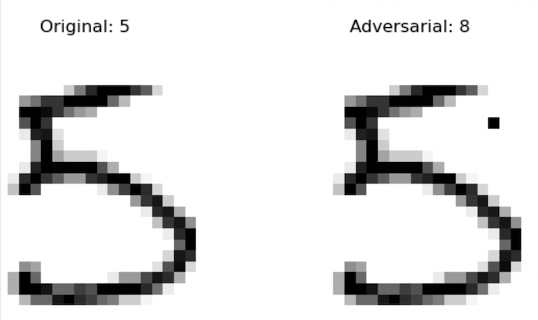
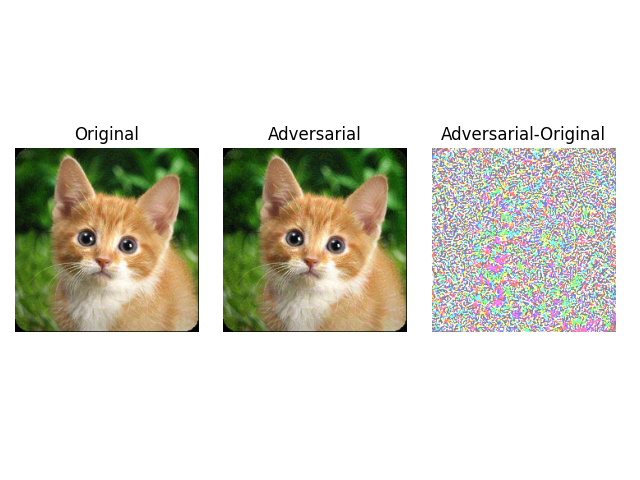

简体中文 | [English](./README.md)

# AdvBox

对抗样本是深度学习领域的一个重要问题，比如在图像上叠加肉眼难以识别的修改，就可以欺骗主流的深度学习图像模型，产生分类错误，指鹿为马，或者无中生有。这些问题对于特定领域（比如无人车、人脸识别）会产生严重的后果。因此AI模型对抗攻击及防御技术引起机器学习和安全领域的研究者及开发者越来越多的关注。对于对抗样本的研究可以找出当前机器学习算法的局限性和潜在威胁，提供鲁棒性的衡量工具，有助于寻找提升模型鲁棒性的方法。
AdvBox( Adversarialbox ) 是一款由百度安全实验室研发，支持Paddle的AI模型安全工具箱。AdvBox集成了多种攻击算法，可以高效的构造对抗样本，进行模型鲁棒性评估或对抗训练，提高模型的安全性。它能为工程师、研究者研究模型的安全性提供便利，减少重复造轮子的精力与时间消耗。

---

## 名词解释

* 白盒攻击：攻击者可以知道模型的内部结构，训练参数，训练和防御方法等。
* 黑盒攻击：攻击者对攻击的模型的内部结构，训练参数等一无所知，只能通过输出与模型进行交互。
* 非定向攻击：攻击者只需要让目标模型对样本分类错误即可，但并不指定分类错成哪一类。
* 定向攻击：攻击者指定某一类，使得目标模型不仅对样本分类错误并且需要错成指定的类别。

---
## 攻击算法列表

白盒攻击算法
+ FGSM
+ MI-FGSM
+ PGD
+ BIM
+ ILCM
+ C/W

黑盒攻击算法
+ SinglePixelAttack
+ TransferAttack

---
### 黑盒攻击示例

在mnist数据集，针对自己训练的CNN模型生成对抗样本。首先生成需要攻击的模型：    

    cd PaddleShield/Advbox/examples/image_cls
    python mnist_cnn_bapi.py


如果已有paddle2训练好的模型，不指定参数为非定向攻击可直接运行:

    python mnist_tutorial_singlepixelattack.py    

对于定向攻击，可指定目标类别，例如设置target为9（可为0-9任意值）    

    python mnist_tutorial_singlepixelattack.py  --target=9

```shell
2021-04-25 13:51:26,187 - INFO - Attack location x=19 y=25
attack success, original_label=9, adversarial_label=2, count=17
2021-04-25 13:51:26,386 - INFO - Attack location x=1 y=6
attack success, original_label=7, adversarial_label=3, count=18
2021-04-25 13:51:26,587 - INFO - Attack location x=5 y=19
attack success, original_label=3, adversarial_label=8, count=19
2021-04-25 13:51:26,788 - INFO - Attack location x=20 y=20
attack success, original_label=4, adversarial_label=1, count=20
[TEST_DATASET]: fooling_count=20, total_count=20, fooling_rate=1.000000
SinglePixelAttack attack done
```

**Single Pixel Attack**



**Transfer Attack**

迁移攻击的两种实现方式，分别用并行和串行。  

    python weighted_ensemble_attack_fgsm.py --target=330
    python serial_ensemble_attack_fgsm.py --target=1

类别282的小猫，经过黑盒攻击后被误识别为类别1金鱼。

### 白盒攻击示例

以FGSM为例，其他攻击方法使用方式类似。采用imagenet数据集，vgg16的预训练模型作为攻击对象。

#### 1.FGSM非定向攻击

    cd PaddleShield/Advbox/examples/image_cls
    python imagenet_tutorial_fgsm.py

``` shell
label=717
input img shape:  [3, 224, 224]
attack success, adversarial_label=803
diff shape:  (224, 224, 3)
fgsm attack done
```
攻击成功，模型对于此图片的识别，label为717识别成label 803。

**FGSM untargeted attack**      


#### 2.FGSM定向攻击
定向攻击类别为266   

    python imagenet_tutorial_fgsm.py --target=266   

``` shell
label=717
input img shape:  [3, 224, 224]
attack success, adversarial_label=999
diff shape:  (224, 224, 3)
fgsm attack done
```

**FGSM targeted attack**


### 其他攻击方法示例结果

**PGD定向攻击**


**CW定向攻击**


**BIM非定向攻击**


# 对抗样本去噪算法列表

基本去噪算法

## 对抗样本去噪示例

- [基本去噪方法](#AdvBox/denoisers)
    + 高斯滤波（Gaussian Filter）
    + 中值滤波（Median Filter）
    + 均值滤波（Mean Filter）
    + 方框滤波（Box Filter）
    + 双边滤波（Bilateral Filter）
    + 像素偏移（Pixel Deflection）
    + JPEG压缩
    + DCT压缩
    + PCA降维
    + 高斯噪声 （GaussianNoise）
    + 椒盐噪声 （SaltPepperNoise）
    + 随机缩放填充
- 在一幅图像上使用FGSM攻击并去噪 **[tutorial python script](#AdvBox/examples/mini_imagenet_evaluation_tool.py)**.
- **命令行参数介绍**
  - `--image_path`  
  : 要处理的图像路径，用户可以上传图像到文件夹：AdvBox/examples/image_cls/input。我们提供了一些采集自mini-imagenet数据集的图像样本：
    + input/schoolbus.png
    + input/vase.png
    + input/lion.png
    + input/hourglass.png
    + input/crate.png
    + input/malamute.png
  - `--method`  
  : 去噪方法的名称，如下：
    + GaussianBlur
    + MedianBlur
    + MeanFilter
    + BoxFilter
    + BilateralFilter
    + PixelDeflection
    + JPEGCompression
    + DCTCompress
    + PCACompress
    + GaussianNoise
    + SaltPepperNoise
    + ResizePadding

  - 在Mini-ImageNet数据集上使用FGSM攻击图像并去噪 **[tutorial python script](#AdvBox/examples/imagenet_tutorial_fgsm_denoise.py)**.
  - **命令行参数介绍**
    - `--dataset_path`  
    : 要处理的mini-imagenet数据集（.pkl）路径，可以将数据集下载至：AdvBox/examples/image_cls/input中。
    - `--label_path`  
    : 要处理的数据集对应的类别标签，可以将文件放在：AdvBox/examples/image_cls/input。我们提供了测试集的标签：
      + input/mini_imagenet_test_labels.txt
    - `--mode`
    : 数据集类型, 'train'，'test'，或者 'val'。默认是 Default 'test'.
    - `--method`  
    : 去噪方法的名称，如下：
      + GaussianBlur
      + MedianBlur
      + MeanFilter
      + BoxFilter
      + BilateralFilter
      + PixelDeflection
      + JPEGCompression
      + DCTCompress
      + PCACompress
      + GaussianNoise
      + SaltPepperNoise
      + ResizePadding

## 去噪算法使用示例
在单幅图像或者mini-imagenet数据集上对清晰图像或者对抗样本使用去噪算法。

### 单幅图像去噪示例
给定一幅图像，首先使用FGSM方法产生对抗样本（AE），在使用去噪算法对AE进行去噪，同时对比对输入的清晰图像的去噪结果。

#### 执行代码：
```shell
cd PaddleShield/Advbox/examples/image_cls
python imagenet_tutorial_fgsm_denoise.py --method='GaussianBlur' --image_path='input/schoolbus.png'
```

#### 输出结果：
```
input image label: school bus
input image shape:  [3, 84, 84]
FGSM attack succeeded, adversarial_label: rubber eraser, rubber, pencil eraser
FGSM attack done
GaussianBlur denoise succeeded
GaussianBlur denoise doesn't change the label of the input image
GaussianBlur denoise done
```

#### 结果解读：
```
1. 原始模型将输入图像识别为：school bus；  
2. FGSM攻击输入图像，得到对抗样本，模型将该对抗样本识别为：rubber eraser, rubber, pencil eraser；  
3. 去噪算法对对抗样本进行去噪，得到去噪结果，模型将该结果识别为：school bus。```
```

#### 可视化结果
<div align=center>

</div>

#### 其他去噪方法示例
**中值滤波**
```shell
python imagenet_tutorial_fgsm_denoise.py --method='MedianBlur' --image_path='input/vase.png'
```
<div align=center>

</div><br/>

**均值滤波**
```shell
python imagenet_tutorial_fgsm_denoise.py --method='MeanFilter' --image_path='input/lion.png'
```

<div align=center>

</div><br/>

**方框滤波**
```shell
python imagenet_tutorial_fgsm_denoise.py --method='BoxFilter' --image_path='input/hourglass.png'
```
<div align=center>

</div><br/>

**双边滤波**
```shell
python imagenet_tutorial_fgsm_denoise.py --method='BilateralFilter' --image_path='input/crate.png'
```
<div align=center>

</div><br/>

**像素偏移**
```shell
python imagenet_tutorial_fgsm_denoise.py --method='PixelDeflection' --image_path='input/malamute.png'
```
<div align=center>

</div><br/>

**JPEG压缩**
```shell
python imagenet_tutorial_fgsm_denoise.py --method='JPEGCompression' --image_path='input/schoolbus.png'
```
<div align=center>

</div><br/>

### Mini-ImageNet数据集去噪示例
给定mini-imagenet数据集，依次对数据集中的每幅图像：先使用FGSM方法产生对抗样本（AE），在使用去噪算法对AE进行去噪，同时对比对输入的清晰图像的去噪结果。

#### 执行代码:
```shell
cd PaddleShield/Advbox/examples/image_cls
python mini_imagenet_evaluation_tool.py --method='GaussianBlur' --dataset_path='input/mini-imagenet-cache-test.pkl' --label_path='mini_imagenet_test_labels.txt'
```

#### 输出结果:
```
100%|█████| 12000/12000 [2:45:59<00:00,  1.20it/s, ORI_ACC=0.439, AE_ACC=0.000, DE_AE_ACC=0.063, DE_ORI_ACC=0.010]
```

#### 定量结果 (分类准确率):
| 去噪方法 | 清晰图像 | 对抗样本 | 对抗样本去噪 | 清晰图像去噪 |
|:-|:-:|:-:|:-:|:-:|
| 高斯滤波    | 43.9%  | 0.0%  | 6.3% | 10.0% |
| 中值滤波    | 43.9%  | 0.0%  | 7.2% | 10.4% |
| 均值滤波    | 43.9%  | 0.0%  | 5.8% | 9.0% |
| 方框滤波    | 43.9%  | 0.0%  | 7.4% | 14.4% |
| 双边滤波    | 43.9%  | 0.0%  | 5.8% | 9.0% |
| 像素偏移    | 43.9%  | 0.0%  | 11.7% | 18.3% |
| JPEG压缩    | 43.9%  | 0.0%  | 12.6% | 19.5% |
| DCT压缩     | 43.9%  | 0.0%  | 10.9% | 16.5% |
| PCA降维     | 43.9%  | 0.0%  | 11.7% | 20.6% |
| 高斯噪声    | 43.9%  | 0.0%  | 8.0% | 10.0% |
| 椒盐噪声    | 43.9%  | 0.0%  | 7.3% | 11.0% |
| 随机缩放填充 | 43.9%  | 0.0%  | 18.9% | 22.5% |
