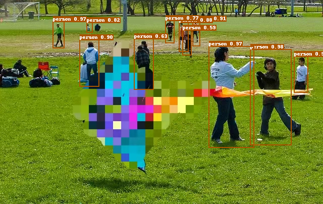

简体中文 | [English](./README.md)

# AdvBox

对抗样本是深度学习领域的一个重要问题，比如在图像上叠加肉眼难以识别的修改，就可以欺骗主流的深度学习图像模型，产生分类错误，指鹿为马，或者无中生有。这些问题对于特定领域（比如无人车、人脸识别）会产生严重的后果。因此AI模型对抗攻击及防御技术引起机器学习和安全领域的研究者及开发者越来越多的关注。对于对抗样本的研究可以找出当前机器学习算法的局限性和潜在威胁，提供鲁棒性的衡量工具，有助于寻找提升模型鲁棒性的方法。
AdvBox( Adversarialbox ) 是一款由百度安全实验室研发，支持Paddle的AI模型安全工具箱。AdvBox集成了多种攻击算法，可以高效的构造对抗样本，进行模型鲁棒性评估或对抗训练，提高模型的安全性。它能为工程师、研究者研究模型的安全性提供便利，减少重复造轮子的精力与时间消耗。

---

## 名词解释

* 白盒攻击：攻击者可以知道模型的内部结构，训练参数，训练和防御方法等。
* 黑盒攻击：攻击者对攻击的模型的内部结构，训练参数等一无所知，只能通过输出与模型进行交互。
* 非定向攻击：攻击者只需要让目标模型对样本分类错误即可，但并不指定分类错成哪一类。
* 定向攻击：攻击者指定某一类，使得目标模型不仅对样本分类错误并且需要错成指定的类别。

---
## 攻击算法列表

| Adversarial Attack Methods                                    | White-Box | Black-Box | Ensemble  |  AdvTrain   |
|-------------------------------------------------------------------------------------------------------------------------------------------------------------------------------------------------------------|:--:|:--:|:--:|:--:|
| [FGSM (FastGradientSignMethodAttack)](attacks/gradient_method.py)                | ✓  |   | ✓ | ✓ |
| [FGSMT (FastGradientSignMethodTargetedAttack)](attacks/gradient_method.py)       | ✓  |   | ✓ | ✓ |
| [BIM (BasicIterativeMethodAttack)](attacks/gradient_method.py)                   | ✓  |   | ✓ | ✓ |
| [ILCM (IterativeLeastLikelyClassMethodAttack)](attacks/gradient_method.py)       | ✓  |   | ✓ | ✓ |
| [MI-FGSM (MomentumIteratorAttack)](attacks/gradient_method.py)                   | ✓  |   | ✓ | ✓ |
| [PGD (ProjectedGradientDescentAttack)](attacks/gradient_method.py)               | ✓  |   | ✓ | ✓ |
| [CW_L2 (CWL2Attack)](attacks/cw.py)                                              | ✓  |   |   | ✓ |
| [SinglePixelAttack](attacks/single_pixel_attack.py)                              |    | ✓ |   |   |
| [HopSkipJumpAttack](attacks/hop_skip_jump_attack.py)                             |    | ✓ |   |   |
| [GeneticPixelsAttack](attacks/genetic_pixel_attack.py)                           |    | ✓ |   |   |
| [SquareAttack](attacks/square_attack.py)                                         |    | ✓ |   |   |

---
### 黑盒攻击示例
进入图片分类黑盒攻击示例目录

    cd PaddleSleeve/Advbox/examples/image_cls

### Single Pixel Attack
在mnist数据集，针对自己训练的CNN模型生成对抗样本。首先生成需要攻击的模型：    

    python mnist_cnn_bapi.py


如果已有paddle2训练好的模型，不指定参数为非定向攻击可直接运行:

    python mnist_tutorial_singlepixelattack.py    

```shell
2021-04-25 13:51:26,187 - INFO - Attack location x=19 y=25
attack success, original_label=9, adversarial_label=2, count=17
2021-04-25 13:51:26,386 - INFO - Attack location x=1 y=6
attack success, original_label=7, adversarial_label=3, count=18
2021-04-25 13:51:26,587 - INFO - Attack location x=5 y=19
attack success, original_label=3, adversarial_label=8, count=19
2021-04-25 13:51:26,788 - INFO - Attack location x=20 y=20
attack success, original_label=4, adversarial_label=1, count=20
[TEST_DATASET]: fooling_count=20, total_count=20, fooling_rate=1.000000
SinglePixelAttack attack done
```


### Genetic Pixels Attack
Genetic Pixels Attack是Single Pixel Attack的增强版。Genetic Pixels Attack也是在L0范数下的攻击，和Single Pixel Attack不同，它不再局限于改变原图像中的一个像素，而是同时改变原图中的若干个像素点，并运用遗传算法生成对抗样本。

- **[tutorial python script](/AdvBox/examples/image_cls/imagenet_tutorial_gp.py)** 运用Genetic Pixels Attack对通过ImageNet数据集训练的ResNet50模型进行攻击 
  - **参数**
    - `--max_gen`
    : 此攻击执行的最大迭代步数
    - `--image_path`
    : 输入图像的路径，例如input/cat_example.png
    - `--target`
    : 目标类别标签，-1如果无目标攻击
    - `--max_pixels`
    : 允许修改的最大像素数。这等价于L0的Lp球的半径

#### Genetic Pixels Attack示例

    python imagenet_tutorial_gp.py

<p align="center">
<br>
</p>

### Square Attack
Square attack是一种基于得分的黑盒攻击算法，该模型不依赖于模型的局部梯度
信息，因此可以绕过梯度隐藏防御攻击。Square Attack是一种随机搜索方法，它
在随机位置选择局部的方形更新，使得每次迭代时扰动近似位于可行集的边界

- **[tutorial python script](/AdvBox/examples/image_cls/imagenet_tutorial_sq.py)** 运用Square Attack对通过ImageNet数据集训练的ResNet50模型进行攻击
  - **参数**
    - `--image_path`
    : 输入图像的路径，用户可以把自己的图像上传到 AdvBox/examples/image_cls/input 文件夹，我们也提供了一些来自mini-imagenet数据集的图像：
      + input/schoolbus.png
      + input/vase.png
      + input/lion.png
      + input/hourglass.png
      + input/crate.png
      + input/malamute.png
    - `--norm`
    : 选择在 L2 或 LInf 范数下展开攻击
    - `--target`
    : 目标类别, 默认为-1
    - `--eps`
    : 最大扰动
    - `--max_steps`
    : 最大迭代次数

#### Square Attack (L2)示例
**Untargeted Attack**

    python imagenet_tutorial_sq.py --norm L2

<p align="center">
<br>
</p>

**Targeted Attack**

    python imagenet_tutorial_sq.py --norm L2 --target 390

<p align="center">
<br>
</p>

类别282的小猫，经过黑盒攻击后被误识别为类别390鳗鱼。

#### Square Attack (LInf)示例
**Untargeted Attack**

    python imagenet_tutorial_sq.py --norm LInf

<p align="center">
<br>
</p>

**Targeted Attack**

    python imagenet_tutorial_sq.py --norm LInf --target 390

<p align="center">
<br>
</p>
类别282的小猫，经过黑盒攻击后被误识别为类别390鳗鱼。

### 白盒攻击示例

以FGSM为例，其他攻击方法使用方式类似。采用imagenet数据集，vgg16的预训练模型作为攻击对象。

### FGSM
- **[tutorial python script](/AdvBox/examples/image_cls/imagenet_tutorial_fgsm.py)** 运用FGSM对通过ImageNet数据集训练的ResNet50模型进行攻击 
  - **参数**
    - `--target`
    : 目标类别, 默认为-1

#### FGSM非定向攻击示例

    python imagenet_tutorial_fgsm.py

``` shell
label=717
input img shape:  [3, 224, 224]
attack success, adversarial_label=803
diff shape:  (224, 224, 3)
fgsm attack done
```
攻击成功，模型对于此图片的识别，label为717识别成label 803。

<p align="center">
<br>
</p>

#### FGSM定向攻击示例
定向攻击类别为266   

    python imagenet_tutorial_fgsm.py --target=266   

``` shell
label=717
input img shape:  [3, 224, 224]
attack success, adversarial_label=999
diff shape:  (224, 224, 3)
fgsm attack done
```
攻击成功，模型对于此图片的识别，虽然不是目标标签266，但是将原label为717识别成label 999。

<p align="center">
<br>
</p>

### PGD
- **[tutorial python script](/AdvBox/examples/image_cls/imagenet_tutorial_pgd.py)** 运用PGD对通过ImageNet数据集训练的ResNet50模型进行攻击
  - **参数**
    - `--target`
    : 目标类别, 默认为-1

#### PGD非定向攻击示例

    python imagenet_tutorial_pgd.py

#### PGD定向攻击示例

    python imagenet_tutorial_pgd.py --target=266

<p align="center">
<br>
</p>

### CW
- **[tutorial python script](/AdvBox/examples/image_cls/imagenet_tutorial_cw.py)** 运用CW对通过ImageNet数据集训练的ResNet50模型进行攻击
  - **参数**
    - `--target`
    : 目标类别, 默认为126
    - `--class_dim`
    : 类别数。默认值:1000。
    - `--image_shape`
    : 输入图像大小默认值:3,224,224。

#### CW定向攻击示例

    python imagenet_tutorial_cw.py --target=126

<p align="center">
<br>
</p>

**BIM非定向攻击**


### 利用AdvBox生成一个对抗样本

```python
import sys
sys.path.append("..")
import paddle
import numpy as np
from adversary import Adversary
from attacks.cw import CW_L2
from models.whitebox import PaddleWhiteBoxModel

from classifier.towernet import transform_eval, TowerNet, MEAN, STD
model_0 = TowerNet(3, 10, wide_scale=1)
model_1 = TowerNet(3, 10, wide_scale=2)

advbox_model = PaddleWhiteBoxModel(
    [model_0, model_1],
    [1, 1.8],
    (0, 1),
    mean=MEAN,
    std=STD,
    input_channel_axis=0,
    input_shape=(3, 256, 256),
    loss=paddle.nn.CrossEntropyLoss(),
    nb_classes=10)

# init attack with the ensembled model
attack = CW_L2(advbox_model)

cifar10_test = paddle.vision.datasets.Cifar10(mode='test', transform=transform_eval)
test_loader = paddle.io.DataLoader(cifar10_test, batch_size=1)

data = test_loader().next()
img = data[0][0]
label = data[1]

# init adversary status
adversary = Adversary(img.numpy(), int(label))
target = np.random.randint(advbox_model.num_classes())
while label == target:
    target = np.random.randint(advbox_model.num_classes())
print(label, target)
adversary.set_status(is_targeted_attack=True, target_label=target)

# launch attack
adversary = attack(adversary, attack_iterations=50, verbose=True)

if adversary.is_successful():
    original_img = adversary.original
    adversarial_img = adversary.adversarial_example
    print("Attack succeeded.")
else:
    print("Attack failed.")
```

# 对抗训练

## AdvBox对抗训练(advtraining)提供:
- 基于主流攻击算法 **[FGSM/PGD/BIM/ILCM/MI-FGSM](#AdvBox/attacks)** 的数据增强工具，用于对抗训练
- 紧凑便捷的对抗训练工具API：
    + 支持将训练数据按照比例进行对抗扰动，便于接入已有的paddle分类模型训练流程
    + 支持事先按照设定权重，进行模型融合的对抗样本生成
    + 支持多对抗攻击方法的对抗样本生成
- Advtraining **[tutorial scripts](#AdvBox/examples/image_adversarial_training)** 演示脚本，基于Cifar10和Mini-ImageNet数据集

## 如何运行对抗训练演示
对抗训练演示包含以下实验：
- 基于Preactresnet在Cifar10和Mini-ImageNet的对抗训练Benchmark
- 基于Towernet在Mini-ImageNet数据集上使用PGD数据增强的微调实验
- 附加的未完成的实验

运行以下命令来运行演示
1. `cd AdvBox/examples/image_adversarial_training`
2. `python run_advtrain_main.py`
3. `python model_evaluation_tutorial.py`

**PreactResnet在不同对抗训练设定下的鲁棒性表现**

| Evaluation-Method | Mini-ImageNet-FGSM | Mini-ImageNet-PGD-20 |
| :----: | :----: | :----: |
|   val_acc: _ / natural_acc: _ / fooling_rate: _   |   preactresnet   |   preactresnet   |
|   Natural Adversarial Training(p=0.1, fgsm(default))   |   0.980 / 0.986 / 0.282   |   0.980 / 0.986 / 0.984   |
|   Natural Adversarial Training(p=0.1, PGD(default))   |   0.983 / 0.978 / 0.098   |   0.983 / 0.982 /0.850   |
|  TRADES(beta=1.0, fgsm(default))  |  0.989 / 0.994 / 0.146  |  0.989 / 0.994 / 0.956  |
|  TRADES(beta=1.0, PGD(default))  |  0.990 / 0.992 / 0.028  |  0.990 / 0.996 / 0.540  |
|  TRADES(beta=1.0, LD(default))  |  0.990 / 0.996 / 0.020  |  0.990 / 0.992 / 0.734  |

如表所示，对抗训练可以在牺牲很少精度的情况下，增加模型的鲁棒性。

## 对抗训练的helloword
```python
import sys
sys.path.append("..")
import paddle
from attacks.gradient_method import FGSM, PGD
from attacks.cw import CW_L2
from models.whitebox import PaddleWhiteBoxModel
from defences.adversarial_transform import ClassificationAdversarialTransform

from classifier.towernet import transform_train, TowerNet, MEAN, STD
model_0 = TowerNet(3, 10, wide_scale=1)
model_1 = TowerNet(3, 10, wide_scale=2)

advbox_model = PaddleWhiteBoxModel(
    [model_0, model_1],
    [1, 1.8],
    (0, 1),
    mean=MEAN,
    std=STD,
    input_channel_axis=0,
    input_shape=(3, 256, 256),
    loss=paddle.nn.CrossEntropyLoss(),
    nb_classes=10)

# "p" controls the probability of this enhance.
# for base model training, we set "p" == 0, so we skipped adv trans data augmentation.
# for adv trained model, we set "p" == 0.05, which means each batch
# will probably contain 5% adv trans augmented data.
enhance_config1 = {"p": 0.1}
enhance_config2 = {"p": 0.1}
init_config3 = {"norm": 'L2', "epsilon_ball": 8/255, "epsilon_stepsize": 2/255}
enhance_config3 = {"p": 0.05,
                   "attack_iterations": 15,
                   "c_search_steps": 6,
                   "verbose": False}

adversarial_trans = ClassificationAdversarialTransform(advbox_model,
                                                       [FGSM, PGD, CW_L2],
                                                       [None, None, init_config3],
                                                       [enhance_config1, enhance_config2, enhance_config3])

cifar10_train = paddle.vision.datasets.Cifar10(mode='train', transform=transform_train)
train_loader = paddle.io.DataLoader(cifar10_train, batch_size=16)

for batch_id, data in enumerate(train_loader()):
    x_data = data[0]
    y_data = paddle.unsqueeze(data[1], 1)
    x_data_augmented, y_data_augmented = adversarial_trans(x_data.numpy(), y_data.numpy())
```

## 多卡对抗训练
部分对抗训练方法同时支持在多GPU上的分布式训练。下表总结了各种不同训练方法支持的功能情况。

| 对抗训练方法                | 多对抗攻击方法训练 | 多卡训练 |
|---------------------------------------------|:--:|:--:|
| Natural Adversarial Training                | ✓  | ✓ |
| TRADES                                      | ✓  |   |
| Adversarial Weights Perturbation            |    | ✓ |
| FreeAT                                      |    | ✓ |

### **多卡训练使用方法**

- ### 数据准备
   Advbox 中提供的MINIIMAGENET类继承了`paddle.io.DataSet`抽象类，可以直接应用到训练当中。该类别的输入是`.pkl`文件，提前制作好的数据集pickle文件可以从 **[Kaggle](https://www.kaggle.com/datasets/whitemoon/miniimagenet)** 官网下载。在开始训练前需要修改代码中的相应路径。
   
   ```python
    ... 
   
    # Load dataset
    transform = T.Compose([T.Normalize(MEAN, STD, data_format='CHW')])
    
    # Change to your dataset 
    train_dataset_path = os.path.join(os.path.realpath(__file__ + "../" * 3),
                                      'dataset/mini-imagenet/mini-imagenet-cache-train.pkl')
    val_dataset_path = os.path.join(os.path.realpath(__file__ + "../" * 3),
                                    'dataset/mini-imagenet/mini-imagenet-cache-test.pkl')
                                
    ...
    ```
    
 - **重新划分数据集**
    
    需要注意，原论文中提出的mini-imagenet数据集的训练集，测试集，和验证集之间的类别并无交叉，所以在开始训练之前需要重新划分数据集。Advbox在`examples/dataset/split.py`中提供了相关工具。若要重新划分，则需首先下载完整的mini-imagenet数据集，完整的数据集应包含一个装有输入样本的文件夹，以及三个`.csv`格式的标签文件。完整的数据集可以从 **[deep-learning-for-image-processing](https://github.com/WZMIAOMIAO/deep-learning-for-image-processing)** 下载。下载完成后修改`split.py`脚本里的对应路径并直接运行即可。脚本会自动生成`.pkl`格式的数据集文件并保存到指定路径。
  
    ```python
    
    # Change to the path on your own device
    dataset_dir = '/Path to Your Dataset/'
    image_dir = '/Path to Your Images/'
    train_save_path = '/Place to Save Cached TrainSet/'
    test_save_path = '/Place to Save Cached TestSet/'
    ```
    
    运行脚本
    ```
    python examples/dataset/split.py
    ```

- ### 命令行启动对抗训练

   Advbox中提供的多卡对抗训练方法支持命令行启动。下列指令会启动natrual advtrain训练，默认使用当前可见的全部GPU。
   
   ```
   python -m paddle.distributed.launch defences/advtrain_natural.py
   ```
   
   **Command-Line Parameters**
   - `--model` 
   : 用于对抗训练的图像分类模型，目前支持mobilenet和resnet系列模型
   - `--dataset`
   : 训练中使用的数据集，支持cifar-10和mini-imagenet
   - `--epoch`
   : 训练轮数
   - `--weights`
   : 模型要加载的预训练权重，若要恢复中断的训练可通过该参数指定需要恢复的模型参数
   - `opt_weights`
   : 指定恢复训练时要加载的优化器参数
   - `--save_path`
   : 模型的保存路径
   - 其他的训练配置，包括batch_size，优化器的选择，学习率，正则化等等都可以通过相应的参数来声明。
 
 
    **演示**
    
    下列指令将会在4张卡上启动awp训练。训练中使用resnet50模型和mini-imagenet数据集。
    ```
    export CUDA_VISIBLE_DEVICES=0,1,2,3
    python -m paddle.distributed.launch defences/advtrain_awp.py --model resnet50 --dataset mini-imagenet --epoch 80 --batch_size 256 --opt adam
    
- ### 在代码中调用训练方法

    对抗训练方法也可以从用户自己的训练代码中直接调用。这种使用方法可以让用户更灵活的配置自己的训练。
    
- **参数**

    - **Natural Advtrain**
    ```python 
        from defences.advtrain_natural import adversarial_train_natural
        from defences.pgd_perturb import PGDTransform
        training_config = {'epoch_num': 60,  # Number of epochs 
                           'advtrain_start_num': 20,  # Adversarial training may start later
                           'batch_size': 256,
                           'adversarial_trans': PGDTransform(model, p=0.1),  # Instance of PGDTransform class that generate AE
                           'optimizer': paddle.optimizer.Adam(learning_rate=0.0005,  # Instance of paddle optimizer
                                                              parameters=model.parameters()),
                           'metrics': paddle.metric.Accuracy(),  # Instance of paddle metric to evaluate model during training
                           'weights': None,  # Weights from previous training. None if new training
                           'opt_weights': None}

        save_path = os.path.join(os.path.dirname(__file__), "output/mini_imagenet_demo_advtrain_natural")
        adversarial_train_natural(model=m,
                                  train_set=train_dataset,
                                  test_set=test_dataset,
                                  save_path=save_path,
                                  **training_config)
    ```
    在`examples/image_adversarial_training/`目录下提供了一个`mini_imagenet_demo_parallel_advtrain_natural.py`的展示脚本。无需添加另外的参数或命令即可直接启动。用户只需运行下列指令即可初步感受natural advtrain对抗训练。 
    ```
    cd Advbox
    export CUDA_VISIBLE_DEVICES=0,1,2,3
    python -m paddle.distributed.launch examples/image_adversarial_training/mini_imagenet_tutorial_parallel_advtrain_natural.py
    ```
    
    - **FreeAT**
    ```python
        from defences.advtrain_free import free_advtrain
        training_config = {'epoch_num': 20,  # Number of epochs 
                           'advtrain_start_num': 0,  # Adversarial training may start later
                           'batch_size': 256,
                           'steps': 8,  # Number of iterations for a mini-batch of data 
                           'optimizer': paddle.optimizer.Adam(learning_rate=0.0005,  # Instance of paddle optimizer
                                                              parameters=model.parameters()),
                           'metrics': paddle.metric.Accuracy(),  # Instance of paddle metric to evaluate model during training
                           'weights': None,  # Weights from previous training. None if new training
                           'opt_weights': None}

        save_path = os.path.join(os.path.dirname(__file__), "output/mini_imagenet_demo_freeat")
        free_advtrain(model=m,
                      train_set=train_dataset,
                      test_set=test_dataset,
                      save_path=save_path,
                      **training_config)
    ```
    对应的展示脚本为 `examples/image_adversarial_training/mini_imagenet_demo_parallel_freeat.py`。
    
    - **AWP**
    ```python
        from defences.advtrain_awp_mod_para import adversarial_train_awp
        from defences.pgd_perturb import PGDTransform
        training_config = {'epoch_num': 60,  # Number of epochs 
                           'advtrain_start_num': 20,  # Adversarial training may start later
                           'batch_size': 256,
                           'gamma': 0.01,  # Amplitude of adversarial weights perturbation
                           'adversarial_trans': PGDTransform(model, p=0.1),  # Instance of PGDTransform class that generate AE
                           'optimizer': paddle.optimizer.Adam(learning_rate=0.0005,  # Instance of paddle optimizer
                                                              parameters=model.parameters()),
                           'metrics': paddle.metric.Accuracy(),  # Instance of paddle metric to evaluate model during training
                           'weights': None,  # Weights from previous training. None if new training
                           'opt_weights': None}

        save_path = os.path.join(os.path.dirname(__file__), "output/mini_imagenet_demo_awp")
        adversarial_train_awp(model=m,
                              train_set=train_dataset,
                              test_set=test_dataset,
                              save_path=save_path,
                              **training_config)
    ```
    对应的展示脚本为 `examples/image_adversarial_training/mini_imagenet_tutorial_parallel_awp.py`。
    
    
- ### 不同对抗训练效果对比
| 对抗训练 | Mini-ImageNet-PGD-10 (L2) | Mini-ImageNet-PGD-10 (Linf) |
| :----: | :----: | :----: |
|   natural_acc: _ / AE_acc: _ / fooling_rate: _  |   resnet50   |   resnet50   |
|  No AdvTrain                             |  0.881 / 0.026 / 0.970 |  0.881 / 0.006 / 0.993 |
|  Natural AdvTrain(p=0.1, PGD(default))   |  0.847 / 0.240 / 0.717 |  0.847 / 0.519 / 0.387 |
|  FreeAT(steps=8)                         |  0.860 / 0.168 / 0.805 |  0.860 / 0.533 / 0.380 |
|  AWP(gamma=0.02)                         |  0.843 / 0.501 / 0.406 |  0.843 / 0.281 / 0.667 |


# 目标检测器的对抗扰动
目标检测器的对抗扰动主要用于目标检测器的对抗训练和鲁棒性测评，主要分为电子世界下和物理世界下的对抗扰动。
这里我们提供一种电子世界下对PP-YOLO目标检测器扰动的演示。该演示基于 **[PaddleDetection](#https://github.com/PaddlePaddle/PaddleDetection)** 项目。

**用于Feed & Sniff的图像**

<table>
<tr>
    <td align="center"></td>
    <td align="center"></td>
</tr>

<tr>
    <td align="center">Original Image</td>
    <td align="center">Masked Image</td>
</tr>
</table>

在`PaddleSleeve/AdvBox/examples/objectdetector`，我们展示了一种称之为目标消失攻击的目标检测器
对抗方法。该演示是在可以获取模型权重信息的情况下，用受害图和制作的目标图获得关键张量，用PGD方法迭代更新扰动图
像，使受害图和目标图对应的分类置信度张量的KL散度最小。该演示中，我们成功的使被扰动后的图片`000000014439.jpg`，
在PP-YOLO下，对风筝这个大目标造成了漏检。

- 友情提示：由于PaddlePaddle<=2.1的版本，暂时不支持对于`paddle.nn.SyncBatchNorm`在eval()模式下
的反向传播功能，我们需要将所有的`sync-bn`组件置换喂`bn`组件(因为`paddle.nn.BatchNorm`支持eval()
模式的求导).
 
想要为其他目标检测器定制攻击脚本，可以参照以下方法置换`paddle.nn.SyncBatchNorm`：

- 如目标检测器配置文件类似于`configs/yolov3/_base_/yolov3_darknet53.yml`，在第三行添加`norm_type: bn`
- 如目标检测器配置文件类似于`configs/ppyolo/ppyolo_mbv3_large_coco.yml`，在第九行添加`norm_type: bn`

## 运行目标消失演示
在把所有`sync-bn`组件置换为`bn`组件后，运行以下命令：
1. `cd PaddleSleeve/AdvBox/examples/objectdetector`
2. `python target_ghosting_demo.py -c configs/ppyolo/ppyolo_mbv3_large_coco.yml -o weights=https://paddledet.bj.bcebos.com/models/ppyolo_mbv3_large_coco.pdparams --infer_img=dataloader/demo_pics/000000014439.jpg --target_img=dataloader/demo_pics/masked_0014439.png`

成功的运行`target_ghosting_demo.py`可以产生以下图片：

**图片对比**

<table align="center">
<tr>
    <td align="center"></td>
    <td align="center"></td>
    <td align="center"></td>
</tr>

<tr>
    <td align="center">Original Image Detection Result</td>
    <td align="center">Masked Image Detection Result</td>
    <td align="center">Adv Image Detection Result</td>
</tr>
</table>


# 对抗样本去噪算法列表

基本去噪算法

## 对抗样本去噪示例

- [基本去噪方法](#AdvBox/denoisers)
    + 高斯滤波（Gaussian Filter）
    + 中值滤波（Median Filter）
    + 均值滤波（Mean Filter）
    + 方框滤波（Box Filter）
    + 双边滤波（Bilateral Filter）
    + 像素偏移（Pixel Deflection）
    + JPEG压缩
    + DCT压缩
    + PCA降维
    + 高斯噪声 （GaussianNoise）
    + 椒盐噪声 （SaltPepperNoise）
    + 随机缩放填充
- 在一幅图像上使用FGSM攻击并去噪 **[tutorial python script](#AdvBox/examples/mini_imagenet_evaluation_tool.py)**.
- **命令行参数介绍**
  - `--image_path`  
  : 要处理的图像路径，用户可以上传图像到文件夹：AdvBox/examples/image_cls/input。我们提供了一些采集自mini-imagenet数据集的图像样本：
    + input/schoolbus.png
    + input/vase.png
    + input/lion.png
    + input/hourglass.png
    + input/crate.png
    + input/malamute.png
  - `--method`  
  : 去噪方法的名称，如下：
    + GaussianBlur
    + MedianBlur
    + MeanFilter
    + BoxFilter
    + BilateralFilter
    + PixelDeflection
    + JPEGCompression
    + DCTCompress
    + PCACompress
    + GaussianNoise
    + SaltPepperNoise
    + ResizePadding

  - 在Mini-ImageNet数据集上使用FGSM攻击图像并去噪 **[tutorial python script](#AdvBox/examples/imagenet_tutorial_fgsm_denoise.py)**.
  - **命令行参数介绍**
    - `--dataset_path`  
    : 要处理的mini-imagenet数据集（.pkl）路径，可以将数据集下载至：AdvBox/examples/image_cls/input中。
    - `--label_path`  
    : 要处理的数据集对应的类别标签，可以将文件放在：AdvBox/examples/image_cls/input。我们提供了测试集的标签：
      + input/mini_imagenet_test_labels.txt
    - `--mode`
    : 数据集类型, 'train'，'test'，或者 'val'。默认是 Default 'test'.
    - `--method`  
    : 去噪方法的名称，如下：
      + GaussianBlur
      + MedianBlur
      + MeanFilter
      + BoxFilter
      + BilateralFilter
      + PixelDeflection
      + JPEGCompression
      + DCTCompress
      + PCACompress
      + GaussianNoise
      + SaltPepperNoise
      + ResizePadding

## 去噪算法使用示例
在单幅图像或者mini-imagenet数据集上对清晰图像或者对抗样本使用去噪算法。

### 单幅图像去噪示例
给定一幅图像，首先使用FGSM方法产生对抗样本（AE），在使用去噪算法对AE进行去噪，同时对比对输入的清晰图像的去噪结果。

#### 执行代码：
```shell
cd PaddleShield/Advbox/examples/image_cls
python imagenet_tutorial_fgsm_denoise.py --method='GaussianBlur' --image_path='input/schoolbus.png'
```

#### 输出结果：
```
input image label: school bus
input image shape:  [3, 84, 84]
FGSM attack succeeded, adversarial_label: rubber eraser, rubber, pencil eraser
FGSM attack done
GaussianBlur denoise succeeded
GaussianBlur denoise doesn't change the label of the input image
GaussianBlur denoise done
```

#### 结果解读：
```
1. 原始模型将输入图像识别为：school bus；  
2. FGSM攻击输入图像，得到对抗样本，模型将该对抗样本识别为：rubber eraser, rubber, pencil eraser；  
3. 去噪算法对对抗样本进行去噪，得到去噪结果，模型将该结果识别为：school bus。```
```

#### 可视化结果
<div align=center>

</div>

#### 其他去噪方法示例
**中值滤波**
```shell
python imagenet_tutorial_fgsm_denoise.py --method='MedianBlur' --image_path='input/vase.png'
```
<div align=center>

</div><br/>

**均值滤波**
```shell
python imagenet_tutorial_fgsm_denoise.py --method='MeanFilter' --image_path='input/lion.png'
```

<div align=center>

</div><br/>

**方框滤波**
```shell
python imagenet_tutorial_fgsm_denoise.py --method='BoxFilter' --image_path='input/hourglass.png'
```
<div align=center>

</div><br/>

**双边滤波**
```shell
python imagenet_tutorial_fgsm_denoise.py --method='BilateralFilter' --image_path='input/crate.png'
```
<div align=center>

</div><br/>

**像素偏移**
```shell
python imagenet_tutorial_fgsm_denoise.py --method='PixelDeflection' --image_path='input/malamute.png'
```
<div align=center>

</div><br/>

**JPEG压缩**
```shell
python imagenet_tutorial_fgsm_denoise.py --method='JPEGCompression' --image_path='input/schoolbus.png'
```
<div align=center>

</div><br/>

### Mini-ImageNet数据集去噪示例
给定mini-imagenet数据集，依次对数据集中的每幅图像：先使用FGSM方法产生对抗样本（AE），在使用去噪算法对AE进行去噪，同时对比对输入的清晰图像的去噪结果。

#### 执行代码:
```shell
cd PaddleShield/Advbox/examples/image_cls
python mini_imagenet_evaluation_tool.py --method='GaussianBlur' --dataset_path='input/mini-imagenet-cache-test.pkl' --label_path='mini_imagenet_test_labels.txt'
```

#### 输出结果:
```
100%|█████| 12000/12000 [2:45:59<00:00,  1.20it/s, ORI_ACC=0.439, AE_ACC=0.000, DE_AE_ACC=0.063, DE_ORI_ACC=0.010]
```

#### 定量结果 (分类准确率):
| 去噪方法 | 清晰图像 | 对抗样本 | 对抗样本去噪 | 清晰图像去噪 |
|:-|:-:|:-:|:-:|:-:|
| 高斯滤波    | 43.9%  | 0.0%  | 6.3% | 10.0% |
| 中值滤波    | 43.9%  | 0.0%  | 7.2% | 10.4% |
| 均值滤波    | 43.9%  | 0.0%  | 5.8% | 9.0% |
| 方框滤波    | 43.9%  | 0.0%  | 7.4% | 14.4% |
| 双边滤波    | 43.9%  | 0.0%  | 5.8% | 9.0% |
| 像素偏移    | 43.9%  | 0.0%  | 11.7% | 18.3% |
| JPEG压缩    | 43.9%  | 0.0%  | 12.6% | 19.5% |
| DCT压缩     | 43.9%  | 0.0%  | 10.9% | 16.5% |
| PCA降维     | 43.9%  | 0.0%  | 11.7% | 20.6% |
| 高斯噪声    | 43.9%  | 0.0%  | 8.0% | 10.0% |
| 椒盐噪声    | 43.9%  | 0.0%  | 7.3% | 11.0% |
| 随机缩放填充 | 43.9%  | 0.0%  | 18.9% | 22.5% |
