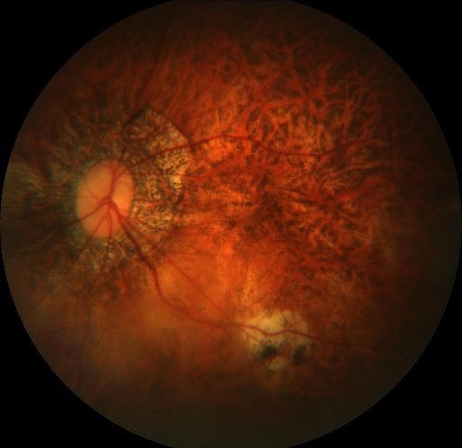
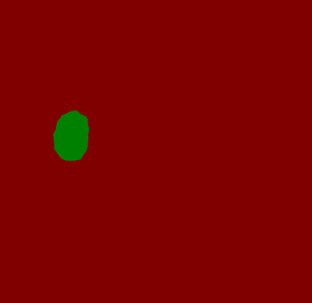
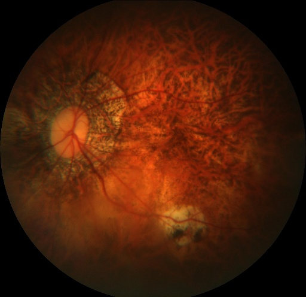
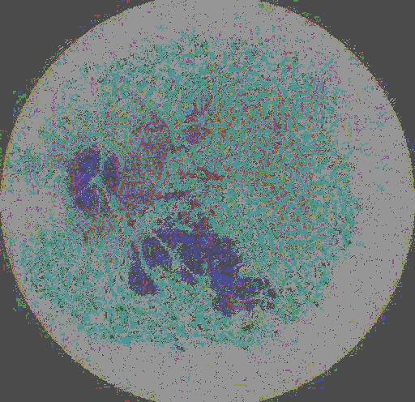

# Adversarial Perturbation for Image Segmentation
Adversarial perturbation for image segmentation, which usually use digital attack methods for adversarial training and evaluating the robustness 
of segmentaion model. Here we provide a demonstration to generate adversarial 
perturbation for BiseNetv2 in the digital world. The demonstration is based on 
**PaddleSeg**(https://github.com/PaddlePaddle/PaddleSeg.git). 


In `PaddleSleeve/AdvBox/img_segmentation`, we demonstrate the adversial 
attack, a method using PGD to produce perturbation to minimize the feature difference between
the values in non-target position and target position, successfully making the object undetected 
and unsegmented in the images.  Otherwise, we also achieve a method using gradient optimization method. 
We use the model ouput of BiseNetv2 as the feature maps, the tensor 
stands for segmentation confidence in BiseNetv2. The adversarial example training code is achieved in
`PaddleSleeve/AdvBox/img_segmentation/paddleseg/core/predict_adv.py`.

Run the following commandlines to adversarial example train and test:
python```
  cd PaddleSleeve/AdvBox/img_segmentation
  CUDA_VISIBLE_DEVICES=0 python image_ghosting_attack.py        --config configs/quick_start/bisenet_optic_disc_512x512_1k.yml  --model_path ./model/model_add_oppo2.pdparams    --image_path ./dataloader        --save_dir output
```

The successful execution of the `image_ghosting_attack.py`, will produce the following outputs.

**Image Compares**

<table align="center">
<tr>
    <td align="center"></td>
    <td align="center"></td>
    <td align="center"></td>
    <td align="center"></td>
</tr>

<tr>
    <td align="center">Original Image</td>
    <td align="center">Segmentation Result</td>
    <td align="center">Adversarial Image</td>
    <td align="center">Adversarial Image Segmentation Result</td>
</tr>
</table>

Additionly, a comparasion between original image and the adversarial example is plotted for better visulization effect:
 
<table align="center">
<tr>
    <td align="center"></td>
    <td align="center"></td>
    <td align="center"></td>
</tr>

<tr>
    <td align="center">Original Image</td>
    <td align="center">Adversarial Image</td>
    <td align="center">Diff*150</td>
</tr>
</table>


**Notes**

   We generate adversarial samples under the "eval" pattern of the segmentation model. For the dropout reason, we achieve the "eval" pattern by manually setting the model parameters not to be updated. While during the test phase, the dropout operation will cause the output result has a small differencein the multiple tests, and then we can add the droput operation under "eval" patther manually. The specific operations are shown in the code.
