# Advbox - Object Detection 
Advbox-ObjectDetection is a sub-module of Advbox, which carries out adversarial attacks & defenses on object detection models. It provides users numerous attacking methods, both blackbox and whitebox, that can be deployed to attack object detection models as well as popular defense methods against intended adversaries to protect these models. Additionally, the models repository in this sub-module includes pretrained version of most of the mainstream object detection models that can be used for users' own attacking or defensing test.

This sub-module is designed primarily for object detection models on PaddleDection platform. It depends on the configs directory from PaddleDetection for model configurations and ppdet module from paddledet package for model structure definitions and some auxiliary utility tools. Note that paddledet-2.5.0 is hard-copied into this project, so users need not to install paddledet themselves. Future developers are also welcomed to add their own models on other platforms if desired. 

For object detection tasks, adversarial attackes roughly falls into two categroies: perturbation on the entire image and patch attack. Perturbation on the entire iamge tries to generate adversarial examples by adding a small perturbation to the entire image. Adversaries are allowed to change every pixels in the image, but each pixes can only vaires by a small size. The overall difference between original images and adversarial examples should be small enough to be negligible to human. On the other hand, patch attack aims at fooling the detection model by adding a patch to the input image. The patch can be add to any places inside the image, and can have arbitrary pattern, but its size is restricted. Unless specified otherwise, the term 'attack' refers to entire-image perturbation attack in this document. More details about attacks and patch attacks, including corresponding demos could be found below. 

## Attack on object detection models 
Adversaries in this subpart is allowed to perturb the entire image, but the amplitude of perturbation is confined. This module provides single_model attack, ensemble attack, and defensive adversarial training under such circumstance. Detailed description and usage can be found below.

### Attacks on single model
In Advbox-ObjectDetection, two well-known whitebox attacking methods, CW and PGD, are implemented, and a command-line tool is given to generate adversarial examples with Zero-Coding.

**Usage:** 
- The python file `launcher.py` in `attacks/single_attack` directory is provided to launch an adversarial attack. Users can specify the attacking method, target model, input images, and other parameters via command-line arguments. 

- **Command-line parameters**
  - `--model`：Select the pre-trained model. Currently, we support ppdet's pretrained yolov3, faster_rcnn, cascade_rcnn, and detr models with various backbones. 
  ```python
  "models": [
    # "paddledet_yolov3_darknet53",
    # "paddledet_yolov3_mobilenet_v1",
    # "paddledet_yolov3_mobilenet_v3_large",
    # "paddledet_yolov3_resnet50vd",
    # "paddledet_faster_rcnn_resnet50",
    # "paddledet_faster_rcnn_resnet50_fpn",
    # "paddledet_faster_rcnn_resnet101_vd_fpn",
    # "paddledet_cascade_rcnn_resnet50_fpn",
    # "paddledet_faster_rcnn_resnext101_64x4d_dcn",
    # "paddledet_detr_resnet50",
    # "paddledet_deformable_detr_resnet50"
  ]
  ``` 
  
  - `--image`：Users can upload their own pictures to the obj_detection/attacks/utils/images folder of the original pictures being attacked.
  - `--criteria`：Provides adversarial criterions, currently support `target_class_miss`.
  - `--target_class`: The category of the object in the input image.
  - `--metric`：Provides different attackingm method. Currently support `carlini_wagner` and `pgd`.
  - `--distance`: The distance metric to be used, choose from `l2` or `linf`

- A kindly Reminder: since paddlepaddle <= 2.1 does not support gradient backward for
 `paddle.nn.SyncBatchNorm` in eval() mode, to run the demonstration, we need to modify
 all `sync-bn` components in detector model into `bn` (because `paddle.nn.BatchNorm`
 supports gradient backward in eval() mode).

 If you want to customize your own demo script, you should try the following methods:

- For object detector like `PaddleSleeve/AdvBox/obj_detection/configs/yolov3/_base_/yolov3_darknet53.yml`,
 add `norm_type: bn` on the third line.
- For object detector like `PaddleSleeve/AdvBox/obj_detection/configs/ppyolo/ppyolo_mbv3_large_coco.yml`, add `norm_type: bn`
 on the 9 th line.

- **Examples**
  - The following example attacks `yolov3_darknet53` models using cw attack, and l2 distance is used. 
  ```shell
  # Navigate to the correct directory 
  cd PaddleSleeve/AdvBox/obj_detection/attack/single_attack

  # paddle：The results can be found under obj_detection/attacks/examples/images.
  python launcher.py  --model paddledet_yolov3_darknet53 --criteria target_class_miss --target_class 3 --metric carlini_wagner --image motor.jpg --distance l2 
  ```
  The above attack outputs the following summary, and a comparasion between original image and the adversarial example is plotted for better visulization effect.
  
  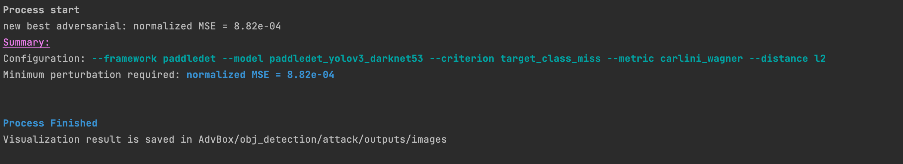
  

**Misclassification attacks on different models:**

<table align="center">
    <tr>
        <td align="center">Model</td>
        <td align="center">Original Detection Results</td>
        <td align="center">Adversarial Detection Results </td>
        <td align="center">Diff</td>
    </tr>
    <tr>
        <td align="center">yolov3</td>
        <td align="center">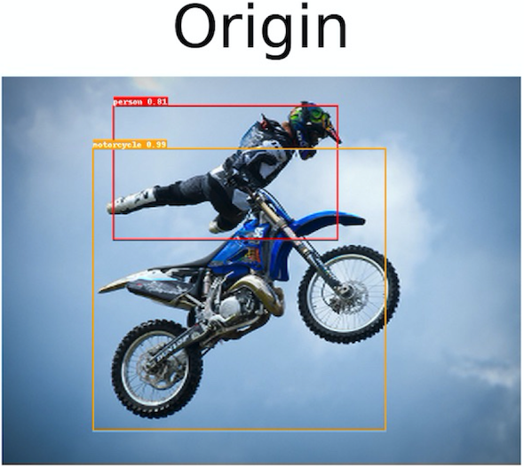</td>
        <td align="center">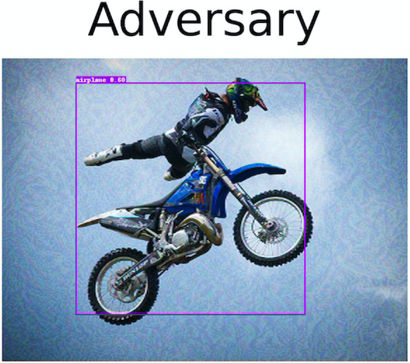</td>
        <td align="center">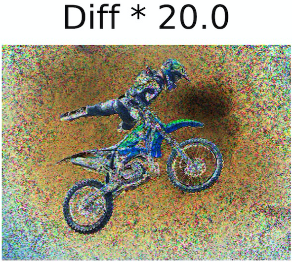</td>
    </tr>
    <tr>
        <td align="center">detr</td>
        <td align="center"></td>
        <td align="center">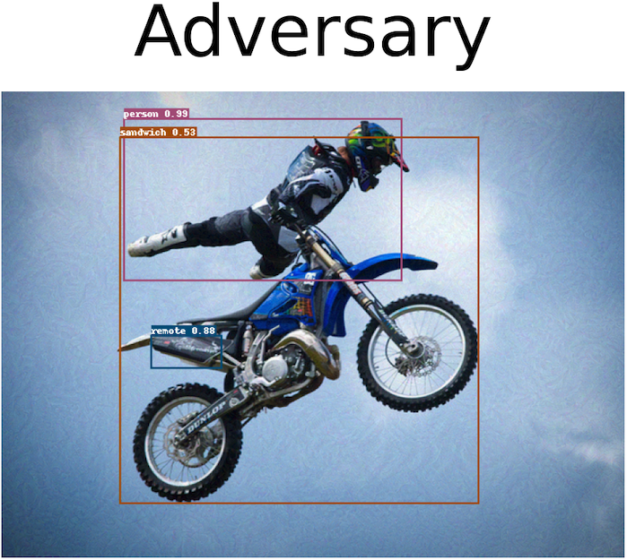</td>
        <td align="center">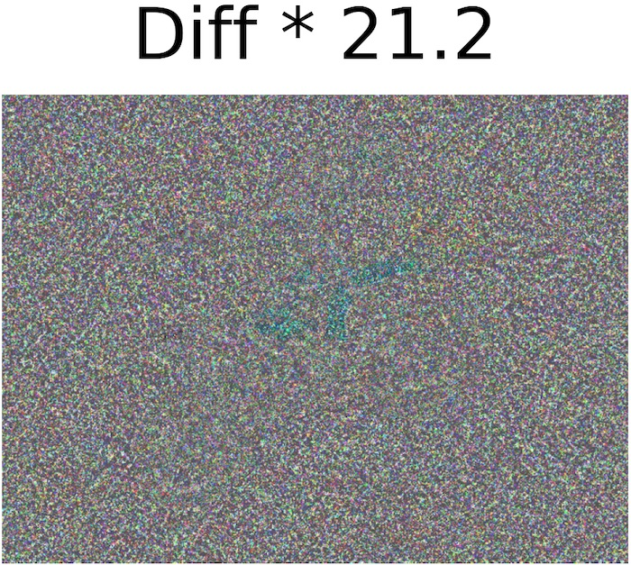</td>
    </tr>
    <tr>
        <td align="center">ssd</td>
        <td align="center">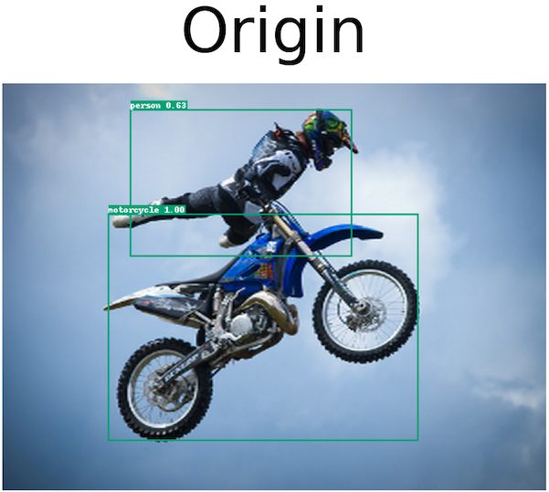</td>
        <td align="center">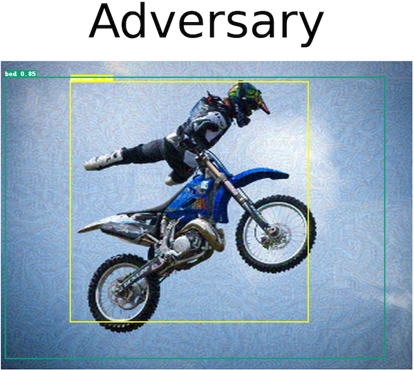</td>
        <td align="center">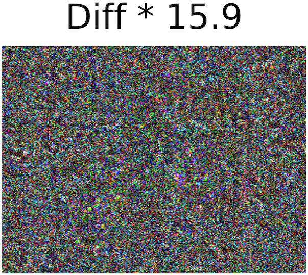</td>
    </tr>
</table>

      
### Attack Transferability Eval & Ensemble Attacks
Adversarial examples are particularly useful because of its transferability (i.e. the adv example trained on one model can also fool another model.) Advbox provides automatic scripts to evaluate the transferabilty of cw and pgd attack. These scripts can be found in `ensemble_attack` folder. 

- **Serial Ensemble Attack**
  
  Serial ensemble attack takes in as input a list of models, and tries to attack them in sequence. The successful adversarial example of the previous model is used as the input to the later model. The successful adversarial example of the last model is passed in the victim model for transferability test.
  
  - **Usage**
  
    This evaluation script can be executed by the following command
    ```shell
    cd PaddleSleeve/AdvBox/obj_detection/attack/ensemble_attack
    python serial_attack_eval.py
    ```
    Note that this script does not take command-line arguments. Users should modify the model list<sup>*</sup> and attack settings specification in the code in order to fit their own task. `dataset_dir`is the path to the input images. The default folder contains about 30 images. Users can add/remove images from the folder, or switch to their own test dataset if desired. 
    ```python
  
    ...
  
    # Choose your model here
    # "paddledet_yolov3_darknet53",
    # "paddledet_yolov3_mobilenet_v1",
    # "paddledet_yolov3_mobilenet_v3_large",
    # "paddledet_yolov3_resnet50vd",
    # "paddledet_faster_rcnn_resnet50",
    # "paddledet_faster_rcnn_resnet50_fpn",
    # "paddledet_faster_rcnn_resnet101_vd_fpn",
    # "paddledet_cascade_rcnn_resnet50_fpn",
    # "paddledet_faster_rcnn_resnext101_64x4d_dcn",
    # "paddledet_detr_resnet50",
    # "paddledet_deformable_detr_resnet50"
    model_list = ["paddledet_yolov3_darknet53",
                  "paddledet_faster_rcnn_resnet50_fpn"]
    victim_model_name = "paddledet_yolov3_mobilenet_v3_large"
    
    # Change here if you want to use your own test dataset
    dataset_dir = os.path.dirname(os.path.realpath(__file__ + '../../')) + '/utils/images/ensemble_demo'

    # Change the attacking config below
    dist = 'l2'
    attack_method = 'carlini_wagner'
    eps = 10 / 255
    num_test = 20

    # You need not change anything below
    
    ...
    
    ```
  - **Examples**

   The code snippiet above tries to attack yolov3_darknet53 and faster_rcnn_resnet50 networks in seriers. The adversatial example is then passed into another object detection network yolov3_mobilentv3 to test the transferability of the adversarial example. 
   
   The sample output will be similar to the following. 
   
  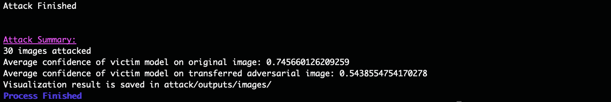
  
  A comparasion plot is shown to demonstrate the transferability of the adversarial examples. It proves that the adversarial example trained on one model can also, at least to some extent, fool other models.
  
    


   
- **Weighted Ensemble Attack PGD**

  Another method of ensemble attack is to attack all models at the same time. The prediction results from all models are take into account when stepping the adversarial example. It is also possible to assign different weight to to models to be attacked. Models with larger weight may affect the adversarial example more greatly. 

  <sup>*</sup>*Note:* Use PaddlePaddle>=2.2.2 solving dropout eval mode does not support backward computation of gradients. 
  
  - **Usage**

    Use the following command to run the PGD ensemble attack
    ```shell
    cd PaddleSleeve/AdvBox/obj_detection/attack/ensemble_attack
    python weighted_ensemble_attack_pgd.py
    ```
    Similar as in serial ensemble attack, users are welcome to change the list of models to be attacked<sup>*</sup> as well as other configs directly in the code. 
    ```python
    # choose from available models:
    # "paddledet_yolov3_darknet53",
    # "paddledet_yolov3_mobilenet_v1",
    # "paddledet_yolov3_mobilenet_v3_large",
    # "paddledet_yolov3_resnet50vd",
    # "paddledet_faster_rcnn_resnet50",
    # "paddledet_faster_rcnn_resnet50_fpn",
    # "paddledet_faster_rcnn_resnet101_vd_fpn",
    # "paddledet_cascade_rcnn_resnet50_fpn",
    # "paddledet_faster_rcnn_resnext101_64x4d_dcn",
    # "paddledet_detr_resnet50",
    # "paddledet_deformable_detr_resnet50"
    model_list = ['paddledet_yolov3_darknet53',
                  'paddledet_detr_resnet50',
                  'paddledet_faster_rcnn_resnet50_fpn']
    weight_list = [1, 1, 1]

    victim_model_name = 'paddledet_yolov3_mobilenet_v3_large'
    
    ... 
    
    ```
    
  - **Examples**

    The above code snippet demonstrates an example that ensembles attack on yolov3_darknet, faster_rcnn, and detr models to attack yolov3_mobilenet. 
    
  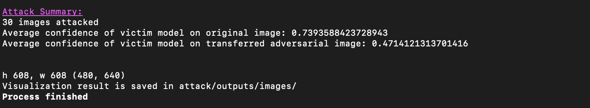
  
  Here is the adversarial example with best transerability 
  
  

- **Weighted Ensemble Attack CW**

  This script launches cw ensemble attack. Its usage is basically the same as weighted_ensemble_attack_pgd
  
  - **Examples**

    ```python 
    # choose from available models:
    # "paddledet_yolov3_darknet53",
    # "paddledet_yolov3_mobilenet_v1",
    # "paddledet_yolov3_mobilenet_v3_large",
    # "paddledet_yolov3_resnet50vd",
    # "paddledet_faster_rcnn_resnet50",
    # "paddledet_faster_rcnn_resnet50_fpn",
    # "paddledet_faster_rcnn_resnet101_vd_fpn",
    # "paddledet_cascade_rcnn_resnet50_fpn",
    # "paddledet_faster_rcnn_resnext101_64x4d_dcn",
    # "paddledet_detr_resnet50",
    # "paddledet_deformable_detr_resnet50"
    model_list = ['paddledet_yolov3_darknet53',
                  'paddledet_detr_resnet50',
                  'paddledet_faster_rcnn_resnet50_fpn']
    weight_list = [1, 1, 1]

    victim_model_name = 'paddledet_yolov3_mobilenet_v3_large'
    ```
    The outputs are as follows. 
    
  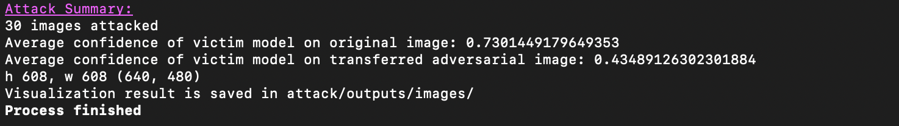
    
  <sup>*</sup>*Note:* The order to initiate the list of models matters in some case. Since the config files are shared globally, if two models have the same structure and the one with non-default settings is initiated first, these settings will shadow the default settings used by the other model. This can result in model structure and parameters mismatch. In general, try to initiate the model with simpler structure first. 
  
     *e.g.* Declear your model list as `[faster_rcnn_resnet50, faster_rcnn_resnet50_fpn]` instead of `[faster_rcnn_resnet50_fpn, faster_rcnn_resnet50]`


### Attack with black-box methods

In `PaddleSleeve/AdvBox/obj_detection/attack/black_attack`, we achieve the black attack algorithm HopSkipJumpAttack(HSJA) with the decision-based adversarial attacks, a method  generating 
the adversarial examples based solely on observing output labels returned by the targeted model. The HSJA algorithm estimate the gradient direction using binary 
information at the decision boundary. The method includes both untargeted and targeted attacks optimized for l2 and l∞ similarity metrics respectively. 


#### Dependencies

The code for HopSkipJumpAttack runs with Python and one deep learning framework. Here we use the paddlepaddle as an example. Please pip install the following packages:
- `numpy`
- `PaddlePadddle2.*`
- `scipy`

    If use Tensoflow or Pytorch framework, just only modify the method from numpy array to tensor, and the input image prcoessing methods for sepcific object detection methods, as follows:
    ```python 
    1. perturbed = paddle.to_tensor(perturbed, dtype='float32', place=paddle.CUDAPlace(0))
    2. data0, datainfo0  = _image2outs(FLAGS.infer_dir, FLAGS.infer_img, cfg)
    ```
       
#### Run HSJA Attack Adversarial Training
The black attack HSJA algorithm should support different object detection models, thus we test four different types of detection methods, yolov3 and ppyolo, ssd, faster-rcnn, deter.
    
```shell 
cd PaddleSleeve/AdvBox/obj_detection/attack/black_attack
# respectively use ppyolo, yolov3, ssd, faster-rcnn, detr detection models:
python hsja.py -c ../../configs/ppyolo/ppyolo_mbv3_large_coco.yml -o weights=https://paddledet.bj.bcebos.com/models/ppyolo_mbv3_large_coco.pdparams --infer_img=dataloader/car_05.jpeg --sim_label 3 8 6
python hsja.py -c ../../configs/yolov3/yolov3_mobilenet_v3_large_270e_coco.yml -o weights=https://paddledet.bj.bcebos.com/models/yolov3_mobilenet_v3_large_270e_coco.pdparams --infer_img=dataloader/car_05.jpeg --sim_label 3 8 6
python hsja.py -c ../../configs/ssd/ssd_mobilenet_v1_300_120e_voc.yml -o weights=https://paddledet.bj.bcebos.com/models/ssd_mobilenet_v1_300_120e_voc.pdparams --infer_img=dataloader/car_test3.jpg --sim_label 6 5
python hsja.py -c ../../configs/faster_rcnn/faster_rcnn_r50_1x_coco.yml -o weights=https://paddledet.bj.bcebos.com/models/faster_rcnn_r50_1x_coco.pdparams --infer_img=dataloader/car_05.jpeg --sim_label 3 8 6
python hsja.py -c ../../configs/detr/detr_r50_1x_coco.yml -o weights=https://paddledet.bj.bcebos.com/models/detr_r50_1x_coco.pdparams --infer_img=dataloader/car_05.jpeg --sim_label 3 8 6
```
Note: The "sim_label 3 8 6" is the labels to hide, and the first "3" is the groundtruth label of the object. The sim_label shoudld be set manually.

See hsja.py for details.


**Image Compares for untargeted attack**

<table align="center">
<tr>
    <td align="center">Model</td>
    <td align="center">Original Image</td>
    <td align="center">Original Detection Results</td>
    <td align="center">Acquired Adversarial Image </td>
    <td align="center">Adversarial Detection Results </td>
    <td align="center">Diff*100</td>
    
</tr>

<tr>
    <td align="center">detr</td>
    <td align="center"></td>
    <td align="center">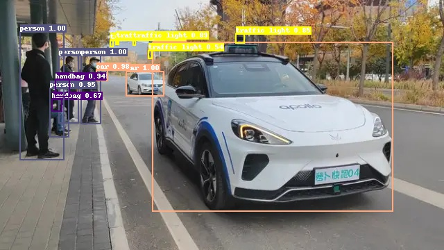</td>
    <td align="center">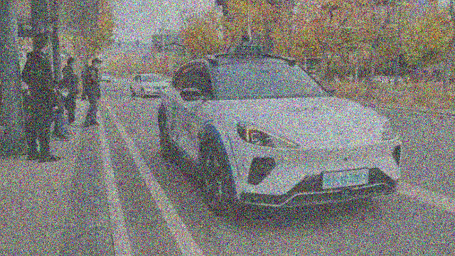</td>
    <td align="center">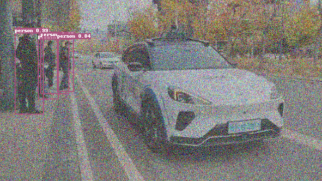</td>
    <td align="center">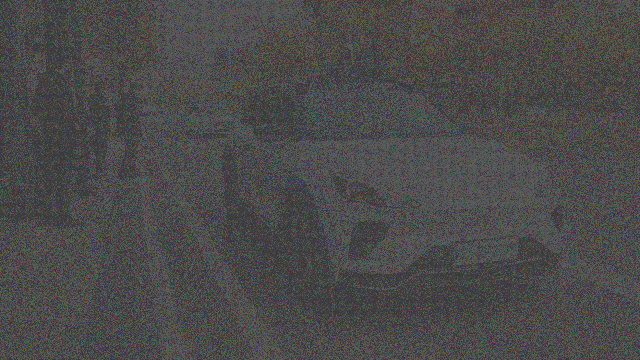</td>
</tr>

<tr>
    <td align="center">ppyolo</td>
    <td align="center"></td>
    <td align="center">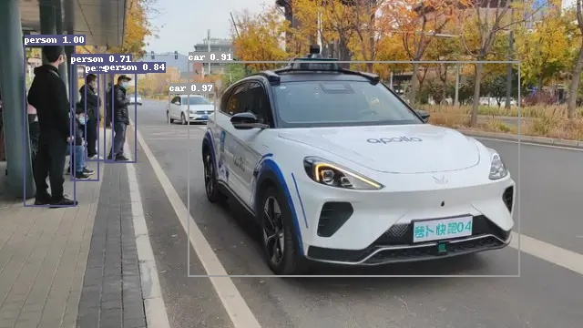</td>
    <td align="center"></td>
    <td align="center">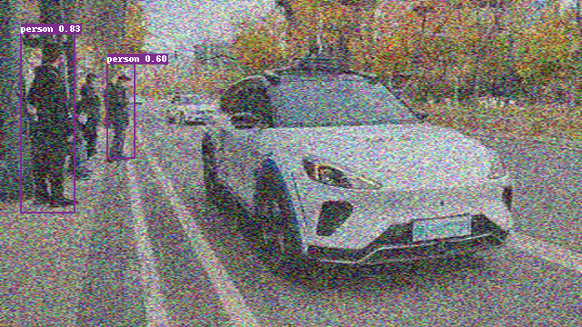</td>
    <td align="center">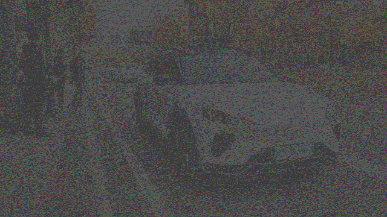</td>
</tr>

<tr>
    <td align="center">faster-rcnn</td>
    <td align="center"></td>
    <td align="center">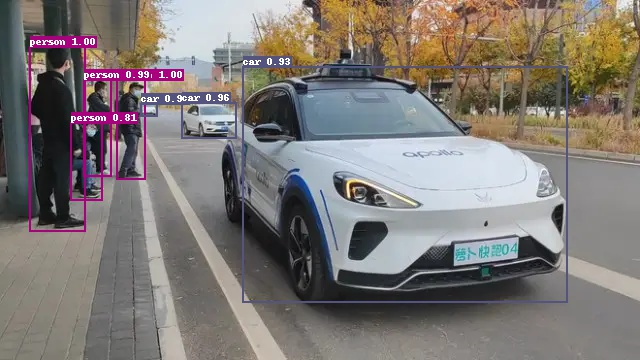</td>
    <td align="center">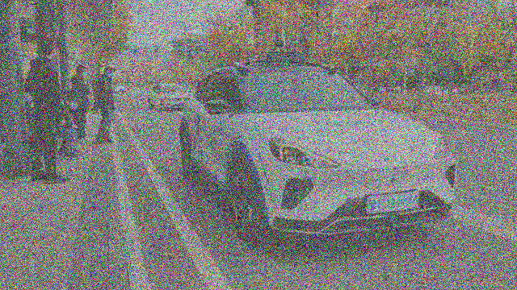</td>
    <td align="center">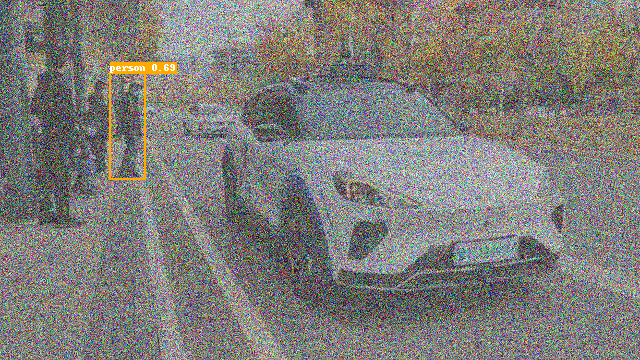</td>
    <td align="center"></td>
</tr>

</table>


## Citation
If you use this code for your research, please cite our [paper](https://arxiv.org/abs/1904.02144):
```
@article{chen2019boundary,
  title={HopSkipJumpAttack: A Query-Efficient Decision-Based Adversarial Attack},
  author={Chen, Jianbo and Jordan, Michael I. and Wainwright, Martin J.},
  journal={arXiv preprint arXiv:1904.02144},
  year={2019}
}
```


### Defense
As malice adversaries increasingly threat AI security, people have proposed numerous methods to defense the deep learning netweork against the attack. Advbox also provides such defensive tools. The codes for defensive adversarial training are in `obj_detection/attack/defense` directory, and a script `advtrain_launcher.py` that allows user to launch an adversarial training from command-line arguments can also be found there. 

- **Usage**
  - **Data**

    Need to download coco2017 to `PaddleSleeve/AdvBox/obj_detection/dataset/coco` in advance. If coco2017 is not available, the script will be downloaded automatically.

  - **Config file**
  
    The launcher uses yaml files for model declaration and training configurations. These files can be found in `obj_detection/configs` directory, and users can add their own model there. If users want to construct their models on the base of other models, simply declear the base config file at the beginning of their own file and redefine the parameters they would like to overwrite. We also need to add `base_model_name`, which represents the name of the base model to automatically download the weight. 
    
    A sample config file `yolov3_darknet53_advtrain`
      ```yaml
      _BASE_: [
      './yolov3_darknet53_270e_coco.yml',
      ]
      base_model_name: yolov3_darknet53_270e_coco

      epoch: 540

      LearningRate:
        base_lr: 0.0005
        schedulers:
         - !PiecewiseDecay
           gamma: 0.1
           milestones:
            - 432
            - 486
        - !LinearWarmup
          start_factor: 0.
          steps: 8000

      TrainReader:
        batch_size: 4
        collate_batch: False

      TrainDataset:
        !COCODataSet
          image_dir: train2017
          anno_path: annotations/instances_train2017.json
          dataset_dir: ../../dataset/coco
          data_fields: ['image', 'gt_bbox', 'gt_class', 'gt_score', 'is_crowd']

      EvalDataset:
        !COCODataSet
          image_dir: val2017
          anno_path: annotations/instances_val2017.json
          dataset_dir: ../../dataset/coco

      ``` 

  - **Command-line parameters**
    - `--model`：Select the model to be defended. This should be the name of your yaml config file.
    - `--defense`: Selecte the defense method, support `natural_advtrain` and `free_advtrain`.
    - `--pretrained`: Whether to use pretrained models. If true, ppdet's pretrained weight for the corresponding model will be loaded
    - `--pretrained_weight`: The path to users' own pretrained weight. This only works when `--pretrained` flag is set to False
  
  - **Examples**
  
    Users can initiate an adversarial training by the following command:
    ```shell
    cd PaddleSleeve/AdvBox/obj_detection/attack/defense
    python advtrain_launcher.py --model yolov3_darknet53_advtrain --defense natural_advtrain --pretrained True
    ```

    The script will save the model after each epoch. Both the model and optimizer are saved in `PaddleSleeve/AdvBox/obj_detection/attack/outputs/models/`.


## Patch attack on object detection models 

In `PaddleSleeve/AdvBox/obj_detection/patch_attack`, we achieve the extended EOT attacking algorithm, a method using EOT to produce patch perturbation
and train to make the detection method of the added patch perturbation images give the wrong detection results. Specifically, we optimize the loss function
definition using the similar top three labels and top three logits to decrease the true object label confidence, and 
thus, the attack is able to succeed.


- A kindly Reminder: since paddlepaddle <= 2.1 does not support gradient backward for
 `paddle.nn.SyncBatchNorm` in eval() mode, to run the demonstration, we need to modify 
 all `sync-bn` components in detector model into `bn` (because `paddle.nn.BatchNorm` 
 supports gradient backward in eval() mode).
 
 If you want to customize your own demo script, you should try the following methods:
 
- For object detector like `PaddleSleeve/AdvBox/obj_detection/configs/yolov3/_base_/yolov3_darknet53.yml`,
 add `norm_type: bn` on the third line.
- For object detector like `PaddleSleeve/AdvBox/obj_detection/configs/ppyolo/ppyolo_mbv3_large_coco.yml`, add `norm_type: bn` 
 on the 9 th line.

### Run Target Patch Adversarial Train
  After changing all `sync-bn` components into `bn`, run the following commandlines.

    1. cd PaddleSleeve/AdvBox/obj_detection/patch_attack

  **single attack**: respectively use ppyolo, yolov3 and ssd detection models:

    2. python target_patch_eto_ppyolo.py -c ../configs/ppyolo/ppyolo_mbv3_large_coco.yml -o weights=https://paddledet.bj.bcebos.com/models/ppyolo_mbv3_large_coco.pdparams --infer_img=dataloader/car_05.jpeg
 
    3. python target_patch_eto_yolov3.py -c ../configs/yolov3/yolov3_mobilenet_v3_large_270e_coco.yml -o weights=https://paddledet.bj.bcebos.com/models/yolov3_mobilenet_v3_large_270e_coco.pdparams --infer_img=dataloader/car_05.jpeg

    4. python target_patch_eto_ssd.py -c ../configs/ssd/ssd_mobilenet_v1_300_120e_voc.yml -o weights=https://paddledet.bj.bcebos.com/models/ssd_mobilenet_v1_300_120e_voc.pdparams --infer_img=dataloader/car_05.jpeg

  **ensemble attack**: using ppyolo and yolov3 detection models:

    5. python target_patch_eto_ensemble.py -c ../configs/ppyolo/ppyolo_mbv3_large_coco.yml,../configs/yolov3/yolov3_mobilenet_v3_large_270e_coco.yml -o weights=https://paddledet.bj.bcebos.com/models/ppyolo_mbv3_large_coco.pdparams,https://paddledet.bj.bcebos.com/models/yolov3_mobilenet_v3_large_270e_coco.pdparams --infer_img=dataloader/car_05.jpeg
    
 **Note**: the origin image size, the added patch size and position, and the object label shoud be manually set in `PaddleSleeve/AdvBox/obj_detection/patch_attack/patch_def/EOTB_car*.xml`.


The successful execution of the `target_patch_eto_ppyolo.py`, will produce the following outputs.

**Image Compares**

<table align="center">
<tr>
    <td align="center"></td>
    <td align="center">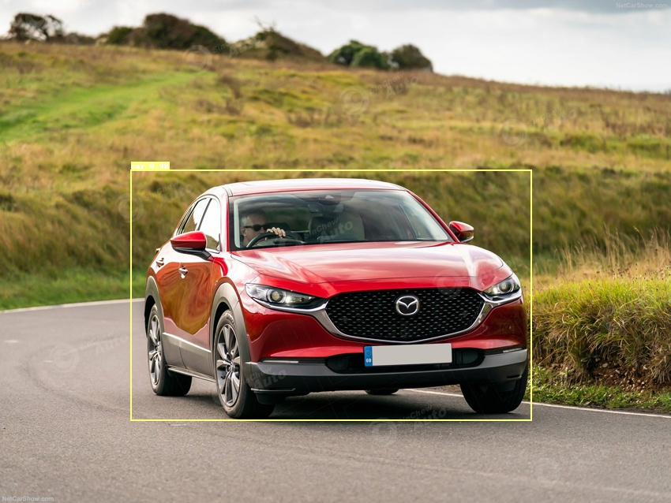</td>
    <td align="center"></td>
    <td align="center">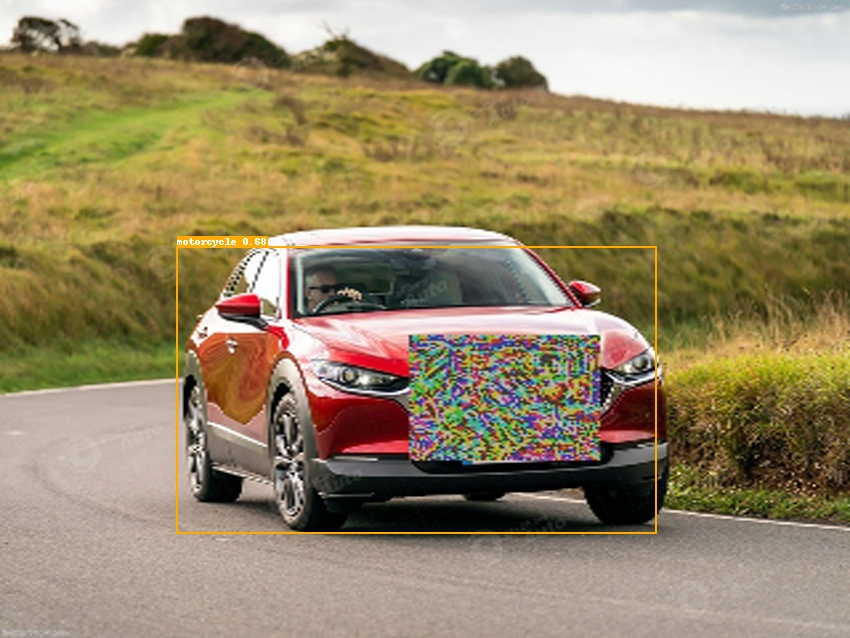</td>
</tr>

<tr>
    <td align="center">Original Image</td>
    <td align="center">Original Detection Results</td>
    <td align="center">Acquired Adversarial Image </td>
    <td align="center">Adversarial Detection Results </td>
</tr>
</table>
The result shows that the confidence score of the object groundtruth label "car" is decreased from 0.98 to lower than 0.5, and the confidence scores of "motorcycle" and "truck" are increased to 0.89 and 0.61, and thus the predicted label is falsely detected as "motorcycle" and "truck". However, we find the "motorcycle" and "truck" are both the car-related labels. If we further want to make the "car" disappear or falsely detected as the lables unrelated to cars. We add the "motorcycle" and "truck" lable as the attacked label, combine them to the loss computation with different weights according to the confidence scores. The weights can be adjusted according to the objetcts you use. The example usage are as follows:

    pcls_3 = paddle.reshape(pcls[:, :, :, :, self.label_id], [b, anc*h*w])  # self.label_id: 3
    pcls_3 = paddle.fluid.layers.reduce_max(pcls_3, 1)
    pcls_3 = paddle.fluid.layers.reduce_sum(pcls_3, 0) # b, 1
    C_target += 0.5 *pcls_3
    pcls_4 = paddle.reshape(pcls[:, :, :, :, 4], [b, anc*h*w])  # 4: motorcycle
    pcls_4 = paddle.fluid.layers.reduce_max(pcls_4, 1) # b
    pcls_4 = paddle.fluid.layers.reduce_sum(pcls_4, 0) # b, 1
    C_target += 0.8*pcls_4
    pcls_8 = paddle.reshape(pcls[:, :, :, :, 8], [b, anc*h*w]) 8: truck
    pcls_8 = paddle.fluid.layers.reduce_max(pcls_8, 1) # b
    pcls_8 = paddle.fluid.layers.reduce_sum(pcls_8, 0) # b, 1
    C_target += 0.4*pcls_8
    
The improved results are as follows:
<table align="center">
<tr>
    <td align="center"></td>
    <td align="center"></td>
    <td align="center"></td>
    <td align="center"></td>
</tr>

<tr>
    <td align="center">Original Image</td>
    <td align="center">Original Detection Results</td>
    <td align="center">Acquired Adversarial Image </td>
    <td align="center">Adversarial Detection Results </td>
</tr>
</table>

## Adaptive Patch attack on object detection models
  In `PaddleSleeve/AdvBox/obj_detection/adaptive_patch_attack`, we achieve an adaptive patch learning attack algorithm faced multi-scene, multi-scale, multi-view and multi-objects. Compared to the classic patch adversarial attack framework, the followings are mainly improved:  
  
  1) provide adaptive patch position determination algorithm;      
  2) provide adaptive patch size determination algorithm;  
  3) provide the patch position and size determination algorithm for multi-scale, multi-scene and multi-object images during training and testing with better adaptive capability;  
  4) provide the training strategy of attack algorithm for object detection, including median pooling, smoothness, nps, and intervention of intermediate layer feature interference enhancement strategy.  

### Run adaptive patch adversarial attack  
    Step1: For the given video, conduct `video2image.py` to obtain images.    
    Step2: Obtain the object label information for each image, including class label and boxes, where the "object" is to be attacked, and save as     *.txt, as follows:    
       6 0.576 0.447 0.834 0.880    
       where the first number is the object class label, and the last four numbers are the center coordinates and aspect ratio of the target box. The object label information can be obtained by calling paddledet models.    
    Step3: Select optimal patch location and size. Conduct `optim_pos.py` to obtain the optimal patch position of multiple candidates.  
      ```python 
      python optim_pos.py
      ```
    Step4: Based on the above candidate patch positions, conduct `optim_range.py` to obtain the optimal patch size of multiple candidates.    
      ```python 
      python optim_range.py
      ```
    Step5: For each candidate patch position and size, modify the patch_def information according to your needs.     
      ```python
      cd patch_def
      vim patch_def.xml
       
      The patch_def.xml is mainly defined as follows:  
         size，the size of the image. Include: image width, image height, image depth.  
         <size>
                <width>960</width>
                <height>540</height>
                <depth>3</depth>
         </size>

         obj_size, the total size of the object to be attack.  
         <obj_size>
                <xmin>274</xmin>
                <ymin>164</ymin>
                <width>445</width>
                <height>243</height>
         </obj_size>

         label, the object class label to be attacked.  
         <label>
                <id>8</id>
         </label>
       
         object, the patch information definition.  
         <object>
                <name>ad_sticker</name>
                <pose>Unspecified</pose>
                <truncated>0</truncated>
                <difficult>0</difficult>
                <bndbox>
                        <xmin>419</xmin>
                        <ymin>208</ymin>
                        <xmax>574</xmax>
                        <ymax>313</ymax>
                </bndbox>
         </object>
      ```
    Step 6: modify the data loader file:   
      ```python
      cd PaddleSleeve/AdvBox/obj_detection/ppdet/data/transform
      vim __init.py :
        #from .operators import *
        from .operators_adapatch import *
      ```
    Step7: Run the adaptive_patch_attack.py to training adaptive optimal patch.   
      ```python
      python adaptive_patch_attack.py -c ../configs/yolov3/yolov3_mobilenet_v3_large_270e_coco_adapatch.yml -o weights=https://paddledet.bj.bcebos.com/models/yolov3_mobilenet_v3_large_270e_coco.pdparams --infer_dir=./truck_toy/
      ```
    Step8: Run the adaptive_patch_attack_test.py to add patch into the testing digit images.    
      ```python
      python adaptive_patch_attack_test.py -c ../configs/yolov3/yolov3_mobilenet_v3_large_270e_coco_adapatch.yml --infer_dir=./truck_toy/
      ```
### Results
   
<table align="center">
<tr>
    <td align="center">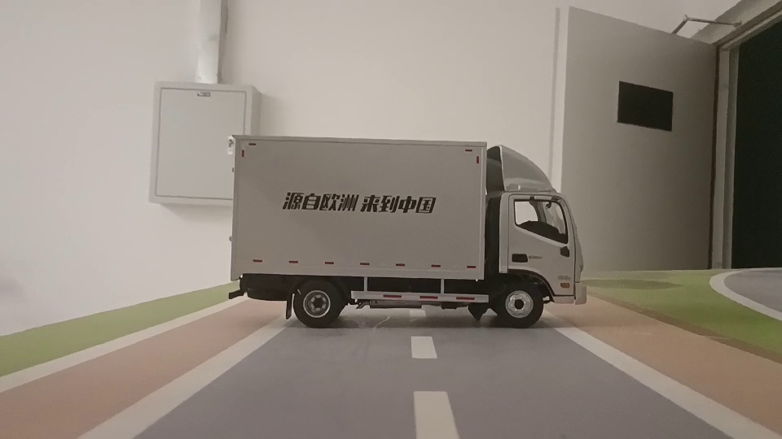</td>
    <td align="center">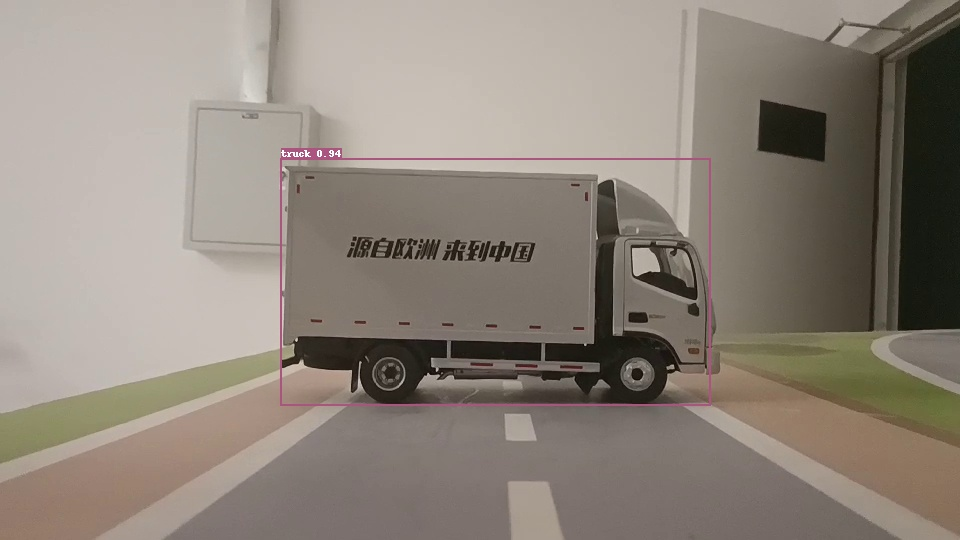</td>
    <td align="center"></td>
    <td align="center"></td>
    <td align="center">52%</td>
    <td align="center">66.5%</td>
</tr>

<tr>
    <td align="center">Original Image</td>
    <td align="center">Original Detection Results</td>
    <td align="center">Acquired Adversarial Image</td>
    <td align="center">Adversary Detection Results</td>
    <td align="center">Eval attack success rate</td>
    <td align="center">Test attack success rate</td>
</tr>
</table>


