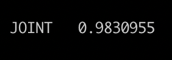
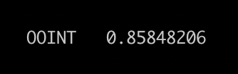

# Adversarial Perturbation for OCR Recognition
Adversarial sample generation for OCR recognition is used for adversarial training and evaluating the robustness 
of OCR recognition models. The algorithm proposes a pgd-based OCR adversarial sample generation method to attack 
the RCNN model. The adversarial attack algorithm mainly aims to the text recognition part. The demonstration is based on 
**PaddleOCR**(https://github.com/PaddlePaddle/PaddleOCR.git). 

In `PaddleSleeve/AdvBox/text_recognition/`, we demonstrate the text recognition attack, a method using an improved PGD to produce 
perturbation to minimize the text confidence score on the groundtruth text label. We obtain the confidence feature map by feeding & sniffing 
the model output. In order to make the acquired adversarial pertuation to be more robust, we introduce the eot adversarial attack algorithm, namely that 
we make multiple copies of the adversarial samples, except for the first sample, the rest of the samples are used for image transformation to simulate 
the disturbance in the real world, including random rotation, translation, adding noise, etc.

## Run Text EOT Attack Demonstration:
  1. `cd PaddleSleeve/AdvBox/text_recognition/`
  2. `python tools/infer_rec.py -c configs/rec/ch_ppocr_v2.0/rec_chinese_lite_train_v2.0.yml -o           Global.pretrained_model=./ch_ppocr_mobile_v2.0_rec_train/best_accuracy.pdparams Global.load_static_weights=false Global.infer_img=./imgs_words/word_1.png`

  3. `python tools/ocr_eot_attack_demo.py -c configs/rec/ch_ppocr_v2.0/rec_chinese_lite_train_v2.0.yml -o   Global.pretrained_model=./ch_ppocr_mobile_v2.0_rec_train/best_accuracy.pdparams Global.load_static_weights=false Global.infer_img=./imgs_words/word_1.png`

## Image Compares

The successful execution of the `tools/ocr_eot_attack_demo.py`, will produce the following outputs:

<table align="center">
<tr>
    <td align="center"></td>
    <td align="center"></td>
    <td align="center"></td>
    <td align="center"></td>
</tr>

<tr>
    <td align="center">Original Image</td>
    <td align="center">Original OCR Results</td>
    <td align="center">Acquired Adversarial Image </td>
    <td align="center">Adversarial OCR Results </td>
</tr>
</table>

Additionly, a comparasion between original image and the adversarial example is plotted for better visulization effect:
 
<table align="center">
<tr>
    <td align="center"></td>
    <td align="center"></td>
    <td align="center"></td>
</tr>

<tr>
    <td align="center">Original Image</td>
    <td align="center">Adversarial Image</td>
    <td align="center">Diff*80</td>
</tr>
</table>

More adversarial samples are availbale in the [output](./output).
