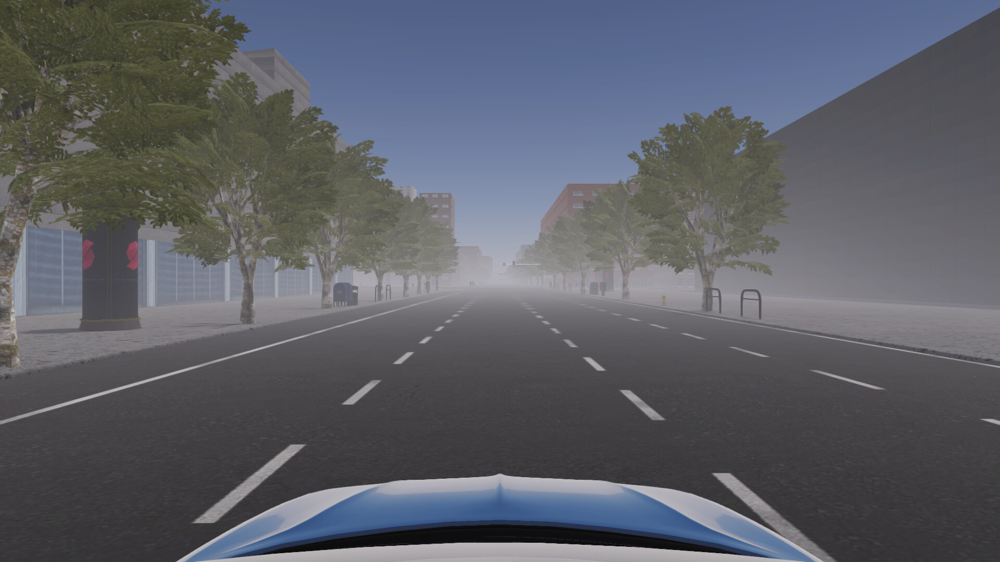
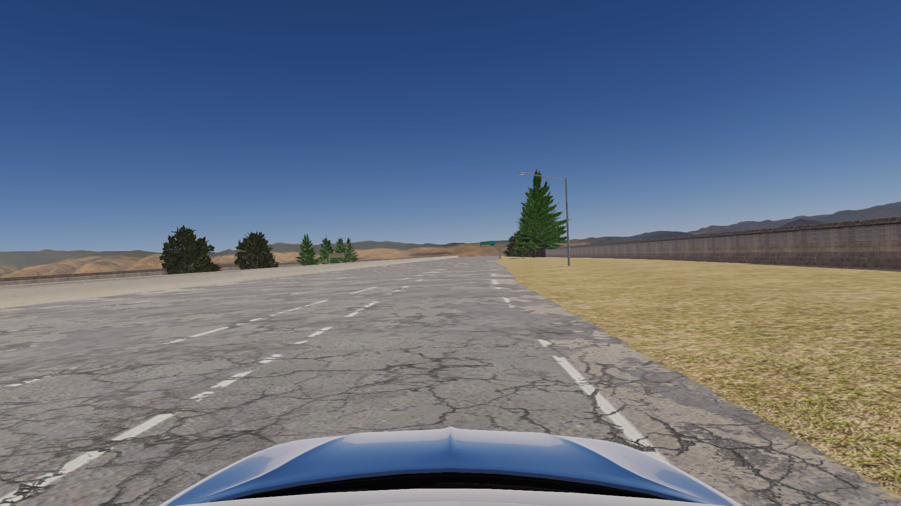

# SimLane Detection Challenge


<table align="center">
<tr>
    <td align="center"></td>
    <td align="center"></td>
    
</tr>
  
</table>


Lane detection is a critical task in autonomous driving, which provides localization information to the control of the car. They instruct the vehicles to interactively and safely drive on the highway. To encourage people to solve the lane detection problem on the highway, we are releasing a dataset containing three main groups:  
- Weather-related scenes, including the foggy weather, the rainy weather; 
- Light conditions, indluing at the dawn, at the night, and the normal illumination (novar); 
- Road conditions, incluing the damaged road, the graffitied road and the wornout road. We then split the dataset into 9 scenes, as follows:

   **hour_dawn**,   **novar**,   **road_graffiti**,   **weather_foggy**,   **Wornout_LM**,   **hour_night**,   **road_damage**,   **road_wet**,   **weather_rainy**.

Each scene gives lane data of different intensities, such as the size of graffiti area, the area of road damage, the severity of hazy weather, etc. Each sub-scene gives a video of about 60 frames, containing a total of 7290 frames. The data we provide is more comprehensive for realistic scenarios, especially for extreme conditions. Therefore, the SimLane dataset has a certain guidence for the performance evaluation of lane line detection models. 

## Dataset Link

  Data Files (list and images): [https://meiyan.cdn.bcebos.com/simlane/simlane_data_list.zip](https://meiyan.cdn.bcebos.com/simlane/simlane_data_list.zip)
  
  Test Labels: [https://meiyan.cdn.bcebos.com/simlane/simlane_test_label.zip](https://meiyan.cdn.bcebos.com/simlane/simlane_test_label.zip)

Please download and unzip the files in one folder, which later is represented as `Dataset_Path`. Then modify the path of `Dataset_Path` in `config.py`.

## Dataset Risk Description

This first release of the SimLane dataset covers the following nine risky environmental variations:

Dawn (Hours): the agent drives during the dawn in low light conditions. Under folder hour_dawn.
Night (Hours): the agent drives during the night in low light conditions. Under folder hour_night.
No Variation: the agent drives under no risky variations. It serves as the baseline. Under folder novar.
Road Damage: the agent drives on the road with damaged surface. Under folder road_damage.
Road Graffiti: the agent drives on the road with randomly painted graffiti patterns. See https://www.cnn.com/travel/article/graffiti-highway-closing-trnd/index.html for a real-world example. Under folder road_graffiti.
Road Wetness: the agent drives on the wet road. Under folder road_wetness.
Foggy (Weather): the agent drives in foggy weather. Under folder weather_foggy_more.
Rainy (Weather): the agent drives on a rainy day. Under folder weather_rainy_more.
Worn-out Lane Marks: the agent drives on roads where some previous lane marks are not wiped out after maintenance. Under folder Wornout_LM.

## Dataset Feature
Complexity:
- Different intensities of rainy, and foggy weather conditions.
- Different daytime, including dawn, night and the daylight.
- Different intensities of road damage, wet, and graffiti conditions.

Dataset size:
- 160 video clips, including 7290 frames.

Camera:
- The view direction of the camera is very close to the driving direction

Type of annotations:
- polylines for lane markings

## Dataset Details

### Directory Structure:
The directory structure for the SimLane dataset is following:

    SimLane
      |
      |----LaneDetection_Binary_Picked/           # video clips
      |------|
      |------|----sequential_images/              # Sequential images for the 9 scenes
      |------|----...
      |
      |----test_label.json                        # Label data in the dataset. 
      |
      |----list                                   # imgaes list 


### Label Data Format

__Format__

```
    {
      'lanes': list. A list of lanes. For each list of one lane, the elements are width values on image.
      'h_samples': list. A list of height values corresponding to the 'lanes', which means len(h_samples) == len(lanes[i]).
      'raw_file': str. the frame file path in a specific scene.
    }
```


The polylines are orgnized by the same distance gap ('h_sample' in each label data) from the recording car. It means you can pair each element in one lane and h_samples to get position of lane marking on images. Also, the lanes are around the center of sight, which we encourage the autonomous driving vehicle to focus on the current lane and left/right lanes. These lanes are essential for the control of the car.

For example,
```
{
  "lanes": [
        [-2, -2, -2, -2, -2, -2, -2, -2, -2, -2, -2, -2, -2, -2, -2, 866, 856, 846, 836, 827, 817, 807, 797, 787, 777, 767, 757, 747, 737, 728, 718, 708, 698, 688, 678, 668, 658, 648, 638, 628, 619, 609, 599, 589, 579, 569, 559, 549, 539, 529, 520, 510, 500, 490, 480, 470, 460, 450], [-2, -2, -2, -2, -2, -2, -2, -2, -2, -2, -2, -2, -2, -2, -2, 1122, 1136, 1149, 1162, 1175, 1189, 1202, 1215, 1228, 1242, 1255, 
        1268, 1281, 1294, 1308, 1321, 1334, 1347, 1361, 1374, 1387, 1400, 1414, 1427, 1440, 1453, 1466, 1480, 1493, 1506, 1519, 1533, 1546, 1559, 1572, 1586, 1599, 1612, 1625, 1639, 1652, 1665, 1678]], 
  "h_samples": [500, 510, 520, 530, 540, 550, 560, 570, 580, 590, 600, 610, 620, 630, 640, 650, 660, 670, 680, 690, 700, 710, 720, 730, 740, 750, 760, 770, 780, 790, 800, 810, 820, 830, 840, 850, 860, 870, 880,
        890, 900, 910, 920, 930, 940, 950, 960, 970, 980, 990, 1000, 1010, 1020, 1030, 1040, 1050, 1060, 1070],
  "raw_file": "LaneDetection_Binary_Picked/Wornout_LM/Wornout_LM0/frame_55.png"
}
```
`-2` in `lanes` means on some h_sample, there is no existing lane marking. The first existing point in the first lane is `(866, 856)`.


## Evaluation

To make it easier to use the SimLane dataset for model performance evaluation, we give the evaluation script of the pre-trained model given by SCNN_Pytorch(https://github.com/harryhan618/SCNN_Pytorch.git) as an example to facilitate more readers, the usage details are in test_SimLane_demo.py, and the three example models are:

- **model_1**: The SCNN_Pytorch model on Tusimple can be downloaded [here](https://drive.google.com/open?id=1IwEenTekMt-t6Yr5WJUa9_kv4d_Pegd_Q). Its configure file is in `exp0`.
  
- **model_2**: The SCNN_Pytorch model on CULane can be downloaded [here](https://drive.google.com/open?id=1AZn23w8RbMh1P6lJcVcf6PcTIWJvQg9u). Its configure file is in `exp10`.
  
- **model_3**: The PINet_new model on Tusimple can be downloaded [here](https://github.com/koyeongmin/PINet_new/tree/master/TuSimple/savefile/0_tensor(0.5242)_lane_detection_network.pkl). The predict_test.json and the evaluation result can be obtained by replacing the Tusimple dataset as our SimLane dataset in PINet_new (https://github.com/koyeongmin/PINet_new.git), and the sepcific modification is in `PINet_new/TuSimple/parameters.py`, as follows:
  
   `test_root_url="/your_data_path/LaneDetection_Evaluation/SimLane/"`

   If you just want to evaluation the testing result, just note the training data in `class Generator` for `PINet_new/TuSimple/data_loader.py`.
  
        
### Demo Usage
  
  1. `cd LaneDetection_Evaluation`
  2. `python test_SimLane_demo.py`
   

### Demo Results:

- **model_1**: SCNN_Pytorch model trained on Tusimple:
   | Accuracy | FP   | FN   |
   | -------- | ---- | ---- |
   | 18.09%   |0.984 | 0.999|
    
- **model_2**: SCNN_Pytorch model traind on CULane:
   | Accuracy | FP   | FN   |
   | -------- | ---- | ---- |
   | 17.77%   |0.952 | 1.0  |
    
- **model_3**: PINet_new model trained on Tusimple:
   | Accuracy | FP   | FN   |
   | -------- | ---- | ---- |
   | 69.18%   |0.290 | 0.308|
