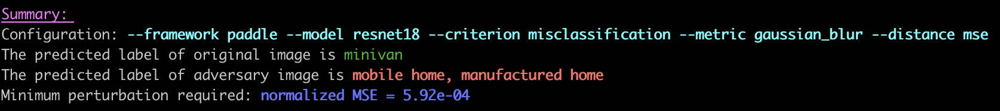
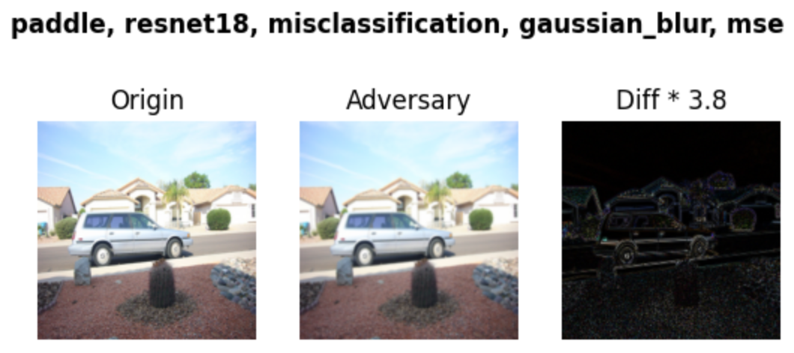
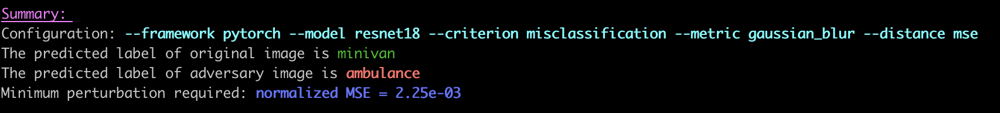
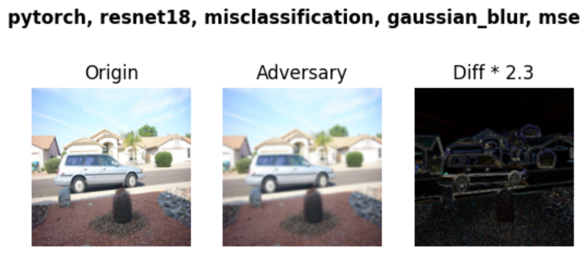
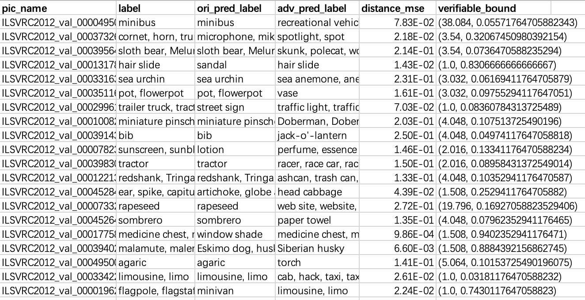
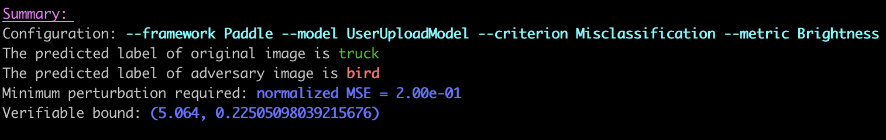
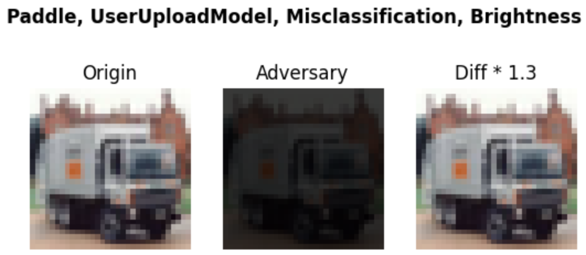

# Robustness
AI产业目前主要关注于准确率的提升， 缺乏有效的深度学习模型鲁棒性评估的手段，无法量化和定义安全攸关场景（无人车视觉感知，图像审核等等）下的模型鲁棒性评估指标。
Robustnesss是一款基于Python开源的AI模型安全鲁棒性评估工具，可为开发人员、研究人员或第三方评测机构提供视觉模型鲁棒性评测等服务，以提升AI系统安全性和可靠性。
本工具通过对模型输入增加噪声、拟真扰动等手段对视觉模型进行测试，评估图像领域主流任务所依赖模型的鲁棒性。
本工具支持多机器学习平台、多标准度量，同时使用者可使用本工具批量生成对抗图片，用于模型验证，或扩充训练数据集来强化模型。


## 鲁棒性评估benchmark 
### 支持不同的Safety属性
- GaussianNoise
- UniformNoise
- GaussianBlur
- Brightness
- ContrastReduction
- MotionBlur
- Rotation
- SaltAndPepper
- Spatial
- Fog
- Frost
- Snow

### 支持不同的度量
- MeanAbsoluteError
- L_inf
- L0
- L2 

### 支持不同的深度学习框架

- Paddle
- Pytorch

## 1. 环境安装

```shell
# 进入目录
cd paddleshield/Robustness

# 创建conda虚拟环境并激活（非必须）
conda create -n perce python=3.7
conda activate perce

# 安装本项目所需库
pip install -e .

# 如果想要使用paddle模型，需要安装paddle，注：根据下方paddle快速安装说明进行安装，本项目paddle版本为2.0.2
python -m pip install paddlepaddle-gpu==2.0.2.post100 -f https://paddlepaddle.org.cn/whl/mkl/stable.html
```

> [paddle快速安装](https://www.paddlepaddle.org.cn/install/quick?docurl=/documentation/docs/zh/install/pip/linux-pip.html)
>
> 注：对于pytorch环境，用户同样需自行安装。

## 2. 调用方式

本项目支持两种调用方式，可以在主程序中通过命令行参数的方式进行调用，也可以直接运行对应的脚本文件。

### 2.1 命令行参数调用

- **命令行参数介绍**

  - `--framework`：选择深度学习框架，支持 paddle、pytorch。
  - `--model`：选择预训练模型，目前paddle框架支持 resnet18、resnet50、vgg16，pytorch 框架支持 vgg11、resnet18 等预训练模型。
  - `--image`：攻击原图片，用户可将自己的图片上传至Robustness/perceptron/utils/images文件夹下。
  - `--criteria`：可以选择的评判标准

  ```python
  "criterions": [
    "misclassification",
    "confident_misclassification",
    "topk_misclassification",
    "target_class",
    "original_class_probability",
    "target_class_probability",
    "misclassification_antiporn",
    "misclassification_safesearch",
    "target_class_miss",
    "target_class_miss_google",
    "weighted_ap"
  ]
  ```

  - `--metric`：攻击方式，支持如下：

  ```python
  "metrics": [
    "additive_gaussian_noise",
    "additive_uniform_noise",
    "blend_uniform_noise",
    "gaussian_blur",
    "brightness",
    "contrast_reduction",
    "motion_blur",
    "rotation",
    "salt_and_pepper_noise",
    "spatial",
    "contrast",
    "horizontal_translation",
    "vertical_translation",
    "snow",
    "fog",
    "frost"
  ]
  ```

- **调用举例**

```shell
# 用paddle框架，使用图片Robustness/perceptron/utils/images/example.jpg 高斯平滑攻击预训练模型 restnet18

# 进入目录
cd paddleshield/Robustness

# paddle：执行命令，所得对比图可在Robustness/examples/images下找到
python perceptron/launcher.py  --framework paddle --model resnet18 --criteria misclassification --metric gaussian_blur --image example.jpg

# pytorch命令：
python perceptron/launcher.py  --framework pytorch --model resnet18 --criteria misclassification --metric gaussian_blur --image example.jpg
```

- **效果展示**









### 2.2 脚本文件调用

在目录 paddleshield/Robustness/examples 下给出了paddle与pytorch的调用脚本文件示例。

- **调用举例**

```shell
# 进入目录
cd paddleshield/Robustness

# 执行脚本文件即可，所得对比图可在Robustness/examples/images下找到
python examples/paddle_sp_example.py
```

### 2.3 批量攻击测试

以上命令均为单样本攻击测试，为了方便用户批量进行验证集多图片文件攻击验证，本项目特支持批量攻击测试，输出结果至csv文件，用户可以根据相关数据绘制相关统计图。

- **调用举例**：选取imagenet验证集进行批量攻击。

```shell
# 进入目录
cd Robustness/batch_attack

# 下载图像验证集imagenet_val存放至Robustness/batch_attack/ILSVRC2012_img_val下

# 图像类别标签于Robustness/batch_attack/caffe_ilsvrc12下

# 执行批量测试，可选命令行参数见2.1
python Batch_Launcher.py  --framework paddle --model resnet50 --criteria misclassification --metric gaussian_blur
```

- **效果展示**



## 3. 用户自定义

为了减轻评估用户深度学习模型的困难，我们提供了以paddle框架为示例，通过相关指南帮助用户移植自己的模型。

### 3.1 Cifar10 图像分类模型

在评估相关分类模型之前，请确保已准备好模型实现和权重，这里以resnet50为基础，训练10分类图像分类模型，并保存权重。

```shell
python Robustness/examples/User_Model/cifar_model.py
```

### 3.2 适应自定义模型

我们要求用户自行创建 `PaddleModel` 或 `PyTorchModel` 的子类，并完成 `load_model()` 方法，以便可以成功加载模型并评估。这里，我们以paddle模型为例，对 3.1 训练所得模型，为用户提供借鉴。

```python
from __future__ import absolute_import

import os
import paddle
from perceptron.models.classification.paddle import PaddleModel


class PaModelUpload(PaddleModel):
    def __init__(self,
                 bounds,
                 num_classes,
                 channel_axis=1,
                 preprocessing=(0, 1)):
        # load model
        model = self.load_model()
        model.eval()

        super(PaModelUpload, self).__init__(model=model,
                                            bounds=bounds,
                                            num_classes=num_classes,
                                            channel_axis=channel_axis,
                                            preprocessing=preprocessing)

    @staticmethod
    def load_model():
        """To be implemented...
           model evaluation participants need to implement this and make sure a paddle model can be loaded and fully-functional"""
        network = paddle.vision.models.resnet50(num_classes=10)
        model = paddle.Model(network)
        here = os.path.dirname(os.path.abspath(__file__))
        model_path = os.path.join(here, '../../../examples/User_Model/checkpoint/test')
        print(model_path)
        model.load(model_path)
        model.network.eval()
        return model.network
```

### 3.3 开始评估

我们以Brightness作为攻击方式为例，对用户自定义模型提供评估代码。

- **调用举例**

```shell
# 进入目录
cd paddleshield/Robustness

# 执行脚本
python examples/paddle_userupload_br.py
```

- **效果展示**





