# Robustness
AI产业目前主要关注于准确率的提升， 缺乏有效的深度学习模型鲁棒性评估的手段，无法量化和定义安全攸关场景（无人车视觉感知，图像审核等等）下的模型鲁棒性评估指标。
Robustnesss是一款基于Python开源的AI模型安全鲁棒性评估工具，可为开发人员、研究人员或第三方评测机构提供视觉模型鲁棒性评测等服务，以提升AI系统安全性和可靠性。
本工具通过对模型输入增加噪声、拟真扰动等手段对视觉模型进行测试，评估图像领域主流任务所依赖模型的鲁棒性。
本工具支持多机器学习平台、多标准度量，同时使用者可使用本工具批量生成对抗图片，用于模型验证，或扩充训练数据集来强化模型。


## 鲁棒性评估benchmark
### 支持不同的Safety属性
- GaussianNoise
- UniformNoise
- GaussianBlur
- Brightness
- ContrastReduction
- MotionBlur
- Rotation
- SaltAndPepper
- Spatial
- Fog
- Frost
- Snow

### 支持不同的度量
- MeanAbsoluteError
- L_inf
- L0
- L2

### 支持不同的深度学习框架

- Paddle
- Pytorch

## 1. 环境安装

```shell
# 进入目录
cd paddleshield/Robustness

# 创建conda虚拟环境并激活（非必须）
conda create -n perce python=3.7
conda activate perce

# 安装本项目所需库
pip install -e .

# 如果想要使用paddle模型，需要安装paddle，注：根据下方paddle快速安装说明进行安装，本项目paddle版本为2.1.1
python -m pip install paddlepaddle-gpu==2.1.1.post101 -f https://www.paddlepaddle.org.cn/whl/linux/mkl/avx/stable.html

# 如果想要使用paddlehub模型，需要安装paddlehub，注：根据下方paddlehub快速安装说明进行安装，本项目paddlehub版本为2.1.0
pip install --upgrade paddlehub -i https://mirror.baidu.com/pypi/simple
```

> [paddle快速安装](https://www.paddlepaddle.org.cn/install/quick?docurl=/documentation/docs/zh/install/pip/linux-pip.html)
>
> [paddlehub快速安装](https://www.paddlepaddle.org.cn/hub)
>
> 注：对于pytorch环境，用户同样需自行安装。

## 2. 调用方式

本项目支持两种调用方式，可以在主程序中通过命令行参数的方式进行调用，也可以直接运行对应的脚本文件。

### 2.1 命令行参数调用

- **命令行参数介绍**

  - `--framework`：选择深度学习框架，支持 paddle、pytorch。
  - `--model`：选择预训练模型，目前paddle框架支持 resnet18、resnet50、vgg16，pytorch 框架支持 vgg11、resnet18 等预训练模型。
  - `--image`：攻击原图片，用户可将自己的图片上传至Robustness/perceptron/utils/images文件夹下。
  - `--criteria`：可以选择的评判标准

  ```python
  "criterions": [
    "misclassification",
    "confident_misclassification",
    "topk_misclassification",
    "target_class",
    "original_class_probability",
    "target_class_probability",
    "misclassification_antiporn",
    "misclassification_safesearch",
    "target_class_miss",
    "target_class_miss_google",
    "weighted_ap"
  ]
  ```

  - `--metric`：攻击方式，支持如下：

  ```python
  "metrics": [
    "additive_gaussian_noise",
    "additive_uniform_noise",
    "blend_uniform_noise",
    "gaussian_blur",
    "brightness",
    "contrast_reduction",
    "motion_blur",
    "rotation",
    "salt_and_pepper_noise",
    "spatial",
    "contrast",
    "horizontal_translation",
    "vertical_translation",
    "snow",
    "fog",
    "frost"
  ]
  ```

- **调用举例**

```shell
# 用paddle框架，使用图片Robustness/perceptron/utils/images/example.jpg 高斯平滑攻击预训练模型 restnet18

# 进入目录
cd paddleshield/Robustness

# paddle：执行命令，所得对比图可在Robustness/examples/images下找到
python perceptron/launcher.py  --framework paddle --model resnet18 --criteria misclassification --metric gaussian_blur --image example.jpg

# 使用其他框架

# paddlehub命令：
python perceptron/launcher.py  --framework paddlehub --model paddlehub_ssd_vgg16_300_coco2017 --criteria target_class_miss --metric gaussian_blur --image example.jpg --target_class -1

# pytorch命令：
python perceptron/launcher.py  --framework pytorch --model resnet18 --criteria misclassification --metric gaussian_blur --image example.jpg

# pytorchhub命令：
python perceptron/launcher.py  --framework pytorchhub --model pytorchhub_yolov5s --criteria target_class_miss --metric gaussian_blur --image example.jpg --target_class -1

#keras命令：
python perceptron/launcher.py --framework keras --model ssd300 --criteria target_class_miss --metric gaussian_blur --image example.jpg --target_class -1

python perceptron/launcher.py  --framework keras --model resnet50 --criteria misclassification --metric gaussian_blur --image example.jpg


```

- **效果展示**

图像分类：

Paddle-ResNet18


图像分类：

Pytorch-ResNet18


目标检测：

PaddleHub-SSD
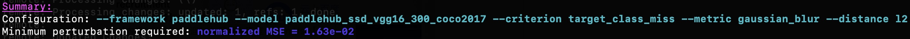


PytorcHub-YOLOv5s
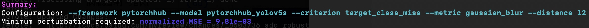

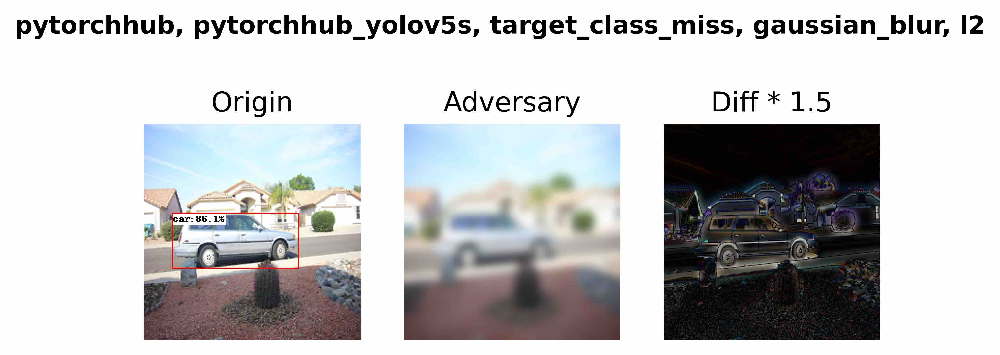


### 2.2 脚本文件调用

在目录 paddleshield/Robustness/examples 下给出了paddle与pytorch的调用脚本文件示例。

- **调用举例**

```shell
# 进入目录
cd paddleshield/Robustness

# 执行脚本文件即可，所得对比图可在Robustness/examples/images下找到
python examples/paddle_sp_example.py
```

### 2.3 批量攻击测试

以上命令均为单样本攻击测试，为了方便用户批量进行验证集多图片文件攻击验证，本项目特支持批量攻击测试，输出结果至csv文件，用户可以根据相关数据绘制相关统计图。

- **调用举例**：选取imagenet验证集进行批量攻击。

```shell
# 进入目录
cd Robustness/batch_attack

# 下载图像验证集imagenet_val存放至Robustness/batch_attack/ILSVRC2012_img_val下

# 图像类别标签于Robustness/batch_attack/caffe_ilsvrc12下

# 执行批量测试，可选命令行参数见2.1
python Batch_Launcher.py  --framework paddle --model resnet50 --criteria misclassification --metric gaussian_blur
```

- **效果展示**


### 2.3 鲁棒性评估

#### 图像分类
展示了图像分类模型在**动物**图像上的鲁棒性评估结果。

- **结果展示**

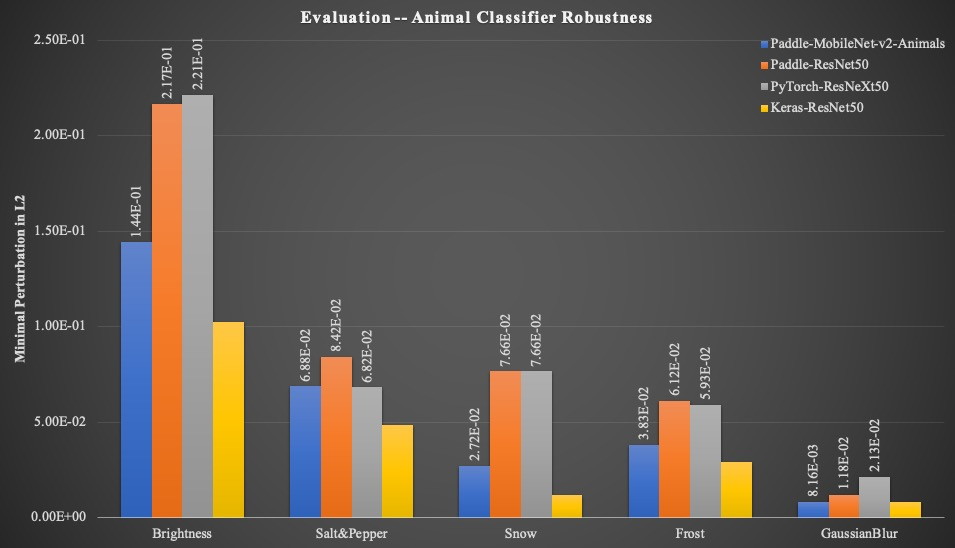

#### 目标检测
展示了目标检测模型在**行人**图像上的鲁棒性评估结果。

- **结果展示**

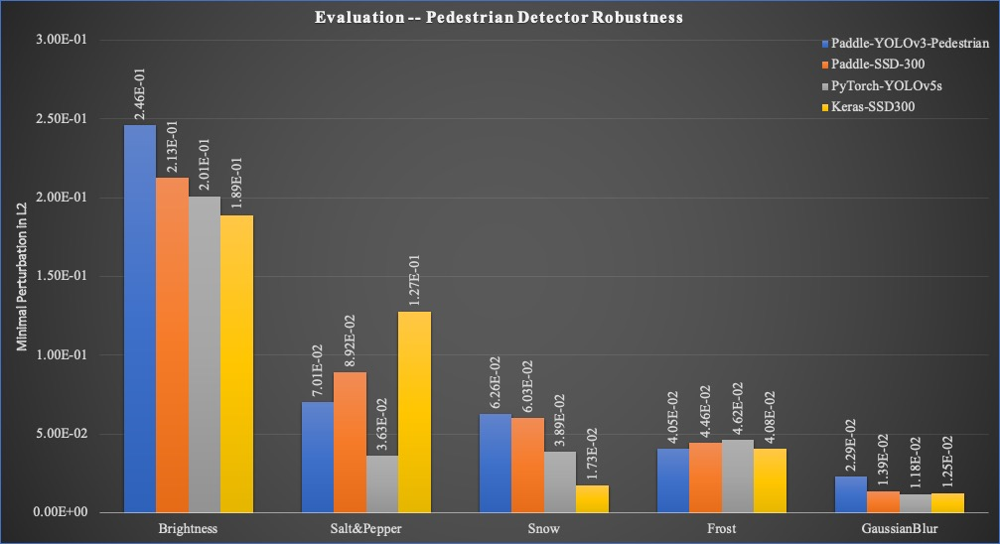


## 3. 用户自定义

为了减轻评估用户深度学习模型的困难，我们提供了以paddle框架为示例，通过相关指南帮助用户移植自己的模型。

### 3.1 Cifar10 图像分类模型

在评估相关分类模型之前，请确保已准备好模型实现和权重，这里以resnet50为基础，训练10分类图像分类模型，并保存权重。

```shell
python Robustness/examples/User_Model/cifar_model.py
```

### 3.2 适应自定义模型

我们要求用户自行创建 `PaddleModel` 或 `PyTorchModel` 的子类，并完成 `load_model()` 方法，以便可以成功加载模型并评估。这里，我们以paddle模型为例，对 3.1 训练所得模型，为用户提供借鉴。

```python
from __future__ import absolute_import

import os
import paddle
from perceptron.models.classification.paddle import PaddleModel


class PaModelUpload(PaddleModel):
    def __init__(self,
                 bounds,
                 num_classes,
                 channel_axis=1,
                 preprocessing=(0, 1)):
        # load model
        model = self.load_model()
        model.eval()

        super(PaModelUpload, self).__init__(model=model,
                                            bounds=bounds,
                                            num_classes=num_classes,
                                            channel_axis=channel_axis,
                                            preprocessing=preprocessing)

    @staticmethod
    def load_model():
        """To be implemented...
           model evaluation participants need to implement this and make sure a paddle model can be loaded and fully-functional"""
        network = paddle.vision.models.resnet50(num_classes=10)
        model = paddle.Model(network)
        here = os.path.dirname(os.path.abspath(__file__))
        model_path = os.path.join(here, '../../../examples/User_Model/checkpoint/test')
        print(model_path)
        model.load(model_path)
        model.network.eval()
        return model.network
```

### 3.3 开始评估

我们以Brightness作为攻击方式为例，对用户自定义模型提供评估代码。

- **调用举例**

```shell
# 进入目录
cd paddleshield/Robustness

# 执行脚本
python examples/paddle_userupload_br.py
```

- **效果展示**


## Data Augmentation 数据增强模块

数组增强指的是通过对输入的图片进行一系列的变换，从而得到与原图片有少许不同的一组图片。数据增强的技巧在机器学习模型训练中应用十分广泛：在训练数据集规模较小时，可以通过数据增强来达到扩充训练集的目的；同时通过在训练中引入经过变换之后的图片，可以达到增强模型鲁棒性的目的。在Robustness目录下我们也提供了一个数据增强模块，其中包含了8个大类，共计超过40种图像增强的算子可供直接调用。同时，我们也支持用户自行组合基本算子从而完成更复杂的变换。

数据增强模块设计的初衷是为了增强深度网络在不同自然环境下的鲁棒性。它可以被应用到深度网络模型的训练过程中，尤其是当训练集规模较小的时候。本模块支持各个主流深度学习框架，尽管提供的示例使用了PaddlePaddle框架下的模型，但在如TensorFlow和PyTorch等其他框架下也可以使用数据增强模块。

数组增强在自动驾驶模型的训练中显得尤为重要。自然道路的环境复杂多变：雨，雪，雾，强光照等极端天气情况，以及因其他事故或意外而造成的摄像头输入图片扭曲失真都会干扰到模型对道路上物体的检测效果。因此，自动驾驶模型必须对环境变化有较强的鲁棒性，做到能够在任何自然条件下准确识别出道路上的物体在文档的下一部分中我们将会以一张汽车牌照的图片为例子，来展示数据增强模块中的各个算子的效果，希望可以让用户更直观的感受到本模块在实际场景中的应用。

## 1. 基础增强效果一览

<table>
  <tr><td align="center">Original image</td></tr>
  <tr><td align="center"></td></tr>

</table>

- **形变 Deformation**
<table>
  <tr>
    <td align="center">Curve</td>
    <td align="center">Distort</td>
    <td align="center">Stretch</td>
    <td align="center">GridDistortion</td>
    <td align="center">OpticalDistortion</td>
</tr>
  
<tr>
    <td align="center"></td>
    <td align="center"></td>
    <td align="center"></td>
    <td align="center"></td>
    <td align="center">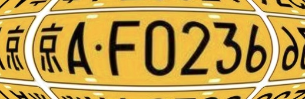</td>
</tr>

</table>

- **几何变换 Geometry Transformation**
<table>
  <tr>
    <td align="center">Rotate</td>
    <td align="center">Perspective</td>
    <td align="center">Transpose</td>
    <td align="center">Translation</td>
    <td align="center">RandomCrop</td>
    <td align="center">RandomMask</td>
</tr>
  
<tr>
    <td align="center"></td>
    <td align="center">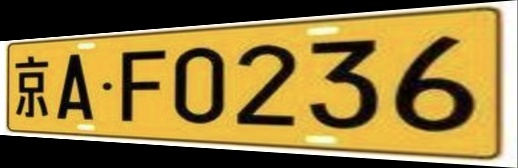</td>
    <td align="center"></td>
    <td align="center"></td>
    <td align="center"></td>
    <td align="center"></td>
</tr>
</table>

- **添加图案 Pattern**
<table>
  <tr>
    <td align="center">VerticalGrid</td>
    <td align="center">HorizontalGrid</td>
    <td align="center">Rectangle/EllipticalGrid</td>
</tr>
  
<tr>
    <td align="center"></td>
    <td align="center"></td>
    <td align="center"></td>
</tr>
</table>

- **模糊处理 Blur**
<table>
  <tr>
    <td align="center">GaussianBlur</td>
    <td align="center">MedianBlur</td>
    <td align="center">DefocusBlur</td>
    <td align="center">GlassBlur</td>
    <td align="center">ZoomBlur</td>
</tr>
  
<tr>
    <td align="center"></td>
    <td align="center"></td>
    <td align="center"></td>
    <td align="center"></td>
    <td align="center"></td>
</tr>
  
<tr>
     <td align="center">MotionBlur</td>
</tr>
  
<tr>
    <td align="center"></td>
</tr>
</table>

- **添加噪声 Additive Noise**
<table>
  <tr>
    <td align="center">GaussianNoise</td>
    <td align="center">ShotNoise</td>
    <td align="center">ImpulseNoise</td>
    <td align="center">SpeckleNoise</td>
</tr>
  
<tr>
    <td align="center">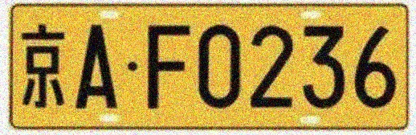</td>
    <td align="center">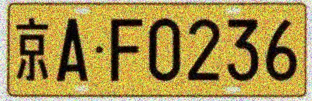</td>
    <td align="center">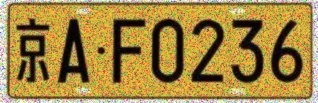</td>
    <td align="center"></td>
</table>

- **气候 Weather**
<table>
  <tr>
    <td align="center">Fog</td>
    <td align="center">Rain</td>
    <td align="center">Snow</td>
    <td align="center">Shadow</td>
</tr>
  
<tr>
    <td align="center">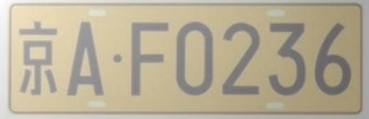</td>
    <td align="center"></td>
    <td align="center">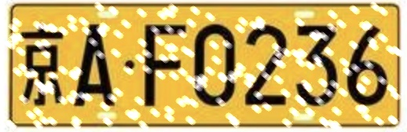</td>
    <td align="center"></td>
</tr>
</table>

- **图片视觉处理 Image Processing**
<table>
  <tr>
    <td align="center">Contrast</td>
    <td align="center">Brightness</td>
    <td align="center">Sharpness</td>
    <td align="center">Posterize</td>
    <td align="center">Solarize</td>
</tr>
  
<tr>
    <td align="center">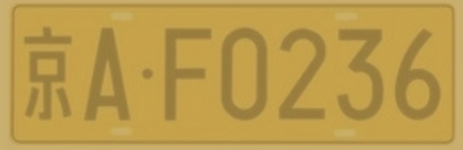</td>
    <td align="center">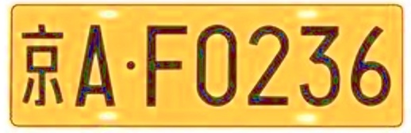</td>
    <td align="center"></td>
    <td align="center"></td>
    <td align="center">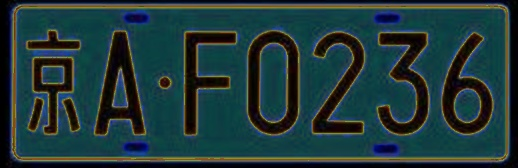</td>
</tr>
 
<tr>
    <td align="center">Color</td>
    <td align="center">HueSaturation</td>
    <td align="center">Equalize</td>
    <td align="center">Invert</td>
</tr>
  
<tr>
    <td align="center"></td>
    <td align="center"></td>
    <td align="center">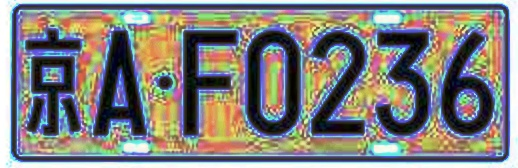</td>
    <td align="center"></td>
 </tr>
</table>

- **平滑和压缩 Smoothing & Compression**
<table>
  <tr>
    <td align="center">JPEGCompression</td>
    <td align="center">Pixelate</td>
    <td align="center">BitReduction</td>
    <td align="center">MaxSmoothing</td>
    <td align="center">AverageSmoothing</td>
</tr>
  
<tr>
    <td align="center"></td>
    <td align="center"></td>
    <td align="center"></td>
    <td align="center">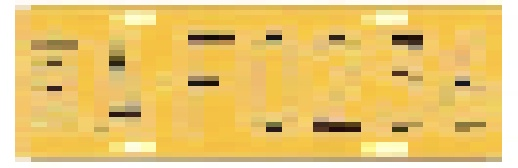</td>
    <td align="center"></td>
</tr>
</table>

## 2. 使用方法

我们提供了SerialAugment类来组合或调用数据增强算子。输入的图片既可以是以数组的形式，也可以是一个文件名或文件夹。详情参见下面的例子。

### 2.1 初始化
- ### 创建SerialAugment类的实例

  SerialAugment类是开发者和数据增强算子之间的媒介。 

  `class SerialAugment(transforms=[], format='CHW', bound=(0, 1), input_path=None, output_path=None)`

 - **参数**
     - `transforms (Dict|list(Dict))`  
     : 使用的数据增强算子。数据类型为列表，其中每一个元素为一个字典，对应着一个模块中提供的基本算子
     - `format (str)`  
     : 描述输入图像的格式，必须为‘CHW’或‘HWC’的一种，默认为‘CHW’ 
     - `bound (tuple)`
     : 输入图像的范围. 默认为(0, 1)
     - `input_path`
     : 输入图像的文件名或文件夹的路径，默认：None
     - `output_path`
     : 增强后图像的保存路径，默认：None
     
 - **示例**
 
 创建一个数据增强器来在输入图片中加上椭圆条纹。
 ```python
     # Import the interface class
     from perceptron.augmentations.augment import SerialAugment
     operator = [{'RectGrid': {'ellipse': True}}]
     data_augment = SerialAugment(operator, format='HWC', bound=(0, 255))

 ```
 
- ### 组合基础算子

除了模块提供的基础算子之外，用户也可以根据自己的需要自行组合基本算子来完成更复杂的变换。用户只需要在初始化SerialAugment的实例时声明期望使用的算子列表，创建的数据增强器就会在后续使用中对输入图片依次进行列表中的所有处理。

 - **示例**
 
 组合Rotate和GaussianNoise两个算子，创建的图像增强器将会旋转输入的图片，并添加高斯噪声。
```python
     # Import the interface class
     from perceptron.augmentations.augment import SerialAugment
     operator = [{'Rotate': {}},
                 {'GaussianNoise': {}}]
     data_augment = SerialAugment(operator, format='HWC', bound=(0, 255))

 ```

### 2.2 对指定的图片进行增强

在创建好SerialAugment的实例后，就可以把它直接应用到图片上。可以通过两种方法指定输入图片：用户可以在初始化SerialAugment实例时把输入图片或文件夹的路径作为参数传入，或是通过实例的`set_image(path)`方法制定输入图片的路径。在设定好图片之后，就可以通过实例的`__call__`方法开始数据增强。

`def __call__(img=None, mag=0)`

**参数**
  - `img (numpy.array|list)`: 将被增强的图片，如果是None，则会根据事先给定的路径从系统中加载图片。
  - `mag (int)`: 对图片增强的强度，为0，1，或2的整数。0代表最轻微的变换程度，2代表最强的程度。

该方法会返回经过增强后的图片。同时它也可以将增强后的图片保存到指定位置。用户可以在初始化实例的时候设定保存图片的位置，或是之后通过`set_out_path(path)`方法设定。

**示例**

使用上文示例中创建的Rotate & GaussianNoise算子，对`images/demo`文件夹中的所有图片进行图像增强变换，并把增强后的图片保存到`output/out_demo`目录下。

```python
  operator = [{'Rotate': {}},
              {'GaussianNoise': {}}]
  data_augment = SerialAugment(operator, format='HWC', bound=(0, 255))
  
  # set the images to be augmented 
  data_augment.set_image('images/demo')
  
  # set the output path
  data_augment.set_out_path('output/out_demo')
  
  # augmentation starts
  augmented_images = data_augment(mag=0)
```
如果运行成功，则在`output`目录下会出现一个新的文件夹`out_demo`，其中保存着增强后的图片。

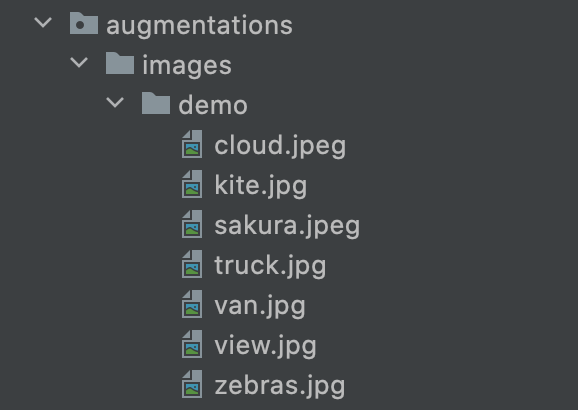      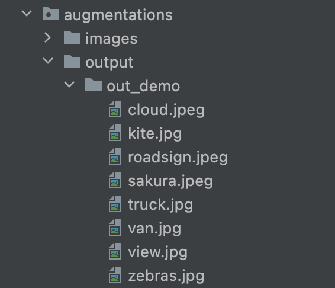

其中一张图片经过增强后的对比。
<table>
  <tr>
    <td align="center">Original</td>
    <td align="center">Augmented</td>
</tr>
  
<tr>
    <td align="center"></td>
    <td align="center"></td>
</tr>
</table>

### 2.3 在模型训练中使用数据增强

设计该模块的最初目的是为了增强深度网络模型的鲁棒性，它可以被添加到模型的训练中作为训练数据预处理的一部分。SerialAugment类也支持对已经被转化成numpy数组格式的图片进行处理。用户既可以手动对每一个minibatch的数据进行增强，也可以把该模块融合到dataloader里面。前者提供了更大的自由度来选择对于哪些数据需要进行增强，而后者则在代码实现上更为简洁，同时有更优的性能。

 - ### 手动增强minibatch

在训练中，若希望对某一minibatch的数据进行增强，只需将数据作为参数传入SerialAugment实例的`__call__`方法即可。

```python
  augmented_data = data_augment(ori_data, mag=0)
```
其中`ori_data`为原始数据，`augmented_data`是增强后的数据。

- **示例**

  以下代码展示了如何对一个minibatch的数据进行增强。示例中对PaddlePaddle框架下的ResNet34模型在Cifar10数据集上进行训练。
  
  ```python
  
    ...
 
    # Initialize dataset, loader, model, optimizer, etc. 
    train_dataset = paddle.vision.datasets.Cifar10(mode='train', transform=T.Transpose(order=(2, 0, 1)), backend='cv2')

    model = paddle.vision.models.resnet34(pretrained=False, num_classes=10)
    BATCH_SIZE = 128
    train_loader = paddle.io.DataLoader(train_dataset, shuffle=True, batch_size=BATCH_SIZE)

    learning_rate = 0.001
    opt = paddle.optimizer.Adam(learning_rate=learning_rate, parameters=model.parameters())
    loss_fn = paddle.nn.CrossEntropyLoss()
    normalize_fn = lambda x_batch: [T.normalize(x, std=[62.99, 62.08, 66.7], mean=[125.31, 122.95, 113.86]) for x in x_batch]

    # Initialize data augmentor
    data_augment = SerialAugment(transforms=[{'Rotate': {}},
                                             {'Translation': {}},
                                             {'RandomCrop': {}}],
                                 format='CHW', bound=(0, 255))

    num_epoch = 20
    model.train()

    # Start training
    for epoch in range(num_epoch):
        for i, data in enumerate(train_loader):
            img, label = data

            # Start augmenting data
            aug_img = paddle.unstack(img)
            aug_img = data_augment(aug_img, mag=0)
            aug_img = normalize_fn(aug_img)
            aug_img = paddle.to_tensor(np.stack(aug_img))

            # Get inference result
            pred = model(aug_img)
            # Backward propagate loss and update model parameters
            loss = loss_fn(pred, label)
            loss.backward()
            opt.step()
            opt.clear_grad()
            
   ...
   
   ```

- ### 将数据增强模块融合到dataloader里

本模块中的算子对于PaddlePaddle平台进行了优化。仅需一行代码就可以将这些算子添加到PaddlePaddle的dataloader里面，成为数据预处理的一部分。只需将初始化好的SerialAugment实例添加到dataloader的`transform`列表中，就可以实现对dataloader加载的所有数据进行增强。

- **示例**

以下示例展示了在Cifar10数据集上训练PaddlePaddle框架下的ResNet34模型，并使用了旋转，平移，颜色饱和度调整，以及网格扭曲四种变换来增强数据。

```python

def train():
    data_augment = SerialAugment(transforms=[{'Rotate': {}},
                                             {'Translation': {}},
                                             {'HueSaturation': {}},
                                             {'GridDistortion': {}}],
                                 format='HWC', bound=(0, 255))
    
    # Prepending data_augment module to dataloaders' list of transform operators
    train_transform = T.Compose([data_augment,
                                T.Normalize(mean=[125.31, 122.95, 113.86], std=[62.99, 62.08, 66.7], data_format='HWC'),
                                T.Transpose(order=(2, 0, 1))])
    
    test_transform = T.Compose([T.Normalize(mean=[125.31, 122.95, 113.86], std=[62.99, 62.08, 66.7], data_format='HWC'),
                                T.RandomRotation(30),
                                T.HueTransform(0.2),
                                T.RandomCrop(size=32, padding=4),
                                T.Transpose(order=(2, 0, 1))])

    train_dataset = paddle.vision.datasets.Cifar10(mode='train', transform=train_transform, backend='cv2')
    val_dataset = paddle.vision.datasets.Cifar10(mode='test', transform=test_transform, backend='cv2')

    model = paddle.vision.models.resnet34(pretrained=False, num_classes=10)
    model = paddle.Model(model)
    BATCH_SIZE = 128
    train_loader = paddle.io.DataLoader(train_dataset, shuffle=True, batch_size=BATCH_SIZE)
    test_loader = paddle.io.DataLoader(val_dataset, batch_size=BATCH_SIZE)

    learning_rate = 0.001
    loss_fn = paddle.nn.CrossEntropyLoss()
    opt = paddle.optimizer.Adam(learning_rate=learning_rate, parameters=model.parameters())
    model.prepare(optimizer=opt, loss=loss_fn, metrics=paddle.metric.Accuracy())

    model.fit(train_loader, test_loader, batch_size=128, epochs=20, eval_freq=5, verbose=1)
    model.evaluate(test_loader, verbose=1)
```

以上训练代码位于 `perceptron/augmentations/cifar10_dataaug_tutorial_dataloader.py`文件中。
